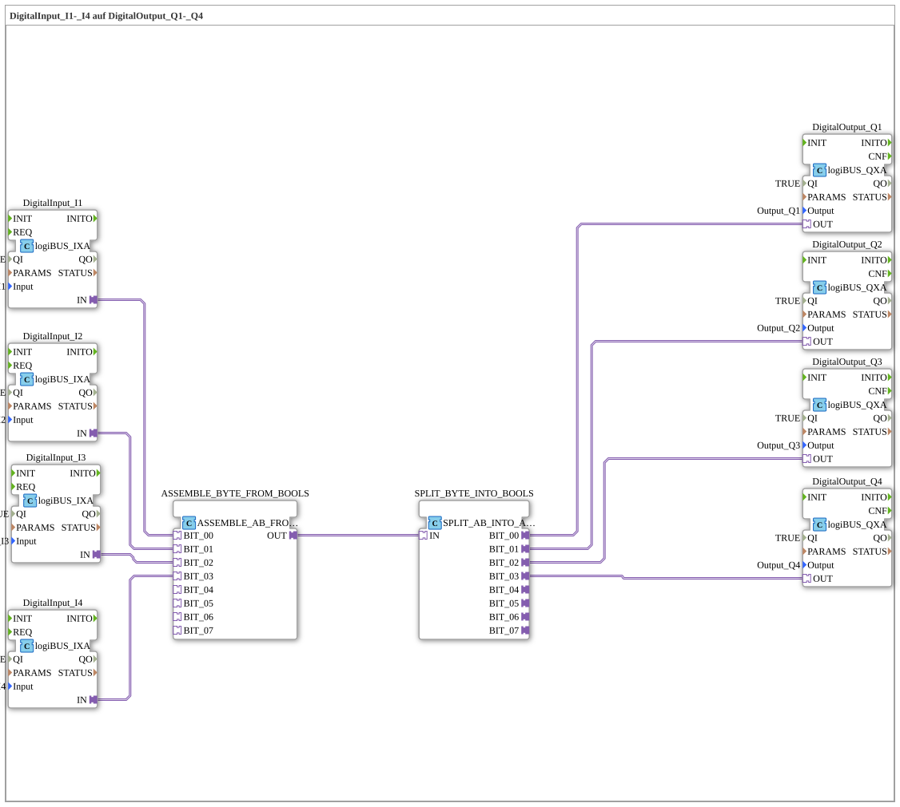

# Uebung_053_AX: DigitalInput_I1-_I4 auf DigitalOutput_Q1-_Q4

This article describes the 4diac IDE sub-application Uebung_053_AX (DigitalInput_I1-_I4 auf DigitalOutput_Q1-_Q4).

----

## Objective of the Exercise

The main objective of this exercise is to implement the following requirement: **DigitalInput_I1-_I4 auf DigitalOutput_Q1-_Q4**

-----

## Description and Components

The exercise consists of the sub-application Uebung_053_AX.SUB, which uses the following function block structure:

### Instantiated Function Blocks (FBs)

- **DigitalOutput_Q1**: Instance of type logiBUS::io::DQ::logiBUS_QXA.
  - Parameter QI = TRUE
  - Parameter Output = Output_Q1
- **DigitalInput_I1**: Instance of type logiBUS::io::DI::logiBUS_IXA.
  - Parameter QI = TRUE
  - Parameter Input = Input_I1
- **DigitalOutput_Q2**: Instance of type logiBUS::io::DQ::logiBUS_QXA.
  - Parameter QI = TRUE
  - Parameter Output = Output_Q2
- **DigitalInput_I2**: Instance of type logiBUS::io::DI::logiBUS_IXA.
  - Parameter QI = TRUE
  - Parameter Input = Input_I2
- **DigitalOutput_Q3**: Instance of type logiBUS::io::DQ::logiBUS_QXA.
  - Parameter QI = TRUE
  - Parameter Output = Output_Q3
- **DigitalInput_I3**: Instance of type logiBUS::io::DI::logiBUS_IXA.
  - Parameter QI = TRUE
  - Parameter Input = Input_I3
- **DigitalOutput_Q4**: Instance of type logiBUS::io::DQ::logiBUS_QXA.
  - Parameter QI = TRUE
  - Parameter Output = Output_Q4
- **DigitalInput_I4**: Instance of type logiBUS::io::DI::logiBUS_IXA.
  - Parameter QI = TRUE
  - Parameter Input = Input_I4
- **ASSEMBLE_BYTE_FROM_BOOLS**: Instance of type adapter::assembling::ASSEMBLE_AB_FROM_AX.
- **SPLIT_BYTE_INTO_BOOLS**: Instance of type adapter::splitting::SPLIT_AB_INTO_AX.

### Connections and Interfaces

**Adapter Connections:**
- ASSEMBLE_BYTE_FROM_BOOLS.OUT -> SPLIT_BYTE_INTO_BOOLS.IN
- SPLIT_BYTE_INTO_BOOLS.BIT_00 -> DigitalOutput_Q1.OUT
- SPLIT_BYTE_INTO_BOOLS.BIT_01 -> DigitalOutput_Q2.OUT
- SPLIT_BYTE_INTO_BOOLS.BIT_02 -> DigitalOutput_Q3.OUT
- SPLIT_BYTE_INTO_BOOLS.BIT_03 -> DigitalOutput_Q4.OUT
- DigitalInput_I4.IN -> ASSEMBLE_BYTE_FROM_BOOLS.BIT_03
- DigitalInput_I3.IN -> ASSEMBLE_BYTE_FROM_BOOLS.BIT_02
- DigitalInput_I2.IN -> ASSEMBLE_BYTE_FROM_BOOLS.BIT_01
- DigitalInput_I1.IN -> ASSEMBLE_BYTE_FROM_BOOLS.BIT_00

-----

## Sequence and Operation

1. **Initialization**: Upon system startup, all participating function blocks are initialized.
2. **Event and Signal Processing**: State changes at the inputs trigger events that are forwarded to downstream function blocks across the defined connections.
3. **Output Update**: The receiving function blocks process incoming events and data values to update physical and logical outputs accordingly.

-----

## Summary

Exercise Uebung_053_AX provides a clear demonstration of modular IEC 61499 application design in 4diac IDE.
