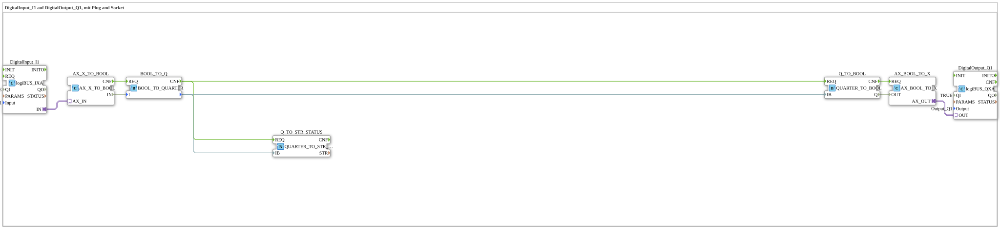

# Uebung_055_AX: DigitalInput_I1 auf DigitalOutput_Q1, mit Plug and Socket

This article describes the 4diac IDE sub-application Uebung_055_AX (DigitalInput_I1 auf DigitalOutput_Q1, mit Plug and Socket).

----

## Objective of the Exercise

The main objective of this exercise is to implement the following requirement: **DigitalInput_I1 auf DigitalOutput_Q1, mit Plug and Socket**

-----

## Description and Components

The exercise consists of the sub-application Uebung_055_AX.SUB, which uses the following function block structure:

### Instantiated Function Blocks (FBs)

- **DigitalOutput_Q1**: Instance of type logiBUS::io::DQ::logiBUS_QXA.
  - Parameter QI = TRUE
  - Parameter Output = Output_Q1
- **DigitalInput_I1**: Instance of type logiBUS::io::DI::logiBUS_IXA.
  - Parameter QI = TRUE
  - Parameter Input = Input_I1
- **Q_TO_STR_STATUS**: Instance of type logiBUS::utils::quarter::QUARTER_TO_STR_STATUS.
- **Q_TO_BOOL**: Instance of type logiBUS::utils::quarter::QUARTER_TO_BOOL.
- **BOOL_TO_Q**: Instance of type logiBUS::utils::quarter::BOOL_TO_QUARTER.
- **AX_X_TO_BOOL**: Instance of type adapter::conversion::unidirectional::AX_X_TO_BOOL.
- **AX_BOOL_TO_X**: Instance of type adapter::conversion::unidirectional::AX_BOOL_TO_X.

### Connections and Interfaces

**Adapter Connections:**
- DigitalInput_I1.IN -> AX_X_TO_BOOL.AX_IN
- AX_BOOL_TO_X.AX_OUT -> DigitalOutput_Q1.OUT

**Event Connections:**
- Q_TO_BOOL.CNF -> AX_BOOL_TO_X.REQ
- AX_X_TO_BOOL.CNF -> BOOL_TO_Q.REQ
- BOOL_TO_Q.CNF -> Q_TO_STR_STATUS.REQ
- BOOL_TO_Q.CNF -> Q_TO_BOOL.REQ

**Data Connections:**
- Q_TO_BOOL.Q -> AX_BOOL_TO_X.OUT
- AX_X_TO_BOOL.IN -> BOOL_TO_Q.I
- BOOL_TO_Q. -> Q_TO_STR_STATUS.IB
- BOOL_TO_Q. -> Q_TO_BOOL.IB

-----

## Sequence and Operation

1. **Initialization**: Upon system startup, all participating function blocks are initialized.
2. **Event and Signal Processing**: State changes at the inputs trigger events that are forwarded to downstream function blocks across the defined connections.
3. **Output Update**: The receiving function blocks process incoming events and data values to update physical and logical outputs accordingly.

-----

## Summary

Exercise Uebung_055_AX provides a clear demonstration of modular IEC 61499 application design in 4diac IDE.
