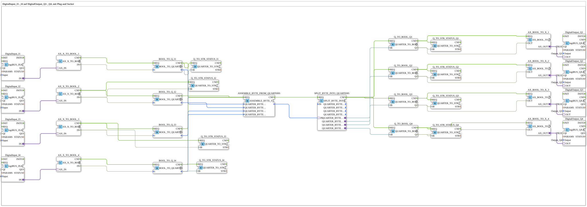

# Uebung_056_AX: DigitalInput_I1-_I4 auf DigitalOutput_Q1-_Q4, mit Plug and Socket

This article describes the 4diac IDE sub-application Uebung_056_AX (DigitalInput_I1-_I4 auf DigitalOutput_Q1-_Q4, mit Plug and Socket).

----

## Objective of the Exercise

The main objective of this exercise is to implement the following requirement: **DigitalInput_I1-_I4 auf DigitalOutput_Q1-_Q4, mit Plug and Socket**

-----

## Description and Components

The exercise consists of the sub-application Uebung_056_AX.SUB, which uses the following function block structure:

### Instantiated Function Blocks (FBs)

- **DigitalInput_I1**: Instance of type logiBUS::io::DI::logiBUS_IXA.
  - Parameter QI = TRUE
  - Parameter Input = Input_I1
- **ASSEMBLE_BYTE_FROM_QUARTERS**: Instance of type eclipse4diac::utils::assembling::ASSEMBLE_BYTE_FROM_QUARTERS.
- **DigitalInput_I2**: Instance of type logiBUS::io::DI::logiBUS_IXA.
  - Parameter QI = TRUE
  - Parameter Input = Input_I2
- **DigitalInput_I3**: Instance of type logiBUS::io::DI::logiBUS_IXA.
  - Parameter QI = TRUE
  - Parameter Input = Input_I3
- **DigitalInput_I4**: Instance of type logiBUS::io::DI::logiBUS_IXA.
  - Parameter QI = TRUE
  - Parameter Input = Input_I4
- **DigitalOutput_Q2**: Instance of type logiBUS::io::DQ::logiBUS_QXA.
  - Parameter QI = TRUE
  - Parameter Output = Output_Q2
- **DigitalOutput_Q3**: Instance of type logiBUS::io::DQ::logiBUS_QXA.
  - Parameter QI = TRUE
  - Parameter Output = Output_Q3
- **SPLIT_BYTE_INTO_QUARTERS**: Instance of type eclipse4diac::utils::splitting::SPLIT_BYTE_INTO_QUARTERS.
- **DigitalOutput_Q1**: Instance of type logiBUS::io::DQ::logiBUS_QXA.
  - Parameter QI = TRUE
  - Parameter Output = Output_Q1
- **DigitalOutput_Q4**: Instance of type logiBUS::io::DQ::logiBUS_QXA.
  - Parameter QI = TRUE
  - Parameter Output = Output_Q4
- **Q_TO_BOOL_Q1**: Instance of type logiBUS::utils::quarter::QUARTER_TO_BOOL.
- **Q_TO_BOOL_Q4**: Instance of type logiBUS::utils::quarter::QUARTER_TO_BOOL.
- **Q_TO_BOOL_Q2**: Instance of type logiBUS::utils::quarter::QUARTER_TO_BOOL.
- **Q_TO_BOOL_Q3**: Instance of type logiBUS::utils::quarter::QUARTER_TO_BOOL.
- **Q_TO_STR_STATUS_Q3**: Instance of type logiBUS::utils::quarter::QUARTER_TO_STR_STATUS.
- **Q_TO_STR_STATUS_Q1**: Instance of type logiBUS::utils::quarter::QUARTER_TO_STR_STATUS.
- **Q_TO_STR_STATUS_I3**: Instance of type logiBUS::utils::quarter::QUARTER_TO_STR_STATUS.
- **Q_TO_STR_STATUS_I1**: Instance of type logiBUS::utils::quarter::QUARTER_TO_STR_STATUS.
- **Q_TO_STR_STATUS_I4**: Instance of type logiBUS::utils::quarter::QUARTER_TO_STR_STATUS.
- **Q_TO_STR_STATUS_Q4**: Instance of type logiBUS::utils::quarter::QUARTER_TO_STR_STATUS.
- **Q_TO_STR_STATUS_Q2**: Instance of type logiBUS::utils::quarter::QUARTER_TO_STR_STATUS.
- **Q_TO_STR_STATUS_I2**: Instance of type logiBUS::utils::quarter::QUARTER_TO_STR_STATUS.
- **BOOL_TO_Q_I1**: Instance of type logiBUS::utils::quarter::BOOL_TO_QUARTER.
- **BOOL_TO_Q_I2**: Instance of type logiBUS::utils::quarter::BOOL_TO_QUARTER.
- **BOOL_TO_Q_I4**: Instance of type logiBUS::utils::quarter::BOOL_TO_QUARTER.
- **BOOL_TO_Q_I3**: Instance of type logiBUS::utils::quarter::BOOL_TO_QUARTER.
- **AX_X_TO_BOOL_1**: Instance of type adapter::conversion::unidirectional::AX_X_TO_BOOL.
- **AX_X_TO_BOOL_2**: Instance of type adapter::conversion::unidirectional::AX_X_TO_BOOL.
- **AX_X_TO_BOOL_3**: Instance of type adapter::conversion::unidirectional::AX_X_TO_BOOL.
- **AX_X_TO_BOOL_4**: Instance of type adapter::conversion::unidirectional::AX_X_TO_BOOL.
- **AX_BOOL_TO_X_1**: Instance of type adapter::conversion::unidirectional::AX_BOOL_TO_X.
- **AX_BOOL_TO_X_2**: Instance of type adapter::conversion::unidirectional::AX_BOOL_TO_X.
- **AX_BOOL_TO_X_3**: Instance of type adapter::conversion::unidirectional::AX_BOOL_TO_X.
- **AX_BOOL_TO_X_4**: Instance of type adapter::conversion::unidirectional::AX_BOOL_TO_X.

### Connections and Interfaces

**Adapter Connections:**
- DigitalInput_I1.IN -> AX_X_TO_BOOL_1.AX_IN
- DigitalInput_I2.IN -> AX_X_TO_BOOL_2.AX_IN
- DigitalInput_I3.IN -> AX_X_TO_BOOL_3.AX_IN
- DigitalInput_I4.IN -> AX_X_TO_BOOL_4.AX_IN
- AX_BOOL_TO_X_1.AX_OUT -> DigitalOutput_Q1.OUT
- AX_BOOL_TO_X_2.AX_OUT -> DigitalOutput_Q2.OUT
- AX_BOOL_TO_X_3.AX_OUT -> DigitalOutput_Q3.OUT
- AX_BOOL_TO_X_4.AX_OUT -> DigitalOutput_Q4.OUT

**Event Connections:**
- ASSEMBLE_BYTE_FROM_QUARTERS.CNF -> SPLIT_BYTE_INTO_QUARTERS.REQ
- SPLIT_BYTE_INTO_QUARTERS.CNF -> Q_TO_BOOL_Q1.REQ
- Q_TO_BOOL_Q1.CNF -> AX_BOOL_TO_X_1.REQ
- SPLIT_BYTE_INTO_QUARTERS.CNF -> Q_TO_BOOL_Q4.REQ
- Q_TO_BOOL_Q4.CNF -> AX_BOOL_TO_X_4.REQ
- SPLIT_BYTE_INTO_QUARTERS.CNF -> Q_TO_BOOL_Q2.REQ
- Q_TO_BOOL_Q2.CNF -> AX_BOOL_TO_X_2.REQ
- SPLIT_BYTE_INTO_QUARTERS.CNF -> Q_TO_BOOL_Q3.REQ
- Q_TO_BOOL_Q3.CNF -> AX_BOOL_TO_X_3.REQ
- Q_TO_BOOL_Q3.CNF -> Q_TO_STR_STATUS_Q3.REQ
- Q_TO_BOOL_Q1.CNF -> Q_TO_STR_STATUS_Q1.REQ
- AX_X_TO_BOOL_3.CNF -> Q_TO_STR_STATUS_I3.REQ
- Q_TO_BOOL_Q4.CNF -> Q_TO_STR_STATUS_Q4.REQ
- Q_TO_BOOL_Q2.CNF -> Q_TO_STR_STATUS_Q2.REQ
- AX_X_TO_BOOL_2.CNF -> Q_TO_STR_STATUS_I2.REQ
- AX_X_TO_BOOL_1.CNF -> BOOL_TO_Q_I1.REQ
- BOOL_TO_Q_I1.CNF -> ASSEMBLE_BYTE_FROM_QUARTERS.REQ
- BOOL_TO_Q_I1.CNF -> Q_TO_STR_STATUS_I1.REQ
- AX_X_TO_BOOL_2.CNF -> BOOL_TO_Q_I2.REQ
- BOOL_TO_Q_I2.CNF -> ASSEMBLE_BYTE_FROM_QUARTERS.REQ
- AX_X_TO_BOOL_4.CNF -> BOOL_TO_Q_I4.REQ
- BOOL_TO_Q_I4.CNF -> ASSEMBLE_BYTE_FROM_QUARTERS.REQ
- BOOL_TO_Q_I4.CNF -> Q_TO_STR_STATUS_I4.REQ
- AX_X_TO_BOOL_3.CNF -> BOOL_TO_Q_I3.REQ
- BOOL_TO_Q_I3.CNF -> ASSEMBLE_BYTE_FROM_QUARTERS.REQ

**Data Connections:**
- Q_TO_BOOL_Q1.Q -> AX_BOOL_TO_X_1.OUT
- Q_TO_BOOL_Q4.Q -> AX_BOOL_TO_X_4.OUT
- Q_TO_BOOL_Q2.Q -> AX_BOOL_TO_X_2.OUT
- Q_TO_BOOL_Q3.Q -> AX_BOOL_TO_X_3.OUT
- Q_TO_BOOL_Q3.Q -> Q_TO_STR_STATUS_Q3.IB
- Q_TO_BOOL_Q1.Q -> Q_TO_STR_STATUS_Q1.IB
- AX_X_TO_BOOL_3.IN -> Q_TO_STR_STATUS_I3.IB
- Q_TO_BOOL_Q4.Q -> Q_TO_STR_STATUS_Q4.IB
- Q_TO_BOOL_Q2.Q -> Q_TO_STR_STATUS_Q2.IB
- AX_X_TO_BOOL_2.IN -> Q_TO_STR_STATUS_I2.IB
- AX_X_TO_BOOL_1.IN -> BOOL_TO_Q_I1.I
- BOOL_TO_Q_I1. -> Q_TO_STR_STATUS_I1.IB
- AX_X_TO_BOOL_2.IN -> BOOL_TO_Q_I2.I
- AX_X_TO_BOOL_4.IN -> BOOL_TO_Q_I4.I
- BOOL_TO_Q_I4. -> Q_TO_STR_STATUS_I4.IB
- AX_X_TO_BOOL_3.IN -> BOOL_TO_Q_I3.I
- ASSEMBLE_BYTE_FROM_QUARTERS. -> SPLIT_BYTE_INTO_QUARTERS.IN
- SPLIT_BYTE_INTO_QUARTERS.QUARTER_BYTE_00 -> Q_TO_BOOL_Q1.IB
- SPLIT_BYTE_INTO_QUARTERS.QUARTER_BYTE_03 -> Q_TO_BOOL_Q4.IB
- SPLIT_BYTE_INTO_QUARTERS.QUARTER_BYTE_01 -> Q_TO_BOOL_Q2.IB
- SPLIT_BYTE_INTO_QUARTERS.QUARTER_BYTE_02 -> Q_TO_BOOL_Q3.IB
- BOOL_TO_Q_I1. -> ASSEMBLE_BYTE_FROM_QUARTERS.QUARTER_BYTE_00
- BOOL_TO_Q_I2. -> ASSEMBLE_BYTE_FROM_QUARTERS.QUARTER_BYTE_01
- BOOL_TO_Q_I4. -> ASSEMBLE_BYTE_FROM_QUARTERS.QUARTER_BYTE_03
- BOOL_TO_Q_I3. -> ASSEMBLE_BYTE_FROM_QUARTERS.QUARTER_BYTE_02

-----

## Sequence and Operation

1. **Initialization**: Upon system startup, all participating function blocks are initialized.
2. **Event and Signal Processing**: State changes at the inputs trigger events that are forwarded to downstream function blocks across the defined connections.
3. **Output Update**: The receiving function blocks process incoming events and data values to update physical and logical outputs accordingly.

-----

## Summary

Exercise Uebung_056_AX provides a clear demonstration of modular IEC 61499 application design in 4diac IDE.
