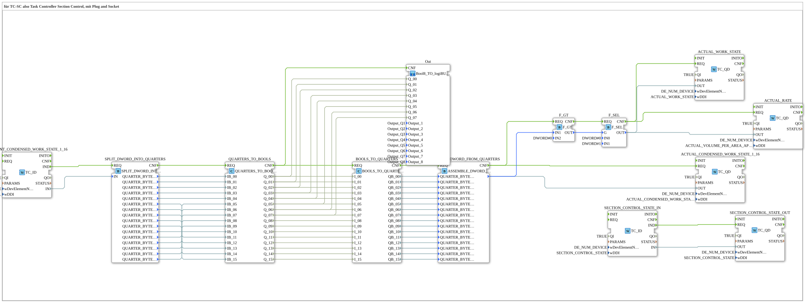

# Uebung_060_AX: für TC-SC also Task Controller Section Control, mit Plug and Socket

This article describes the 4diac IDE sub-application Uebung_060_AX (für TC-SC also Task Controller Section Control, mit Plug and Socket).

----

## Objective of the Exercise

The main objective of this exercise is to implement the following requirement: **für TC-SC also Task Controller Section Control, mit Plug and Socket**

-----

## Description and Components

The exercise consists of the sub-application Uebung_060_AX.SUB, which uses the following function block structure:

### Instantiated Function Blocks (FBs)

- **SETPOINT_CONDENSED_WORK_STATE_1_16**: Instance of type isobus::TC::io::TC_ID.
  - Parameter QI = TRUE
  - Parameter wDevElementNumb = DE_NUM_DEVICE
  - Parameter wDDI = SETPOINT_CONDENSED_WORK_STATE_1_16
- **SPLIT_DWORD_INTO_QUARTERS**: Instance of type eclipse4diac::utils::splitting::SPLIT_DWORD_INTO_QUARTERS.
- **ASSEMBLE_DWORD_FROM_QUARTERS**: Instance of type eclipse4diac::utils::assembling::ASSEMBLE_DWORD_FROM_QUARTERS.
- **ACTUAL_CONDENSED_WORK_STATE_1_16**: Instance of type isobus::TC::io::TC_QD.
  - Parameter QI = TRUE
  - Parameter wDevElementNumb = DE_NUM_DEVICE
  - Parameter wDDI = ACTUAL_CONDENSED_WORK_STATE_1_16
- **BOOLS_TO_QUARTERS**: Instance of type logiBUS::utils::quarter::BOOLS_TO_QUARTERS.
- **QUARTERS_TO_BOOLS**: Instance of type logiBUS::utils::quarter::QUARTERS_TO_BOOLS.
- **SECTION_CONTROL_STATE_IN**: Instance of type isobus::TC::io::TC_ID.
  - Parameter QI = TRUE
  - Parameter wDevElementNumb = DE_NUM_DEVICE
  - Parameter wDDI = SECTION_CONTROL_STATE
- **SECTION_CONTROL_STATE_OUT**: Instance of type isobus::TC::io::TC_QD.
  - Parameter QI = TRUE
  - Parameter wDevElementNumb = DE_NUM_DEVICE
  - Parameter wDDI = SECTION_CONTROL_STATE
- **ACTUAL_RATE**: Instance of type isobus::TC::io::TC_QD.
  - Parameter QI = TRUE
  - Parameter wDevElementNumb = DE_NUM_DEVICE
  - Parameter wDDI = ACTUAL_VOLUME_PER_AREA_APPLICATION_RATE
- **ACTUAL_WORK_STATE**: Instance of type isobus::TC::io::TC_QD.
  - Parameter QI = TRUE
  - Parameter wDevElementNumb = DE_NUM_DEVICE
  - Parameter wDDI = ACTUAL_WORK_STATE
- **F_SEL**: Instance of type iec61131::selection::F_SEL.
  - Parameter IN0 = DWORD#0
  - Parameter IN1 = DWORD#1
- **F_GT**: Instance of type iec61131::comparison::F_GT.
  - Parameter IN2 = DWORD#0

### Connections and Interfaces

**Event Connections:**

- SETPOINT_CONDENSED_WORK_STATE_1_16.IND -> SPLIT_DWORD_INTO_QUARTERS.REQ
- ASSEMBLE_DWORD_FROM_QUARTERS.CNF -> ACTUAL_CONDENSED_WORK_STATE_1_16.REQ
- BOOLS_TO_QUARTERS.CNF -> ASSEMBLE_DWORD_FROM_QUARTERS.REQ
- SPLIT_DWORD_INTO_QUARTERS.CNF -> QUARTERS_TO_BOOLS.REQ
- QUARTERS_TO_BOOLS.CNF -> BOOLS_TO_QUARTERS.REQ
- QUARTERS_TO_BOOLS.CNF -> Out.CNF
- SECTION_CONTROL_STATE_IN.IND -> SECTION_CONTROL_STATE_OUT.REQ
- F_GT.CNF -> F_SEL.REQ
- ASSEMBLE_DWORD_FROM_QUARTERS.CNF -> F_GT.REQ
- F_SEL.CNF -> ACTUAL_WORK_STATE.REQ
- F_SEL.CNF -> ACTUAL_RATE.REQ

**Data Connections:**

- SETPOINT_CONDENSED_WORK_STATE_1_16.IN -> SPLIT_DWORD_INTO_QUARTERS.IN
- QUARTERS_TO_BOOLS.Q_00 -> BOOLS_TO_QUARTERS.I_00
- QUARTERS_TO_BOOLS.Q_02 -> BOOLS_TO_QUARTERS.I_02
- QUARTERS_TO_BOOLS.Q_01 -> BOOLS_TO_QUARTERS.I_01
- QUARTERS_TO_BOOLS.Q_03 -> BOOLS_TO_QUARTERS.I_03
- QUARTERS_TO_BOOLS.Q_04 -> BOOLS_TO_QUARTERS.I_04
- QUARTERS_TO_BOOLS.Q_05 -> BOOLS_TO_QUARTERS.I_05
- QUARTERS_TO_BOOLS.Q_06 -> BOOLS_TO_QUARTERS.I_06
- QUARTERS_TO_BOOLS.Q_07 -> BOOLS_TO_QUARTERS.I_07
- QUARTERS_TO_BOOLS.Q_08 -> BOOLS_TO_QUARTERS.I_08
- QUARTERS_TO_BOOLS.Q_09 -> BOOLS_TO_QUARTERS.I_09
- QUARTERS_TO_BOOLS.Q_10 -> BOOLS_TO_QUARTERS.I_10
- QUARTERS_TO_BOOLS.Q_11 -> BOOLS_TO_QUARTERS.I_11
- QUARTERS_TO_BOOLS.Q_12 -> BOOLS_TO_QUARTERS.I_12
- QUARTERS_TO_BOOLS.Q_13 -> BOOLS_TO_QUARTERS.I_13
- QUARTERS_TO_BOOLS.Q_14 -> BOOLS_TO_QUARTERS.I_14
- QUARTERS_TO_BOOLS.Q_15 -> BOOLS_TO_QUARTERS.I_15
- QUARTERS_TO_BOOLS.Q_06 -> Out.Q_06
- QUARTERS_TO_BOOLS.Q_00 -> Out.Q_00
- QUARTERS_TO_BOOLS.Q_04 -> Out.Q_04
- QUARTERS_TO_BOOLS.Q_01 -> Out.Q_01
- QUARTERS_TO_BOOLS.Q_05 -> Out.Q_05
- QUARTERS_TO_BOOLS.Q_07 -> Out.Q_07
- QUARTERS_TO_BOOLS.Q_02 -> Out.Q_02
- QUARTERS_TO_BOOLS.Q_03 -> Out.Q_03
- BOOLS_TO_QUARTERS.QB_00 -> ASSEMBLE_DWORD_FROM_QUARTERS.QUARTER_BYTE_00
- BOOLS_TO_QUARTERS.QB_01 -> ASSEMBLE_DWORD_FROM_QUARTERS.QUARTER_BYTE_01
- BOOLS_TO_QUARTERS.QB_02 -> ASSEMBLE_DWORD_FROM_QUARTERS.QUARTER_BYTE_02
- BOOLS_TO_QUARTERS.QB_03 -> ASSEMBLE_DWORD_FROM_QUARTERS.QUARTER_BYTE_03
- ASSEMBLE_DWORD_FROM_QUARTERS. -> ACTUAL_CONDENSED_WORK_STATE_1_16.OUT
- BOOLS_TO_QUARTERS.QB_04 -> ASSEMBLE_DWORD_FROM_QUARTERS.QUARTER_BYTE_04
- BOOLS_TO_QUARTERS.QB_05 -> ASSEMBLE_DWORD_FROM_QUARTERS.QUARTER_BYTE_05
- BOOLS_TO_QUARTERS.QB_06 -> ASSEMBLE_DWORD_FROM_QUARTERS.QUARTER_BYTE_06
- BOOLS_TO_QUARTERS.QB_07 -> ASSEMBLE_DWORD_FROM_QUARTERS.QUARTER_BYTE_07
- BOOLS_TO_QUARTERS.QB_08 -> ASSEMBLE_DWORD_FROM_QUARTERS.QUARTER_BYTE_08
- BOOLS_TO_QUARTERS.QB_09 -> ASSEMBLE_DWORD_FROM_QUARTERS.QUARTER_BYTE_09
- BOOLS_TO_QUARTERS.QB_10 -> ASSEMBLE_DWORD_FROM_QUARTERS.QUARTER_BYTE_10
- BOOLS_TO_QUARTERS.QB_11 -> ASSEMBLE_DWORD_FROM_QUARTERS.QUARTER_BYTE_11
- BOOLS_TO_QUARTERS.QB_12 -> ASSEMBLE_DWORD_FROM_QUARTERS.QUARTER_BYTE_12
- BOOLS_TO_QUARTERS.QB_13 -> ASSEMBLE_DWORD_FROM_QUARTERS.QUARTER_BYTE_13
- BOOLS_TO_QUARTERS.QB_14 -> ASSEMBLE_DWORD_FROM_QUARTERS.QUARTER_BYTE_14
- BOOLS_TO_QUARTERS.QB_15 -> ASSEMBLE_DWORD_FROM_QUARTERS.QUARTER_BYTE_15
- SPLIT_DWORD_INTO_QUARTERS.QUARTER_BYTE_00 -> QUARTERS_TO_BOOLS.IB_00
- SPLIT_DWORD_INTO_QUARTERS.QUARTER_BYTE_01 -> QUARTERS_TO_BOOLS.IB_01
- SPLIT_DWORD_INTO_QUARTERS.QUARTER_BYTE_02 -> QUARTERS_TO_BOOLS.IB_02
- SPLIT_DWORD_INTO_QUARTERS.QUARTER_BYTE_03 -> QUARTERS_TO_BOOLS.IB_03
- SPLIT_DWORD_INTO_QUARTERS.QUARTER_BYTE_04 -> QUARTERS_TO_BOOLS.IB_04
- SPLIT_DWORD_INTO_QUARTERS.QUARTER_BYTE_15 -> QUARTERS_TO_BOOLS.IB_15
- SPLIT_DWORD_INTO_QUARTERS.QUARTER_BYTE_14 -> QUARTERS_TO_BOOLS.IB_14
- SPLIT_DWORD_INTO_QUARTERS.QUARTER_BYTE_13 -> QUARTERS_TO_BOOLS.IB_13
- SPLIT_DWORD_INTO_QUARTERS.QUARTER_BYTE_12 -> QUARTERS_TO_BOOLS.IB_12
- SPLIT_DWORD_INTO_QUARTERS.QUARTER_BYTE_11 -> QUARTERS_TO_BOOLS.IB_11
- SPLIT_DWORD_INTO_QUARTERS.QUARTER_BYTE_10 -> QUARTERS_TO_BOOLS.IB_10
- SPLIT_DWORD_INTO_QUARTERS.QUARTER_BYTE_09 -> QUARTERS_TO_BOOLS.IB_09
- SPLIT_DWORD_INTO_QUARTERS.QUARTER_BYTE_08 -> QUARTERS_TO_BOOLS.IB_08
- SPLIT_DWORD_INTO_QUARTERS.QUARTER_BYTE_07 -> QUARTERS_TO_BOOLS.IB_07
- SPLIT_DWORD_INTO_QUARTERS.QUARTER_BYTE_06 -> QUARTERS_TO_BOOLS.IB_06
- SPLIT_DWORD_INTO_QUARTERS.QUARTER_BYTE_05 -> QUARTERS_TO_BOOLS.IB_05
- SECTION_CONTROL_STATE_IN.IN -> SECTION_CONTROL_STATE_OUT.OUT
- F_GT.OUT -> F_SEL.G
- ASSEMBLE_DWORD_FROM_QUARTERS. -> F_GT.IN1
- F_SEL.OUT -> ACTUAL_RATE.OUT
- F_SEL.OUT -> ACTUAL_WORK_STATE.OUT

-----

## Sequence and Operation

1. **Initialization**: Upon system startup, all participating function blocks are initialized.
2. **Event and Signal Processing**: State changes at the inputs trigger events that are forwarded to downstream function blocks across the defined connections.
3. **Output Update**: The receiving function blocks process incoming events and data values to update physical and logical outputs accordingly.

-----

## Summary

Exercise Uebung_060_AX provides a clear demonstration of modular IEC 61499 application design in 4diac IDE.
