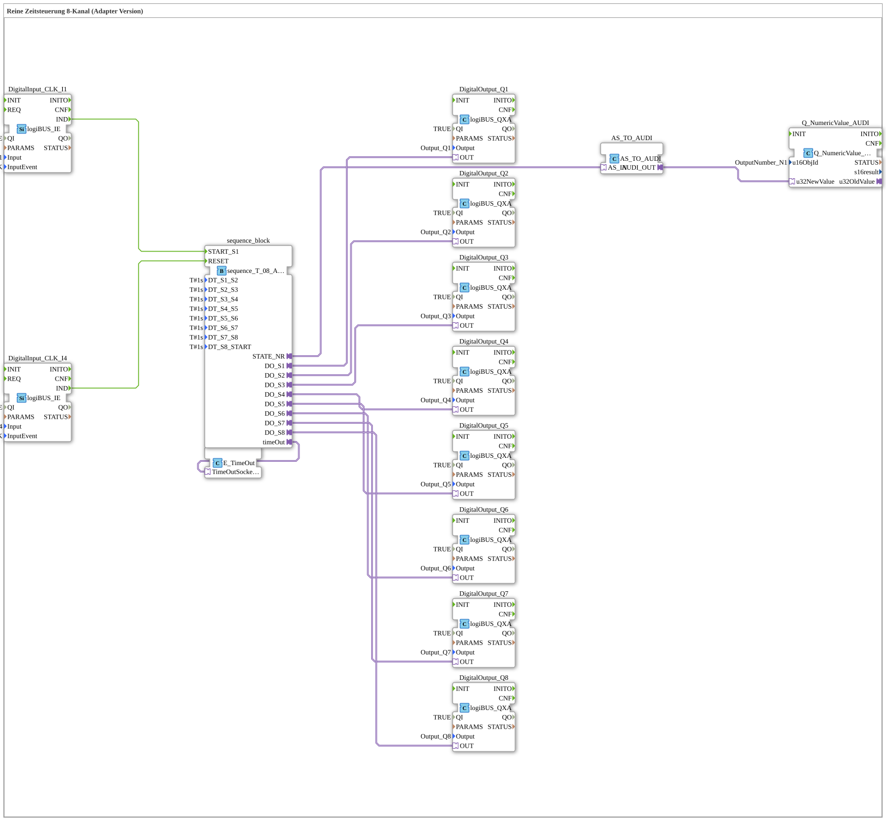

# Uebung_063_AX: Pure Time-Controlled Sequence, 8 Channels (Adapter Version)

This article describes the logiBUS® exercise `Uebung_063_AX`. We build a purely time-driven step chain using AX adapter technology.

----

## Goal of the Exercise

Realize an automatic sequence across 8 outputs (Q1, Q2, Q3, Q4, Q5, Q6, Q7, Q8), where each step advances to the next purely after a fixed dwell time (`DT_S1_S2` etc., each `T#1s`) elapses - with no further button press needed once the sequence is running.

-----

## Description and Components

The subapplication `Uebung_063_AX` uses the sequencer `sequence_T_08_AX` (AX adapter variant), which cycles through 8 states (`S1` to `S8`) purely on elapsed time.

- **`sequence_T_08_AX`**: Manages the 8 steps; each transition happens once the respective `DT_Sx_Sy` parameter elapses.
- **`E_TimeOut`**: Watchdog supervising the sequence.
- **`Q_NumericValue_AUDI`**: Displays the current step number on the ISOBUS terminal.

-----

## Behavior

1. Start via button `I1` -> the sequence jumps to `S1`.
2. Each output (`Q1, Q2, Q3, Q4, Q5, Q6, Q7, Q8`) is switched active for the configured time before automatically advancing to the next step.
3. After the last step, the sequence ends.
4. Reset via button `I4` -> everything off, sequence back to its base state.
