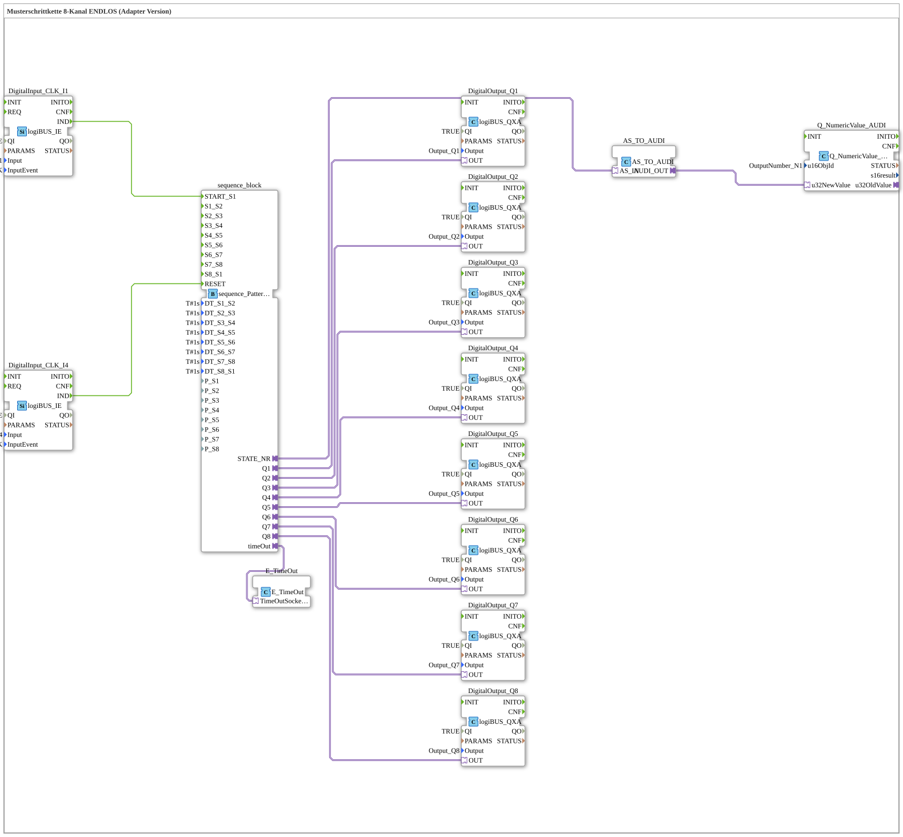

# Uebung_064_AX: Pattern Step Chain, 8 Channels, Loop (Adapter Version)

This article describes the logiBUS® exercise `Uebung_064_AX`. We build a pattern-based running-light sequence using AX adapter technology.

----

## Goal of the Exercise

Realize a running-light sequence across 8 outputs (`Q1`-`Q8`) which, unlike the plain step chains (`Uebung_044_AX` through `Uebung_063_AX`), is based on a pattern sequencer.

-----

## Description and Components

The subapplication `Uebung_064_AX` uses the block `sequence_Pattern_08_08_loop_AX`. Unlike the plain state sequencers (`sequence_T_08_AX`, `sequence_E_08_AX`), this block addresses its outputs directly as `Q1`-`Q8` instead of via individual `DO_Sx` state outputs - it can therefore emit arbitrary bit patterns over time (not just "one channel after another").

- **`sequence_Pattern_08_08_loop_AX`**: Pattern-based 8-channel sequencer, time-driven via the same `DT_Sx_Sy` parameters as the plain timed exercises, but emits a full 8-bit pattern per step.
- **`E_TimeOut`**: Watchdog supervising the sequence.
- **`Q_NumericValue_AUDI`**: Displays the current step number on the ISOBUS terminal.

-----

## Behavior

1. Start via button `I1` -> the sequence starts.
2. Every `T#1s`, the emitted bit pattern advances to the next step.
3. After the last step (`S8`), the sequence automatically returns to `S1` (loop).
4. Reset via button `I4` -> everything off.
