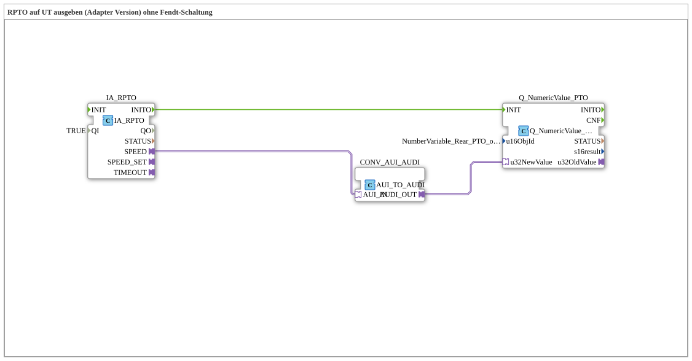

# Uebung_074b_AUI: Output RPTO on the UT (Adapter Version) without Fendt Fallback

This article describes the logiBUS® exercise `Uebung_074b_AUI`. A simplified variant of `Uebung_074a_AUI` (see there for the Fendt-specific fallback-value selection): here the PTO speed is displayed directly, with no selection logic.

----

## Goal of the Exercise

Display the rear PTO output shaft speed on the VT terminal, taken directly from the TECU value, with no Fendt-specific fallback selection.

-----

## Description and Components

- **`IA_RPTO`**: `isobus::tecu::IA_RPTO`, reads the PTO output shaft speed from the Tractor ECU (TECU) via ISOBUS.
- **`CONV_AUI_AUDI`**: `adapter::conversion::unidirectional::AUI_TO_AUDI`, converts the TECU value directly into the AUDI format needed by `Q_NumericValue`.
- **`Q_NumericValue_PTO`**: displays the value on the VT terminal (`u16ObjId = NumberVariable_Rear_PTO_output_shaft_speed`).

-----

## Behavior

1. `IA_RPTO` continuously reads the PTO output shaft speed from the TECU.
2. The value (`SPEED`) is converted directly via `CONV_AUI_AUDI` into the display format, with no selection/fallback logic.
3. On initialization (`INITO`), the display is prepared.
