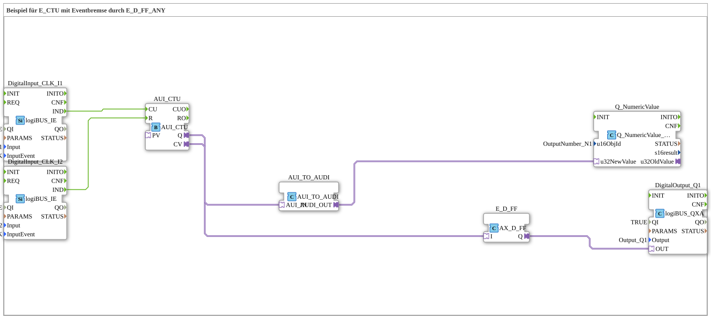

# Uebung_080d_AX: Beispiel für E_CTU mit Eventbremse durch E_D_FF_ANY

This article describes the 4diac IDE sub-application Uebung_080d_AX (Beispiel für E_CTU mit Eventbremse durch E_D_FF_ANY).

----

## Objective of the Exercise

The main objective of this exercise is to implement the following requirement: **Beispiel für E_CTU mit Eventbremse durch E_D_FF_ANY**

-----

## Description and Components

The exercise consists of the sub-application Uebung_080d_AX.SUB, which uses the following function block structure:

### Instantiated Function Blocks (FBs)

- **DigitalOutput_Q1**: Instance of type logiBUS::io::DQ::logiBUS_QXA.
  - Parameter QI = TRUE
  - Parameter Output = Output_Q1
- **DigitalInput_CLK_I1**: Instance of type logiBUS::io::DI::logiBUS_IE.
  - Parameter QI = TRUE
  - Parameter Input = Input_I1
  - Parameter InputEvent = BUTTON_SINGLE_CLICK
- **AUI_CTU**: Instance of type adapter::events::unidirectional::AUI_CTU.
- **DigitalInput_CLK_I2**: Instance of type logiBUS::io::DI::logiBUS_IE.
  - Parameter QI = TRUE
  - Parameter Input = Input_I2
  - Parameter InputEvent = BUTTON_SINGLE_CLICK
- **E_D_FF**: Instance of type adapter::events::unidirectional::AX_D_FF.
- **AUI_TO_AUDI**: Instance of type adapter::conversion::unidirectional::AUI_TO_AUDI.
- **Q_NumericValue**: Instance of type isobus::UT::Q::Q_NumericValue_AUDI.
  - Parameter u16ObjId = OutputNumber_N1

### Connections and Interfaces

**Adapter Connections:**

- AUI_CTU.Q -> E_D_FF.I
- E_D_FF.Q -> DigitalOutput_Q1.OUT
- AUI_CTU.CV -> AUI_TO_AUDI.AUI_IN
- AUI_TO_AUDI.AUDI_OUT -> Q_NumericValue.u32NewValue

**Event Connections:**

- DigitalInput_CLK_I1.IND -> AUI_CTU.CU
- DigitalInput_CLK_I2.IND -> AUI_CTU.R

-----

## Sequence and Operation

1. **Initialization**: Upon system startup, all participating function blocks are initialized.
2. **Event and Signal Processing**: State changes at the inputs trigger events that are forwarded to downstream function blocks across the defined connections.
3. **Output Update**: The receiving function blocks process incoming events and data values to update physical and logical outputs accordingly.

-----

## Summary

Exercise Uebung_080d_AX provides a clear demonstration of modular IEC 61499 application design in 4diac IDE.
