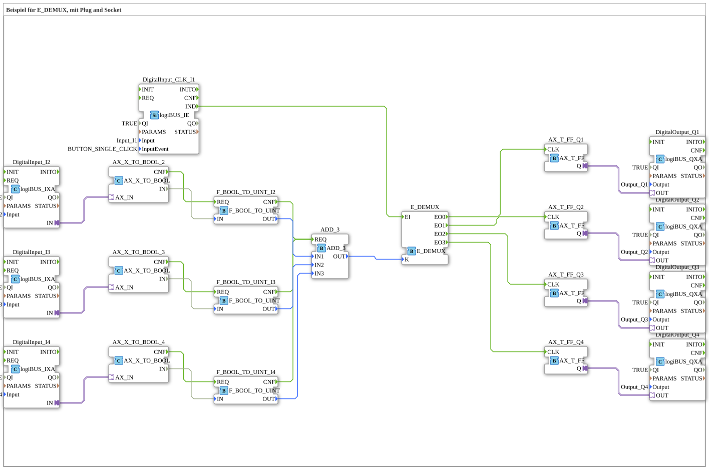

# Uebung_087_AX: Beispiel für E_DEMUX, mit Plug and Socket

This article describes the 4diac IDE sub-application Uebung_087_AX (Beispiel für E_DEMUX, mit Plug and Socket).

----

## Objective of the Exercise

The main objective of this exercise is to implement the following requirement: **Beispiel für E_DEMUX, mit Plug and Socket**

-----

## Description and Components

The exercise consists of the sub-application Uebung_087_AX.SUB, which uses the following function block structure:

### Instantiated Function Blocks (FBs)

- **E_DEMUX**: Instance of type iec61499::events::E_DEMUX.
- **ADD_3**: Instance of type iec61131::arithmetic::ADD_3.
- **DigitalInput_I2**: Instance of type logiBUS::io::DI::logiBUS_IXA.
  - Parameter QI = TRUE
  - Parameter Input = Input_I2
- **DigitalInput_I3**: Instance of type logiBUS::io::DI::logiBUS_IXA.
  - Parameter QI = TRUE
  - Parameter Input = Input_I3
- **DigitalInput_I4**: Instance of type logiBUS::io::DI::logiBUS_IXA.
  - Parameter QI = TRUE
  - Parameter Input = Input_I4
- **AX_X_TO_BOOL_2**: Instance of type adapter::conversion::unidirectional::AX_X_TO_BOOL.
- **AX_X_TO_BOOL_3**: Instance of type adapter::conversion::unidirectional::AX_X_TO_BOOL.
- **AX_X_TO_BOOL_4**: Instance of type adapter::conversion::unidirectional::AX_X_TO_BOOL.
- **F_BOOL_TO_UINT_I2**: Instance of type iec61131::conversion::F_BOOL_TO_UINT.
- **F_BOOL_TO_UINT_I3**: Instance of type iec61131::conversion::F_BOOL_TO_UINT.
- **F_BOOL_TO_UINT_I4**: Instance of type iec61131::conversion::F_BOOL_TO_UINT.
- **DigitalOutput_Q2**: Instance of type logiBUS::io::DQ::logiBUS_QXA.
  - Parameter QI = TRUE
  - Parameter Output = Output_Q2
- **DigitalOutput_Q1**: Instance of type logiBUS::io::DQ::logiBUS_QXA.
  - Parameter QI = TRUE
  - Parameter Output = Output_Q1
- **DigitalOutput_Q4**: Instance of type logiBUS::io::DQ::logiBUS_QXA.
  - Parameter QI = TRUE
  - Parameter Output = Output_Q4
- **DigitalOutput_Q3**: Instance of type logiBUS::io::DQ::logiBUS_QXA.
  - Parameter QI = TRUE
  - Parameter Output = Output_Q3
- **AX_T_FF_Q1**: Instance of type adapter::events::unidirectional::AX_T_FF.
- **AX_T_FF_Q2**: Instance of type adapter::events::unidirectional::AX_T_FF.
- **AX_T_FF_Q3**: Instance of type adapter::events::unidirectional::AX_T_FF.
- **AX_T_FF_Q4**: Instance of type adapter::events::unidirectional::AX_T_FF.
- **DigitalInput_CLK_I1**: Instance of type logiBUS::io::DI::logiBUS_IE.
  - Parameter QI = TRUE
  - Parameter Input = Input_I1
  - Parameter InputEvent = BUTTON_SINGLE_CLICK

### Connections and Interfaces

**Adapter Connections:**

- DigitalInput_I2.IN -> AX_X_TO_BOOL_2.AX_IN
- DigitalInput_I3.IN -> AX_X_TO_BOOL_3.AX_IN
- DigitalInput_I4.IN -> AX_X_TO_BOOL_4.AX_IN
- AX_T_FF_Q1.Q -> DigitalOutput_Q1.OUT
- AX_T_FF_Q2.Q -> DigitalOutput_Q2.OUT
- AX_T_FF_Q3.Q -> DigitalOutput_Q3.OUT
- AX_T_FF_Q4.Q -> DigitalOutput_Q4.OUT

**Event Connections:**

- AX_X_TO_BOOL_2.CNF -> F_BOOL_TO_UINT_I2.REQ
- AX_X_TO_BOOL_3.CNF -> F_BOOL_TO_UINT_I3.REQ
- AX_X_TO_BOOL_4.CNF -> F_BOOL_TO_UINT_I4.REQ
- F_BOOL_TO_UINT_I4.CNF -> ADD_3.REQ
- F_BOOL_TO_UINT_I3.CNF -> ADD_3.REQ
- F_BOOL_TO_UINT_I2.CNF -> ADD_3.REQ
- E_DEMUX.EO0 -> AX_T_FF_Q1.CLK
- E_DEMUX.EO1 -> AX_T_FF_Q2.CLK
- E_DEMUX.EO2 -> AX_T_FF_Q3.CLK
- E_DEMUX.EO3 -> AX_T_FF_Q4.CLK
- DigitalInput_CLK_I1.IND -> E_DEMUX.EI

**Data Connections:**

- AX_X_TO_BOOL_2.IN -> F_BOOL_TO_UINT_I2.IN
- AX_X_TO_BOOL_3.IN -> F_BOOL_TO_UINT_I3.IN
- AX_X_TO_BOOL_4.IN -> F_BOOL_TO_UINT_I4.IN
- F_BOOL_TO_UINT_I2.OUT -> ADD_3.IN1
- F_BOOL_TO_UINT_I3.OUT -> ADD_3.IN2
- F_BOOL_TO_UINT_I4.OUT -> ADD_3.IN3
- ADD_3.OUT -> E_DEMUX.K

### Notes from the Model

> Diese Taste schaltet ein oder aus
> Die Anzahl der restlichen Tasten bestimmt den Ausgang: 
Keine --> Q1
Eine --> Q2
Zwei --> Q3
Drei --> Q4

-----

## Sequence and Operation

1. **Initialization**: Upon system startup, all participating function blocks are initialized.
2. **Event and Signal Processing**: State changes at the inputs trigger events that are forwarded to downstream function blocks across the defined connections.
3. **Output Update**: The receiving function blocks process incoming events and data values to update physical and logical outputs accordingly.

-----

## Summary

Exercise Uebung_087_AX provides a clear demonstration of modular IEC 61499 application design in 4diac IDE.
