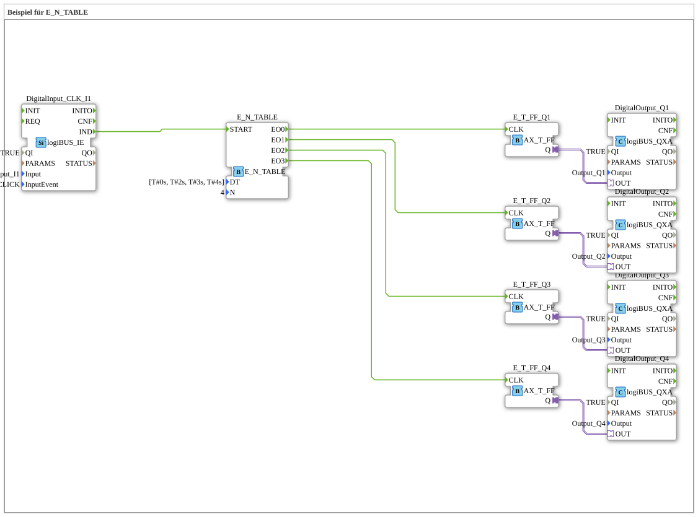

# Uebung_093b_AX: Beispiel für E_N_TABLE

This article describes the 4diac IDE sub-application Uebung_093b_AX (Beispiel für E_N_TABLE).

----

## Objective of the Exercise

The main objective of this exercise is to implement the following requirement: **Beispiel für E_N_TABLE**

-----

## Description and Components

The exercise consists of the sub-application Uebung_093b_AX.SUB, which uses the following function block structure:

### Instantiated Function Blocks (FBs)

- **E_N_TABLE**: Instance of type iec61499::events::E_N_TABLE.
  - Parameter DT = [T#0s, T#2s, T#3s, T#4s]
  - Parameter N = 4
- **DigitalInput_CLK_I1**: Instance of type logiBUS::io::DI::logiBUS_IE.
  - Parameter QI = TRUE
  - Parameter Input = Input_I1
  - Parameter InputEvent = BUTTON_SINGLE_CLICK
- **E_T_FF_Q2**: Instance of type adapter::events::unidirectional::AX_T_FF.
- **E_T_FF_Q4**: Instance of type adapter::events::unidirectional::AX_T_FF.
- **DigitalOutput_Q1**: Instance of type logiBUS::io::DQ::logiBUS_QXA.
  - Parameter QI = TRUE
  - Parameter Output = Output_Q1
- **E_T_FF_Q3**: Instance of type adapter::events::unidirectional::AX_T_FF.
- **DigitalOutput_Q3**: Instance of type logiBUS::io::DQ::logiBUS_QXA.
  - Parameter QI = TRUE
  - Parameter Output = Output_Q3
- **E_T_FF_Q1**: Instance of type adapter::events::unidirectional::AX_T_FF.
- **DigitalOutput_Q2**: Instance of type logiBUS::io::DQ::logiBUS_QXA.
  - Parameter QI = TRUE
  - Parameter Output = Output_Q2
- **DigitalOutput_Q4**: Instance of type logiBUS::io::DQ::logiBUS_QXA.
  - Parameter QI = TRUE
  - Parameter Output = Output_Q4

### Connections and Interfaces

**Adapter Connections:**
- E_T_FF_Q1.Q -> DigitalOutput_Q1.OUT
- E_T_FF_Q4.Q -> DigitalOutput_Q4.OUT
- E_T_FF_Q2.Q -> DigitalOutput_Q2.OUT
- E_T_FF_Q3.Q -> DigitalOutput_Q3.OUT

**Event Connections:**
- DigitalInput_CLK_I1.IND -> E_N_TABLE.START
- E_N_TABLE.EO0 -> E_T_FF_Q1.CLK
- E_N_TABLE.EO1 -> E_T_FF_Q2.CLK
- E_N_TABLE.EO2 -> E_T_FF_Q3.CLK
- E_N_TABLE.EO3 -> E_T_FF_Q4.CLK

### Notes from the Model

> E_TABLE wird 4 Events ausgeben, das erste sofort nach dem Click, das letzte 9s nach dem Click
[T#0s, T#2s, T#3s, T#4s]

-----

## Sequence and Operation

1. **Initialization**: Upon system startup, all participating function blocks are initialized.
2. **Event and Signal Processing**: State changes at the inputs trigger events that are forwarded to downstream function blocks across the defined connections.
3. **Output Update**: The receiving function blocks process incoming events and data values to update physical and logical outputs accordingly.

-----

## Summary

Exercise Uebung_093b_AX provides a clear demonstration of modular IEC 61499 application design in 4diac IDE.
