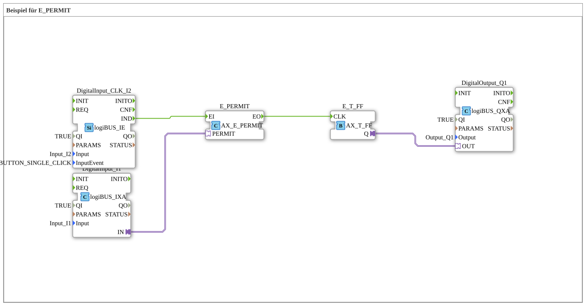

# Uebung_094_AX: Beispiel für E_PERMIT

This article describes the 4diac IDE sub-application Uebung_094_AX (Beispiel für E_PERMIT).

----

## Objective of the Exercise

The main objective of this exercise is to implement the following requirement: **Beispiel für E_PERMIT**

-----

## Description and Components

The exercise consists of the sub-application Uebung_094_AX.SUB, which uses the following function block structure:

### Instantiated Function Blocks (FBs)

- **DigitalInput_I1**: Instance of type logiBUS::io::DI::logiBUS_IXA.
  - Parameter QI = TRUE
  - Parameter Input = Input_I1
- **DigitalInput_CLK_I2**: Instance of type logiBUS::io::DI::logiBUS_IE.
  - Parameter QI = TRUE
  - Parameter Input = Input_I2
  - Parameter InputEvent = BUTTON_SINGLE_CLICK
- **E_PERMIT**: Instance of type adapter::events::unidirectional::AX_E_PERMIT.
- **E_T_FF**: Instance of type adapter::events::unidirectional::AX_T_FF.
- **DigitalOutput_Q1**: Instance of type logiBUS::io::DQ::logiBUS_QXA.
  - Parameter QI = TRUE
  - Parameter Output = Output_Q1

### Connections and Interfaces

**Adapter Connections:**

- DigitalInput_I1.IN -> E_PERMIT.PERMIT
- E_T_FF.Q -> DigitalOutput_Q1.OUT

**Event Connections:**

- DigitalInput_CLK_I2.IND -> E_PERMIT.EI
- E_PERMIT.EO -> E_T_FF.CLK

-----

## Sequence and Operation

1. **Initialization**: Upon system startup, all participating function blocks are initialized.
2. **Event and Signal Processing**: State changes at the inputs trigger events that are forwarded to downstream function blocks across the defined connections.
3. **Output Update**: The receiving function blocks process incoming events and data values to update physical and logical outputs accordingly.

-----

## Summary

Exercise Uebung_094_AX provides a clear demonstration of modular IEC 61499 application design in 4diac IDE.
