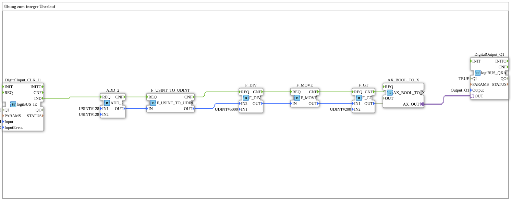

# Uebung_111_AX: Übung zum Integer Überlauf

This article describes the 4diac IDE sub-application Uebung_111_AX (Übung zum Integer Überlauf).

----

## Objective of the Exercise

The main objective of this exercise is to implement the following requirement: **Übung zum Integer Überlauf**

-----

## Description and Components

The exercise consists of the sub-application Uebung_111_AX.SUB, which uses the following function block structure:

### Instantiated Function Blocks (FBs)

- **DigitalOutput_Q1**: Instance of type logiBUS::io::DQ::logiBUS_QXA.
  - Parameter QI = TRUE
  - Parameter Output = Output_Q1
- **ADD_2**: Instance of type iec61131::arithmetic::ADD_2.
  - Parameter IN1 = USINT#128
  - Parameter IN2 = USINT#128
- **DigitalInput_CLK_I1**: Instance of type logiBUS::io::DI::logiBUS_IE.
  - Parameter QI = TRUE
  - Parameter Input = Input_I1
  - Parameter InputEvent = BUTTON_SINGLE_CLICK
- **F_GT**: Instance of type iec61131::comparison::F_GT.
  - Parameter IN2 = UDINT#200
- **F_DIV**: Instance of type iec61131::arithmetic::F_DIV.
  - Parameter IN1 = UDINT#5000
- **F_USINT_TO_UDINT**: Instance of type iec61131::conversion::F_USINT_TO_UDINT.
- **F_MOVE**: Instance of type iec61131::selection::F_MOVE.
- **AX_BOOL_TO_X**: Instance of type adapter::conversion::unidirectional::AX_BOOL_TO_X.

### Connections and Interfaces

**Adapter Connections:**

- AX_BOOL_TO_X.AX_OUT -> DigitalOutput_Q1.OUT

**Event Connections:**

- DigitalInput_CLK_I1.IND -> ADD_2.REQ
- F_GT.CNF -> AX_BOOL_TO_X.REQ
- ADD_2.CNF -> F_USINT_TO_UDINT.REQ
- F_USINT_TO_UDINT.CNF -> F_DIV.REQ
- F_DIV.CNF -> F_MOVE.REQ
- F_MOVE.CNF -> F_GT.REQ

**Data Connections:**

- F_GT.OUT -> AX_BOOL_TO_X.OUT
- ADD_2.OUT -> F_USINT_TO_UDINT.IN
- F_USINT_TO_UDINT.OUT -> F_DIV.IN2
- F_MOVE.OUT -> F_GT.IN1
- F_DIV.OUT -> F_MOVE.IN

-----

## Sequence and Operation

1. **Initialization**: Upon system startup, all participating function blocks are initialized.
2. **Event and Signal Processing**: State changes at the inputs trigger events that are forwarded to downstream function blocks across the defined connections.
3. **Output Update**: The receiving function blocks process incoming events and data values to update physical and logical outputs accordingly.

-----

## Summary

Exercise Uebung_111_AX provides a clear demonstration of modular IEC 61499 application design in 4diac IDE.
