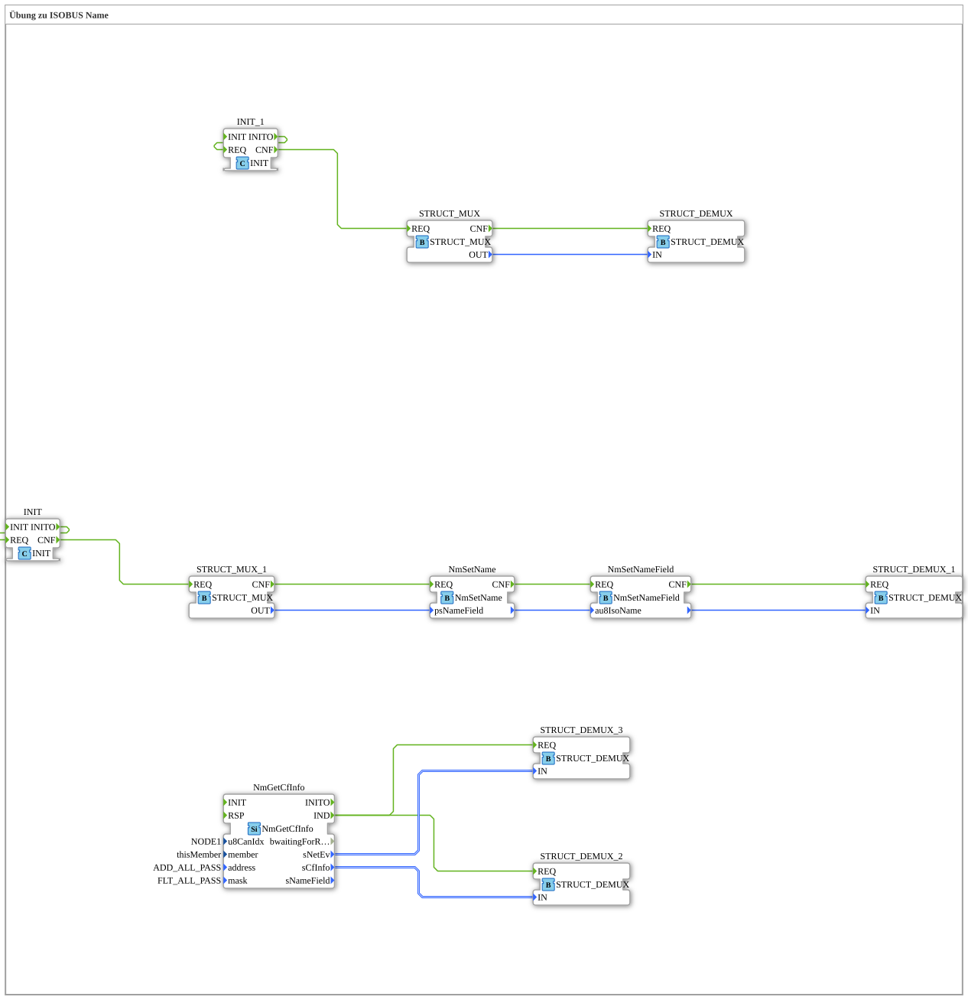

# Uebung_121_AX: Übung zu ISOBUS Name

This article describes the 4diac IDE sub-application Uebung_121_AX (Übung zu ISOBUS Name).

----

## Objective of the Exercise

The main objective of this exercise is to implement the following requirement: **Übung zu ISOBUS Name**

-----

## Description and Components

The exercise consists of the sub-application Uebung_121_AX.SUB, which uses the following function block structure:

### Instantiated Function Blocks (FBs)

- **STRUCT_DEMUX**: Instance of type eclipse4diac::convert::STRUCT_DEMUX.
- **STRUCT_MUX**: Instance of type eclipse4diac::convert::STRUCT_MUX.
- **NmSetName**: Instance of type isobus::pgn::NmSetName.
- **NmSetNameField**: Instance of type isobus::pgn::NmSetNameField.
- **STRUCT_MUX_1**: Instance of type eclipse4diac::convert::STRUCT_MUX.
- **STRUCT_DEMUX_1**: Instance of type eclipse4diac::convert::STRUCT_DEMUX.
- **NmGetCfInfo**: Instance of type isobus::pgn::NmGetCfInfo.
  - Parameter u8CanIdx = NODE1
  - Parameter member = thisMember
  - Parameter address = ADD_ALL_PASS
  - Parameter mask = FLT_ALL_PASS
- **STRUCT_DEMUX_2**: Instance of type eclipse4diac::convert::STRUCT_DEMUX.
- **STRUCT_DEMUX_3**: Instance of type eclipse4diac::convert::STRUCT_DEMUX.
- **INIT**: Instance of type iec61131::booleanOperators::INIT.
- **INIT_1**: Instance of type iec61131::booleanOperators::INIT.

### Connections and Interfaces

**Event Connections:**

- STRUCT_MUX.CNF -> STRUCT_DEMUX.REQ
- NmSetName.CNF -> NmSetNameField.REQ
- STRUCT_MUX_1.CNF -> NmSetName.REQ
- NmSetNameField.CNF -> STRUCT_DEMUX_1.REQ
- NmGetCfInfo.IND -> STRUCT_DEMUX_3.REQ
- NmGetCfInfo.IND -> STRUCT_DEMUX_2.REQ
- INIT.INITO -> INIT.REQ
- INIT.CNF -> STRUCT_MUX_1.REQ
- INIT_1.INITO -> INIT_1.REQ
- INIT_1.CNF -> STRUCT_MUX.REQ

**Data Connections:**

- STRUCT_MUX.OUT -> STRUCT_DEMUX.IN
- STRUCT_MUX_1.OUT -> NmSetName.psNameField
- NmSetName. -> NmSetNameField.au8IsoName
- NmSetNameField. -> STRUCT_DEMUX_1.IN
- NmGetCfInfo.sNetEv -> STRUCT_DEMUX_3.IN
- NmGetCfInfo.sCfInfo -> STRUCT_DEMUX_2.IN

-----

## Sequence and Operation

1. **Initialization**: Upon system startup, all participating function blocks are initialized.
2. **Event and Signal Processing**: State changes at the inputs trigger events that are forwarded to downstream function blocks across the defined connections.
3. **Output Update**: The receiving function blocks process incoming events and data values to update physical and logical outputs accordingly.

-----

## Summary

Exercise Uebung_121_AX provides a clear demonstration of modular IEC 61499 application design in 4diac IDE.
