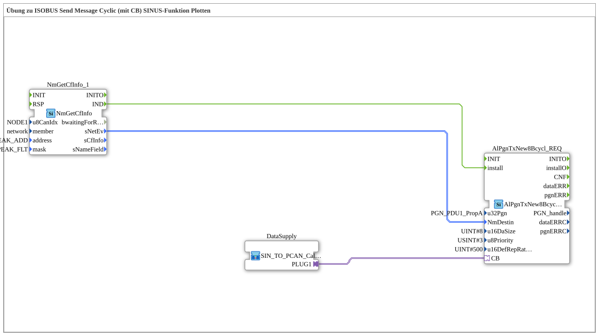

# Uebung_126b_AX: Übung zu ISOBUS Send Message Cyclic (mit CB) SINUS-Funktion Plotten

This article describes the 4diac IDE sub-application Uebung_126b_AX (Übung zu ISOBUS Send Message Cyclic (mit CB) SINUS-Funktion Plotten).

----

## Objective of the Exercise

The main objective of this exercise is to implement the following requirement: **Übung zu ISOBUS Send Message Cyclic (mit CB) SINUS-Funktion Plotten**

-----

## Description and Components

The exercise consists of the sub-application Uebung_126b_AX.SUB, which uses the following function block structure:

### Instantiated Function Blocks (FBs)

- **NmGetCfInfo_1**: Instance of type isobus::pgn::NmGetCfInfo.
  - Parameter u8CanIdx = NODE1
  - Parameter member = network
  - Parameter address = PEAK_ADD
  - Parameter mask = PEAK_FLT
- **AlPgnTxNew8Bcycl_REQ**: Instance of type isobus::pgn::tx::AlPgnTxNew8Bcycl_REQ.
  - Parameter u32Pgn = PGN_PDU1_PropA
  - Parameter u16DaSize = 8
  - Parameter u8Priority = 3
  - Parameter u16DefRepRate = 500

### Connections and Interfaces

**Adapter Connections:**

- DataSupply.PLUG1 -> AlPgnTxNew8Bcycl_REQ.CB

**Event Connections:**

- NmGetCfInfo_1.IND -> AlPgnTxNew8Bcycl_REQ.install

**Data Connections:**

- NmGetCfInfo_1.sNetEv -> AlPgnTxNew8Bcycl_REQ.NmDestin

-----

## Sequence and Operation

1. **Initialization**: Upon system startup, all participating function blocks are initialized.
2. **Event and Signal Processing**: State changes at the inputs trigger events that are forwarded to downstream function blocks across the defined connections.
3. **Output Update**: The receiving function blocks process incoming events and data values to update physical and logical outputs accordingly.

-----

## Summary

Exercise Uebung_126b_AX provides a clear demonstration of modular IEC 61499 application design in 4diac IDE.
