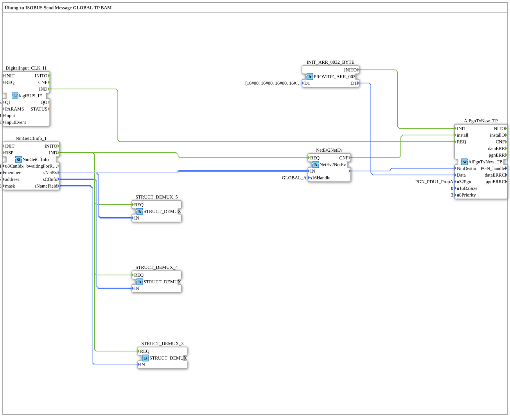

# Uebung_128b_AX: Übung zu ISOBUS Send Message GLOBAL TP BAM

This article describes the 4diac IDE sub-application Uebung_128b_AX (Übung zu ISOBUS Send Message GLOBAL TP BAM).

----

## Objective of the Exercise

The main objective of this exercise is to implement the following requirement: **Übung zu ISOBUS Send Message GLOBAL TP BAM**

-----

## Description and Components

The exercise consists of the sub-application Uebung_128b_AX.SUB, which uses the following function block structure:

### Instantiated Function Blocks (FBs)

- **STRUCT_DEMUX_3**: Instance of type eclipse4diac::convert::STRUCT_DEMUX.
- **NmGetCfInfo_1**: Instance of type isobus::pgn::NmGetCfInfo.
  - Parameter u8CanIdx = NODE1
  - Parameter member = thisMember
  - Parameter address = ADD_ALL_PASS
  - Parameter mask = FLT_ALL_PASS
- **STRUCT_DEMUX_4**: Instance of type eclipse4diac::convert::STRUCT_DEMUX.
- **STRUCT_DEMUX_5**: Instance of type eclipse4diac::convert::STRUCT_DEMUX.
- **AlPgnTxNew_TP**: Instance of type isobus::pgn::tx::AlPgnTxNew_TP.
  - Parameter u32Pgn = PGN_PDU1_PropA
  - Parameter u16DaSize = 0
  - Parameter u8Priority = 3
- **DigitalInput_CLK_I1**: Instance of type logiBUS::io::DI::logiBUS_IE.
  - Parameter QI = TRUE
  - Parameter Input = Input_I1
  - Parameter InputEvent = BUTTON_SINGLE_CLICK
- **NetEv2NetEv**: Instance of type isobus::pgn::NetEv2NetEv.
  - Parameter s16Handle = GLOBAL_A
- **INIT_ARR_0032_BYTE**: Instance of type eclipse4diac::convert::providers::PROVIDE_ARR_0032_BYTE.
  - Parameter D1 = [16#00, 16#00, 16#00, 16#00, 16#00, 16#00, 16#00, 16#00, 16#00, 16#00, 16#00, 16#00, 16#00, 16#00, 16#00, 16#00, 16#00, 16#00, 16#00, 16#00, 16#00, 16#00, 16#00, 16#00, 16#00, 16#00, 16#00, 16#00, 16#00, 16#00, 16#00, 16#00]

### Connections and Interfaces

**Event Connections:**
- NmGetCfInfo_1.IND -> STRUCT_DEMUX_3.REQ
- NmGetCfInfo_1.IND -> STRUCT_DEMUX_4.REQ
- NmGetCfInfo_1.IND -> STRUCT_DEMUX_5.REQ
- NmGetCfInfo_1.IND -> NetEv2NetEv.REQ
- DigitalInput_CLK_I1.IND -> AlPgnTxNew_TP.REQ
- NetEv2NetEv.CNF -> AlPgnTxNew_TP.install
- INIT_ARR_0032_BYTE.INITO -> AlPgnTxNew_TP.INIT

**Data Connections:**
- NmGetCfInfo_1.sNameField -> STRUCT_DEMUX_3.IN
- NmGetCfInfo_1.sNetEv -> STRUCT_DEMUX_5.IN
- NmGetCfInfo_1.sCfInfo -> STRUCT_DEMUX_4.IN
- NmGetCfInfo_1.sNetEv -> NetEv2NetEv.IN
- NetEv2NetEv. -> AlPgnTxNew_TP.NmDestin
- INIT_ARR_0032_BYTE.D1 -> AlPgnTxNew_TP.Data

-----

## Sequence and Operation

1. **Initialization**: Upon system startup, all participating function blocks are initialized.
2. **Event and Signal Processing**: State changes at the inputs trigger events that are forwarded to downstream function blocks across the defined connections.
3. **Output Update**: The receiving function blocks process incoming events and data values to update physical and logical outputs accordingly.

-----

## Summary

Exercise Uebung_128b_AX provides a clear demonstration of modular IEC 61499 application design in 4diac IDE.
