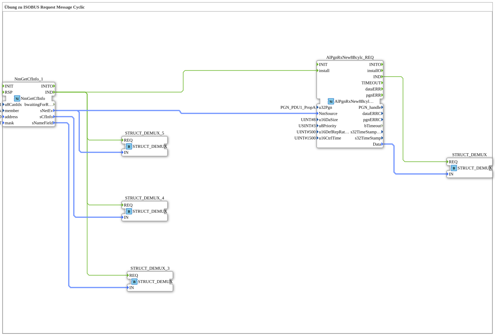

# Uebung_133_AX: Übung zu ISOBUS Request Message Cyclic

This article describes the 4diac IDE sub-application Uebung_133_AX (Übung zu ISOBUS Request Message Cyclic).

----

## Objective of the Exercise

The main objective of this exercise is to implement the following requirement: **Übung zu ISOBUS Request Message Cyclic**

-----

## Description and Components

The exercise consists of the sub-application Uebung_133_AX.SUB, which uses the following function block structure:

### Instantiated Function Blocks (FBs)

- **STRUCT_DEMUX_3**: Instance of type eclipse4diac::convert::STRUCT_DEMUX.
- **NmGetCfInfo_1**: Instance of type isobus::pgn::NmGetCfInfo.
  - Parameter u8CanIdx = NODE1
  - Parameter member = network
  - Parameter address = PEAK_ADD
  - Parameter mask = PEAK_FLT
- **STRUCT_DEMUX_4**: Instance of type eclipse4diac::convert::STRUCT_DEMUX.
- **STRUCT_DEMUX_5**: Instance of type eclipse4diac::convert::STRUCT_DEMUX.
- **AlPgnRxNew8Bcylc_REQ**: Instance of type isobus::pgn::rx::AlPgnRxNew8Bcylc_REQ.
  - Parameter u32Pgn = PGN_PDU1_PropA
  - Parameter u16DaSize = 8
  - Parameter u8Priority = 3
  - Parameter u16DefRepRate = 500
  - Parameter u16CtrlTime = 1500
- **STRUCT_DEMUX**: Instance of type eclipse4diac::convert::STRUCT_DEMUX.

### Connections and Interfaces

**Event Connections:**
- NmGetCfInfo_1.IND -> STRUCT_DEMUX_3.REQ
- NmGetCfInfo_1.IND -> STRUCT_DEMUX_4.REQ
- NmGetCfInfo_1.IND -> STRUCT_DEMUX_5.REQ
- NmGetCfInfo_1.IND -> AlPgnRxNew8Bcylc_REQ.install
- AlPgnRxNew8Bcylc_REQ.IND -> STRUCT_DEMUX.REQ

**Data Connections:**
- NmGetCfInfo_1.sNameField -> STRUCT_DEMUX_3.IN
- NmGetCfInfo_1.sNetEv -> STRUCT_DEMUX_5.IN
- NmGetCfInfo_1.sCfInfo -> STRUCT_DEMUX_4.IN
- NmGetCfInfo_1.sNetEv -> AlPgnRxNew8Bcylc_REQ.NmSource
- AlPgnRxNew8Bcylc_REQ.Data -> STRUCT_DEMUX.IN

-----

## Sequence and Operation

1. **Initialization**: Upon system startup, all participating function blocks are initialized.
2. **Event and Signal Processing**: State changes at the inputs trigger events that are forwarded to downstream function blocks across the defined connections.
3. **Output Update**: The receiving function blocks process incoming events and data values to update physical and logical outputs accordingly.

-----

## Summary

Exercise Uebung_133_AX provides a clear demonstration of modular IEC 61499 application design in 4diac IDE.
