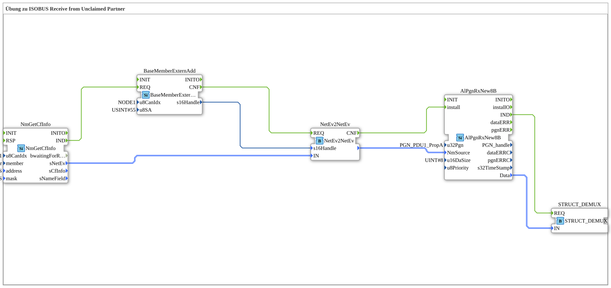

# Uebung_134_AX: Übung zu ISOBUS Receive from Unclaimed Partner

This article describes the 4diac IDE sub-application Uebung_134_AX (Übung zu ISOBUS Receive from Unclaimed Partner).

----

## Objective of the Exercise

The main objective of this exercise is to implement the following requirement: **Übung zu ISOBUS Receive from Unclaimed Partner**

-----

## Description and Components

The exercise consists of the sub-application Uebung_134_AX.SUB, which uses the following function block structure:

### Instantiated Function Blocks (FBs)

- **BaseMemberExternAdd**: Instance of type isobus::pgn::BaseMemberExternAdd.
  - Parameter u8CanIdx = NODE1
  - Parameter u8SA = 55
- **AlPgnRxNew8B**: Instance of type isobus::pgn::rx::AlPgnRxNew8B.
  - Parameter u32Pgn = PGN_PDU1_PropA
  - Parameter u16DaSize = 8
- **NmGetCfInfo**: Instance of type isobus::pgn::NmGetCfInfo.
  - Parameter u8CanIdx = NODE1
  - Parameter member = thisMember
  - Parameter address = ADD_ALL_PASS
  - Parameter mask = FLT_ALL_PASS
- **NetEv2NetEv**: Instance of type isobus::pgn::NetEv2NetEv.
- **STRUCT_DEMUX**: Instance of type eclipse4diac::convert::STRUCT_DEMUX.

### Connections and Interfaces

**Event Connections:**
- BaseMemberExternAdd.CNF -> NetEv2NetEv.REQ
- NetEv2NetEv.CNF -> AlPgnRxNew8B.install
- NmGetCfInfo.IND -> BaseMemberExternAdd.REQ
- AlPgnRxNew8B.IND -> STRUCT_DEMUX.REQ

**Data Connections:**
- BaseMemberExternAdd.s16Handle -> NetEv2NetEv.s16Handle
- NmGetCfInfo.sNetEv -> NetEv2NetEv.IN
- NetEv2NetEv. -> AlPgnRxNew8B.NmSource
- AlPgnRxNew8B.Data -> STRUCT_DEMUX.IN

-----

## Sequence and Operation

1. **Initialization**: Upon system startup, all participating function blocks are initialized.
2. **Event and Signal Processing**: State changes at the inputs trigger events that are forwarded to downstream function blocks across the defined connections.
3. **Output Update**: The receiving function blocks process incoming events and data values to update physical and logical outputs accordingly.

-----

## Summary

Exercise Uebung_134_AX provides a clear demonstration of modular IEC 61499 application design in 4diac IDE.
