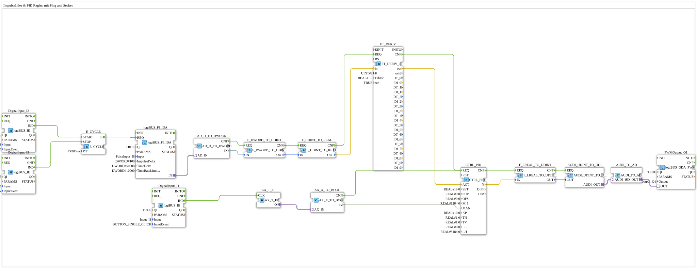

# Uebung_153_AX: Impulszähler & PID Regler, mit Plug and Socket

This article describes the 4diac IDE sub-application Uebung_153_AX (Impulszähler & PID Regler, mit Plug and Socket).

----

## Objective of the Exercise

The main objective of this exercise is to implement the following requirement: **Impulszähler & PID Regler, mit Plug and Socket**

-----

## Description and Components

The exercise consists of the sub-application Uebung_153_AX.SUB, which uses the following function block structure:

### Instantiated Function Blocks (FBs)

- **logiBUS_PI_IDA**: Instance of type logiBUS::io::PI::logiBUS_PI_IDA.
  - Parameter QI = TRUE
  - Parameter Input = PulseInput_I8
  - Parameter ImpulseDelta = 100
  - Parameter TimeDelta = 50000
  - Parameter TimeRateLimit = 10000
- **AD_D_TO_DWORD**: Instance of type adapter::conversion::unidirectional::AD_D_TO_DWORD.
- **FT_DERIV**: Instance of type OSCAT::Basic::POUs::Engineering::Control::FT_DERIV_10.
  - Parameter K = 9
  - Parameter Faktor = 1.0
  - Parameter run = TRUE
- **F_DWORD_TO_UDINT**: Instance of type iec61131::conversion::F_DWORD_TO_UDINT.
- **F_UDINT_TO_REAL**: Instance of type iec61131::conversion::F_UDINT_TO_REAL.
- **PWMOutput_Q1**: Instance of type logiBUS::io::DQ::logiBUS_QDA_PWM.
  - Parameter QI = TRUE
  - Parameter Output = Output_Q1
- **CTRL_PID**: Instance of type OSCAT::Basic::POUs::Engineering::Control::CTRL_PID.
  - Parameter SET = 16.0
  - Parameter SUP = 0.0
  - Parameter OFS = 0.0
  - Parameter M_I = 8184.0
  - Parameter KP = 10.0
  - Parameter TN = 1.0
  - Parameter TV = 1.0
  - Parameter LL = 0.0
  - Parameter LH = 8184.0
- **DigitalInput_I1**: Instance of type logiBUS::io::DI::logiBUS_IE.
  - Parameter QI = TRUE
  - Parameter Input = Input_I1
  - Parameter InputEvent = BUTTON_SINGLE_CLICK
- **AX_T_FF**: Instance of type adapter::events::unidirectional::AX_T_FF.
- **AX_X_TO_BOOL**: Instance of type adapter::conversion::unidirectional::AX_X_TO_BOOL.
- **F_LREAL_TO_UDINT**: Instance of type iec61131::conversion::F_LREAL_TO_UDINT.
- **AUDI_UDINT_TO_UDI**: Instance of type adapter::conversion::unidirectional::AUDI_UDINT_TO_UDI.
- **AUDI_TO_AD**: Instance of type adapter::conversion::unidirectional::AUDI_TO_AD.
- **E_CYCLE**: Instance of type iec61499::events::E_CYCLE.
  - Parameter DT = T#200ms
- **DigitalInput_I2**: Instance of type logiBUS::io::DI::logiBUS_IE.
  - Parameter QI = TRUE
  - Parameter Input = Input_I2
  - Parameter InputEvent = BUTTON_SINGLE_CLICK
- **DigitalInput_I3**: Instance of type logiBUS::io::DI::logiBUS_IE.
  - Parameter QI = TRUE
  - Parameter Input = Input_I3
  - Parameter InputEvent = BUTTON_SINGLE_CLICK

### Connections and Interfaces

**Adapter Connections:**
- logiBUS_PI_IDA.IN -> AD_D_TO_DWORD.AD_IN
- AX_T_FF.Q -> AX_X_TO_BOOL.AX_IN
- AUDI_UDINT_TO_UDI.AUDI_OUT -> AUDI_TO_AD.AUDI_IN
- AUDI_TO_AD.AD_OUT -> PWMOutput_Q1.OUT

**Event Connections:**
- AD_D_TO_DWORD.CNF -> F_DWORD_TO_UDINT.REQ
- F_DWORD_TO_UDINT.CNF -> F_UDINT_TO_REAL.REQ
- F_UDINT_TO_REAL.CNF -> FT_DERIV.REQ
- FT_DERIV.CNF -> CTRL_PID.REQ
- DigitalInput_I1.IND -> AX_T_FF.CLK
- AX_X_TO_BOOL.CNF -> CTRL_PID.REQ
- CTRL_PID.CNF -> F_LREAL_TO_UDINT.REQ
- F_LREAL_TO_UDINT.CNF -> AUDI_UDINT_TO_UDI.REQ
- DigitalInput_I2.IND -> E_CYCLE.START
- DigitalInput_I3.IND -> E_CYCLE.STOP
- E_CYCLE.EO -> logiBUS_PI_IDA.REQ

**Data Connections:**
- AD_D_TO_DWORD.IN -> F_DWORD_TO_UDINT.IN
- F_DWORD_TO_UDINT.OUT -> F_UDINT_TO_REAL.IN
- F_UDINT_TO_REAL.OUT -> FT_DERIV.in
- FT_DERIV.out -> CTRL_PID.ACT
- AX_X_TO_BOOL.IN -> CTRL_PID.MAN
- CTRL_PID.Y -> F_LREAL_TO_UDINT.IN
- F_LREAL_TO_UDINT.OUT -> AUDI_UDINT_TO_UDI.OUT

-----

## Sequence and Operation

1. **Initialization**: Upon system startup, all participating function blocks are initialized.
2. **Event and Signal Processing**: State changes at the inputs trigger events that are forwarded to downstream function blocks across the defined connections.
3. **Output Update**: The receiving function blocks process incoming events and data values to update physical and logical outputs accordingly.

-----

## Summary

Exercise Uebung_153_AX provides a clear demonstration of modular IEC 61499 application design in 4diac IDE.
