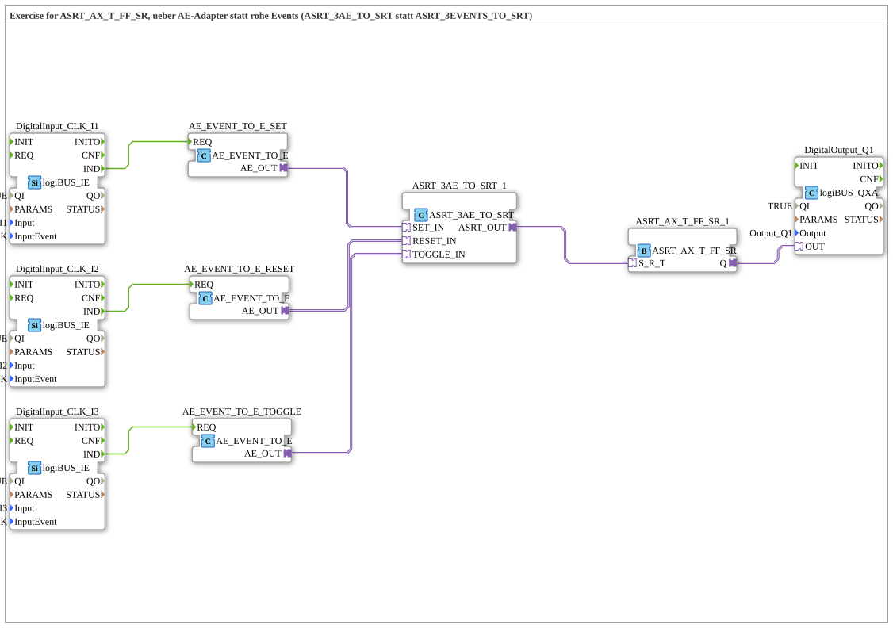

# Exercise_172b_ASRT: SET/RESET/TOGGLE Latch via AE Adapter instead of Raw Events

* * * * * * * * * *

## Introduction

This exercise implements the same function as `Uebung_172_ASRT` (buttons `I1` = SET click, `I2` = RESET click, `I3` = TOGGLE click, latching via `ASRT_AX_T_FF_SR`), but it connects the three click events to the latch using **AE adapter sockets** instead of raw event connections. As with `Uebung_171b_ASR`, the reason is the same here: a `AE` plug is a fully functional adapter (can be further processed, for example, with `AE_SPLIT_2`), whereas a raw event can only be wired via EventConnections.

## Function Blocks (FBs) Used

- **DigitalInput_CLK_I1**, **DigitalInput_CLK_I2**, **DigitalInput_CLK_I3**: logiBUS click inputs (Type: `logiBUS::io::DI::logiBUS_IE`)

- **Parameters**: `QI = TRUE`, `Input = Input_I1`/`Input_I2`/`Input_I3`, `InputEvent = BUTTON_SINGLE_CLICK`

- **Explanation**: Each reports a single button click as an event (`IND`) at the respective physical input.

**DigitalInput_CLK_I1**, **DigitalInput_CLK_I2**, **DigitalInput_CLK_I3**: logiBUS click inputs (Type: `logiBUS::io::DI::logiBUS_IE`)

**Parameters**: `QI = TRUE`, `Input = Input_I1`/`Input_I2`/`Input_I3`, `InputEvent = BUTTON_SINGLE_CLICK`

**Explanation**: Each reports a single button click as an event (`IND`) at the respective physical input. - **AE_EVENT_TO_E_SET**, **AE_EVENT_TO_E_RESET**, **AE_EVENT_TO_E_TOGGLE**: Event-to-adapter bridge (Type: `adapter::conversion::unidirectional::AE_EVENT_TO_E`)

- **Parameters**: None

- **Explanation**: Convert one raw click event (`REQ`) into a typed `AE` adapter output (`AE_OUT`).

- **ASRT_3AE_TO_SRT_1**: AE-to-ASRT Converter (Type: `adapter::conversion::unidirectional::ASRT_3AE_TO_SRT`)

- **Parameters**: None

- **Description**: Accepts three `AE` adapter inputs (`SET_IN`, `RESET_IN`, `TOGGLE_IN`) and combines them into a single `ASRT` adapter output (`ASRT_OUT`).

- **ASRT_AX_T_FF_SR_1**: Set-Reset-Toggle Latch (Type: `adapter::events::unidirectional::ASRT_AX_T_FF_SR`)

- **Parameters**: None

- **Description**: Locks the bundled `S_R_T` input: SET turns `Q` ON, RESET turns `Q` OFF, TOGGLE reverses the current state.

**ASRT_AX_T_FF_SR_1**: Set-Reset-Toggle Latch (Type: `adapter::events::unidirectional::ASRT_AX_T_FF_SR`)

**Parameters**: None

**Description**: Locks the bundled `S_R_T` input: SET turns `Q` ON, RESET turns `Q` OFF, TOGGLE reverses the current state. - **DigitalOutput_Q1**: logiBUS digital output (Type: `logiBUS::io::DQ::logiBUS_QXA`)

- **Parameters**: `QI = TRUE`, `Output = Output_Q1`

- **Explanation**: Outputs the latch state `Q` as a physical output signal.

### Sub-Blocks: None

This exercise does not use any further sub-blocks; all function blocks are located directly at the top level of the sub-app.

## Program Flow and Connections

1. **Click on I1 (SET)**: `DigitalInput_CLK_I1.IND` triggers `AE_EVENT_TO_E_SET.REQ`, which converts the event into a `AE` adapter output.

2. **Click on I2 (RESET)**: Analog triggers `DigitalInput_CLK_I2.IND` and `AE_EVENT_TO_E_RESET.REQ`.

3. **Click on I3 (TOGGLE)**: Analog triggers `DigitalInput_CLK_I3.IND` and `AE_EVENT_TO_E_TOGGLE.REQ`.

4. **Bundling to ASRT**: The three `AE_OUT` outputs are routed to `ASRT_3AE_TO_SRT_1.SET_IN`, `RESET_IN`, and `TOGGLE_IN`. The function block combines them into `ASRT_OUT`.

5. **Locking**: `ASRT_3AE_TO_SRT_1.ASRT_OUT` is routed to `ASRT_AX_T_FF_SR_1.S_R_T`. SET → `Q = TRUE`, RESET → `Q = FALSE`, TOGGLE → `Q` toggles the state.

6. **Output**: `ASRT_AX_T_FF_SR_1.Q` directly drives `DigitalOutput_Q1.OUT`.

## Summary

Exercise 172b demonstrates the same SET/RESET/TOGGLE latch as Exercise 172, but deliberately uses AE adapter sockets instead of raw events: each `AE_EVENT_TO_E` bridges the click event to the typed `AE` plug, and `ASRT_3AE_TO_SRT` combines all three into a single `ASRT` signal for the latch `ASRT_AX_T_FF_SR`. The additional effort compared to the raw event version is worthwhile as soon as the signal itself needs to be further processed like an adapter.

---

### 🌐 Related topic subpages on ms-muc-docs.de

- [🌐 Eclipse 4diac IDE & Color Reference on ms-muc-docs.de](https://www.ms-muc-docs.de/iec-61499/eclipse-4diac/)
