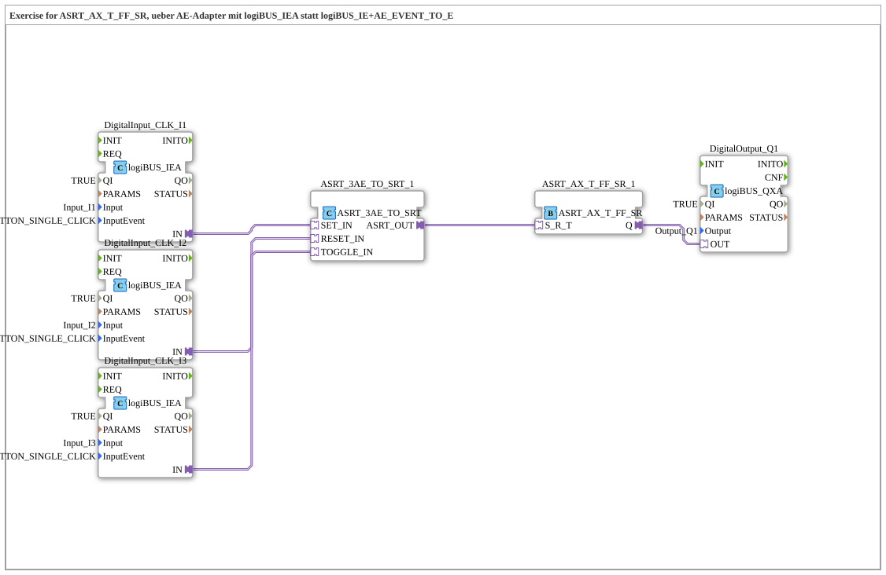

# Exercise_172c_ASRT: SET/RESET/TOGGLE Latch with logiBUS_IEA (AE adapter already installed)

* * * * * * * * * *

## Introduction

This exercise implements the same function as `Uebung_172b_ASRT` (button `I1` = SET click, `I2` = RESET click, `I3` = TOGGLE click, latching via `ASRT_AX_T_FF_SR`), but eliminates the manually wired `AE_EVENT_TO_E` bridge per channel: the input block `logiBUS_IEA` already has the `AE` adapter plug built in, just like `logiBUS_IX` → `logiBUS_IXA` for level signals, but only for event inputs.

## Function Blocks (FBs) Used

- **DigitalInput_CLK_I1**, **DigitalInput_CLK_I2**, **DigitalInput_CLK_I3**: logiBUS click inputs with integrated AE adapter (Type: `logiBUS::io::DI::logiBUS_IEA`)

- **Parameters**: `QI = TRUE`, `Input = Input_I1`/`Input_I2`/`Input_I3`, `InputEvent = BUTTON_SINGLE_CLICK`

- **Explanation**: Internally encapsulate a `logiBUS_IE` and redirect its click event directly to a dedicated `AE` adapter output (`IN`) – without separate `AE_EVENT_TO_E` block as in `Uebung_172b_ASRT`.

- **ASRT_3AE_TO_SRT_1**: AE-to-ASRT converter (Type: `adapter::conversion::unidirectional::ASRT_3AE_TO_SRT`)

- **Parameters**: none

- **Explanation**: Accepts three `AE` adapter inputs (`SET_IN`, `RESET_IN`, `TOGGLE_IN`) and combines them into a single `ASRT` adapter output (`ASRT_OUT`).

- **ASRT_AX_T_FF_SR_1**: Set-Reset-Toggle Latch (Type: `adapter::events::unidirectional::ASRT_AX_T_FF_SR`)

- **Parameters**: None

- **Description**: Locks the bundled `S_R_T` input: SET turns `Q` ON, RESET turns `Q` OFF, TOGGLE reverses the current state.

- **DigitalOutput_Q1**: logiBUS digital output (Type: `logiBUS::io::DQ::logiBUS_QXA`)

- **Parameters**: `QI = TRUE`, `Output = Output_Q1`

- **Explanation**: Outputs the latch state `Q` as a physical output signal.

### Sub-Blocks: None

This exercise does not use any further sub-blocks; all function blocks are located directly at the top level of the sub-app.

## Program Flow and Connections

1. **Click on I1 (SET)**: `DigitalInput_CLK_I1` (`logiBUS_IEA`) detects the click internally and provides it directly as the `AE` adapter output (`IN`).

2. **Click on I2 (RESET)**: Similarly, `DigitalInput_CLK_I2.IN` provides the reset branch as the `AE` adapter.

3. **Click on I3 (TOGGLE)**: Similarly, `DigitalInput_CLK_I3.IN` provides the toggle branch as the `AE` adapter.

4. **Bundling to ASRT**: The three outputs of `IN` are routed directly to `ASRT_3AE_TO_SRT_1.SET_IN`/`RESET_IN`/`TOGGLE_IN` – without an intermediate block. The block combines them into `ASRT_OUT`.

5. **Locking**: `ASRT_3AE_TO_SRT_1.ASRT_OUT` is routed to `ASRT_AX_T_FF_SR_1.S_R_T`. SET → `Q = TRUE`, RESET → `Q = FALSE`, TOGGLE → `Q` toggles the state.

6. **Output**: `ASRT_AX_T_FF_SR_1.Q` directly drives `DigitalOutput_Q1.OUT`.

## Summary

Exercise 172c exhibits the exact same latching behavior as Exercises 172 and 172b, but requires the fewest components: `logiBUS_IEA` replaces `logiBUS_IE` and includes the `AE` adapter plug, eliminating the need for the three `AE_EVENT_TO_E` components required in Exercise 172b. A comparison of all three SubApps in the 4diac editor reveals the same functional core with progressively more compact wiring.

 ---

### 🌐 Related topic subpages on ms-muc-docs.de

- [🌐 Eclipse 4diac IDE & Color Reference on ms-muc-docs.de](https://www.ms-muc-docs.de/iec-61499/eclipse-4diac/)
