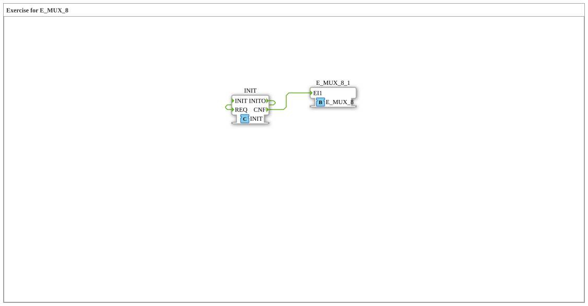

# Uebung_173_AX: Exercise for E_MUX_8

This article describes the 4diac IDE sub-application Uebung_173_AX (Exercise for E_MUX_8).

----

## Objective of the Exercise

The main objective of this exercise is to implement the following requirement: **Exercise for E_MUX_8**

-----

## Description and Components

The exercise consists of the sub-application Uebung_173_AX.SUB, which uses the following function block structure:

### Instantiated Function Blocks (FBs)

- **E_MUX_8_1**: Instance of type iec61499::events::E_MUX_8.
- **INIT**: Instance of type iec61131::booleanOperators::INIT.

### Connections and Interfaces

**Event Connections:**
- INIT.INITO -> INIT.REQ
- INIT.CNF -> E_MUX_8_1.EI1

### Notes from the Model

> TODO

-----

## Sequence and Operation

1. **Initialization**: Upon system startup, all participating function blocks are initialized.
2. **Event and Signal Processing**: State changes at the inputs trigger events that are forwarded to downstream function blocks across the defined connections.
3. **Output Update**: The receiving function blocks process incoming events and data values to update physical and logical outputs accordingly.

-----

## Summary

Exercise Uebung_173_AX provides a clear demonstration of modular IEC 61499 application design in 4diac IDE.
