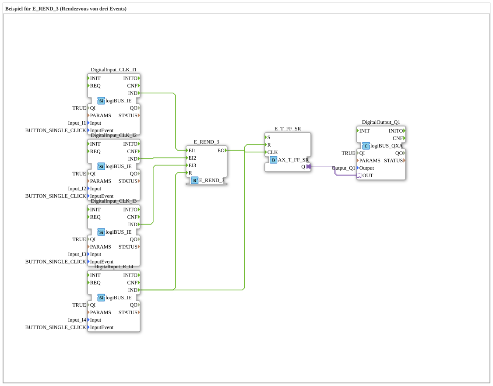

# Uebung_180_AX: Beispiel für E_REND_3 (Rendezvous von drei Events)

This article describes the 4diac IDE sub-application Uebung_180_AX (Beispiel für E_REND_3 (Rendezvous von drei Events)).

----

## Objective of the Exercise

The main objective of this exercise is to implement the following requirement: **Beispiel für E_REND_3 (Rendezvous von drei Events)**

-----

## Description and Components

The exercise consists of the sub-application Uebung_180_AX.SUB, which uses the following function block structure:

### Instantiated Function Blocks (FBs)

- **DigitalOutput_Q1**: Instance of type logiBUS::io::DQ::logiBUS_QXA.
  - Parameter QI = TRUE
  - Parameter Output = Output_Q1
- **DigitalInput_CLK_I1**: Instance of type logiBUS::io::DI::logiBUS_IE.
  - Parameter QI = TRUE
  - Parameter Input = Input_I1
  - Parameter InputEvent = BUTTON_SINGLE_CLICK
- **DigitalInput_CLK_I2**: Instance of type logiBUS::io::DI::logiBUS_IE.
  - Parameter QI = TRUE
  - Parameter Input = Input_I2
  - Parameter InputEvent = BUTTON_SINGLE_CLICK
- **DigitalInput_CLK_I3**: Instance of type logiBUS::io::DI::logiBUS_IE.
  - Parameter QI = TRUE
  - Parameter Input = Input_I3
  - Parameter InputEvent = BUTTON_SINGLE_CLICK
- **DigitalInput_R_I4**: Instance of type logiBUS::io::DI::logiBUS_IE.
  - Parameter QI = TRUE
  - Parameter Input = Input_I4
  - Parameter InputEvent = BUTTON_SINGLE_CLICK
- **E_REND_3**: Instance of type iec61499::events::E_REND_3.
- **E_T_FF_SR**: Instance of type adapter::events::unidirectional::AX_T_FF_SR.

### Connections and Interfaces

**Adapter Connections:**
- E_T_FF_SR.Q -> DigitalOutput_Q1.OUT

**Event Connections:**
- DigitalInput_CLK_I1.IND -> E_REND_3.EI1
- DigitalInput_CLK_I2.IND -> E_REND_3.EI2
- DigitalInput_CLK_I3.IND -> E_REND_3.EI3
- DigitalInput_R_I4.IND -> E_REND_3.R
- E_REND_3.EO -> E_T_FF_SR.CLK
- DigitalInput_R_I4.IND -> E_T_FF_SR.R

-----

## Sequence and Operation

1. **Initialization**: Upon system startup, all participating function blocks are initialized.
2. **Event and Signal Processing**: State changes at the inputs trigger events that are forwarded to downstream function blocks across the defined connections.
3. **Output Update**: The receiving function blocks process incoming events and data values to update physical and logical outputs accordingly.

-----

## Summary

Exercise Uebung_180_AX provides a clear demonstration of modular IEC 61499 application design in 4diac IDE.
