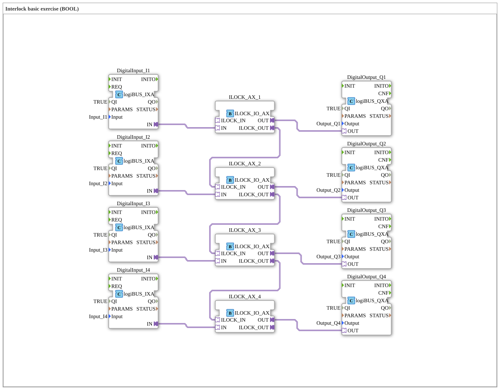

# Uebung_201_Interlock_BOOL_AX: Interlock basic exercise (BOOL)

This article describes the 4diac IDE sub-application Uebung_201_Interlock_BOOL_AX (Interlock basic exercise (BOOL)).

----

## Objective of the Exercise

The main objective of this exercise is to implement the following requirement: **Interlock basic exercise (BOOL)**

-----

## Description and Components

The exercise consists of the sub-application Uebung_201_Interlock_BOOL_AX.SUB, which uses the following function block structure:

### Instantiated Function Blocks (FBs)

- **DigitalOutput_Q1**: Instance of type logiBUS::io::DQ::logiBUS_QXA.
  - Parameter QI = TRUE
  - Parameter Output = Output_Q1
- **DigitalOutput_Q4**: Instance of type logiBUS::io::DQ::logiBUS_QXA.
  - Parameter QI = TRUE
  - Parameter Output = Output_Q4
- **DigitalInput_I2**: Instance of type logiBUS::io::DI::logiBUS_IXA.
  - Parameter QI = TRUE
  - Parameter Input = Input_I2
- **DigitalOutput_Q3**: Instance of type logiBUS::io::DQ::logiBUS_QXA.
  - Parameter QI = TRUE
  - Parameter Output = Output_Q3
- **DigitalInput_I3**: Instance of type logiBUS::io::DI::logiBUS_IXA.
  - Parameter QI = TRUE
  - Parameter Input = Input_I3
- **DigitalOutput_Q2**: Instance of type logiBUS::io::DQ::logiBUS_QXA.
  - Parameter QI = TRUE
  - Parameter Output = Output_Q2
- **ILOCK_AX_3**: Instance of type logiBUS::signalprocessing::interlock::ILOCK_IO_AX.
- **ILOCK_AX_4**: Instance of type logiBUS::signalprocessing::interlock::ILOCK_IO_AX.
- **ILOCK_AX_1**: Instance of type logiBUS::signalprocessing::interlock::ILOCK_IO_AX.
- **ILOCK_AX_2**: Instance of type logiBUS::signalprocessing::interlock::ILOCK_IO_AX.
- **DigitalInput_I4**: Instance of type logiBUS::io::DI::logiBUS_IXA.
  - Parameter QI = TRUE
  - Parameter Input = Input_I4
- **DigitalInput_I1**: Instance of type logiBUS::io::DI::logiBUS_IXA.
  - Parameter QI = TRUE
  - Parameter Input = Input_I1

### Connections and Interfaces

**Adapter Connections:**

- DigitalInput_I3.IN -> ILOCK_AX_3.IN
- DigitalInput_I4.IN -> ILOCK_AX_4.IN
- ILOCK_AX_4.OUT -> DigitalOutput_Q4.OUT
- ILOCK_AX_3.OUT -> DigitalOutput_Q3.OUT
- DigitalInput_I1.IN -> ILOCK_AX_1.IN
- ILOCK_AX_1.OUT -> DigitalOutput_Q1.OUT
- DigitalInput_I2.IN -> ILOCK_AX_2.IN
- ILOCK_AX_2.OUT -> DigitalOutput_Q2.OUT
- ILOCK_AX_1.ILOCK_OUT -> ILOCK_AX_2.ILOCK_IN
- ILOCK_AX_2.ILOCK_OUT -> ILOCK_AX_3.ILOCK_IN
- ILOCK_AX_3.ILOCK_OUT -> ILOCK_AX_4.ILOCK_IN

-----

## Sequence and Operation

1. **Initialization**: Upon system startup, all participating function blocks are initialized.
2. **Event and Signal Processing**: State changes at the inputs trigger events that are forwarded to downstream function blocks across the defined connections.
3. **Output Update**: The receiving function blocks process incoming events and data values to update physical and logical outputs accordingly.

-----

## Summary

Exercise Uebung_201_Interlock_BOOL_AX provides a clear demonstration of modular IEC 61499 application design in 4diac IDE.
