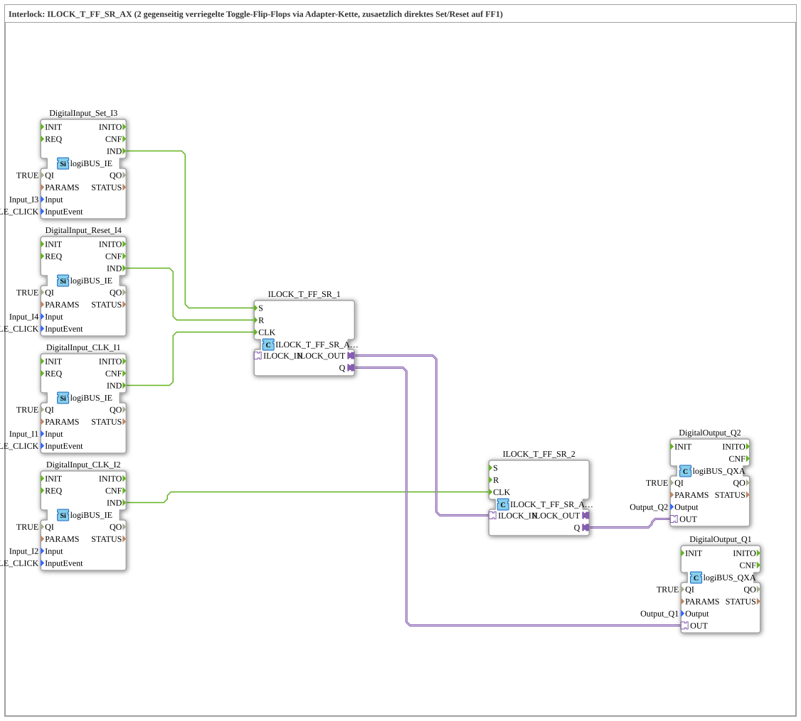

# Exercise_206b_AX: Interlock ILOCK_T_FF_SR_AX (2 mutually interlocked toggle flip-flops, plus direct set/reset on FF1)

* * * * * * * * * *

## Introduction

This exercise extends `Uebung_206_AX` (two mutually interlocked toggle flip-flops via `ILOCK_T_FF_AX`) by adding the last, previously unused interlock component: `ILOCK_T_FF_SR_AX`. In addition to the toggle input (`CLK`), this provides two direct event inputs, `S` (Set) and `R` (Reset) — shown only in the first instance. Of the two, only `S` acts on the other flip-flop via the interlocking chain (exactly like a CLK toggle to ON); `R` affects only the local output and leaves the partner flip-flop unchanged.

## Function Blocks (FBs) Used

- **DigitalInput_CLK_I1**: logiBUS event input (Type: `logiBUS::io::DI::logiBUS_IE`)

- **Parameters**: QI = TRUE, Input = Input_I1, InputEvent = BUTTON_SINGLE_CLICK

- **Explanation**: Clicking I1 toggles FF1 (`ILOCK_T_FF_SR_1.CLK`).

- **DigitalInput_Set_I3**: logiBUS event input (Type: `logiBUS::io::DI::logiBUS_IE`)

- **Parameters**: QI = TRUE, Input = Input_I3, InputEvent = BUTTON_SINGLE_CLICK

- **Explanation**: Clicking I3 directly sets FF1 (`ILOCK_T_FF_SR_1.S`), regardless of its previous state.

- **DigitalInput_Reset_I4**: logiBUS event input (Type: `logiBUS::io::DI::logiBUS_IE`)

- **Parameters**: QI = TRUE, Input = Input_I4, InputEvent = BUTTON_SINGLE_CLICK

- **Explanation**: Clicking I4 directly resets FF1 (`ILOCK_T_FF_SR_1.R`).

- **DigitalInput_CLK_I2**: logiBUS event input (Type: `logiBUS::io::DI::logiBUS_IE`)

- **Parameters**: QI = TRUE, Input = Input_I2, InputEvent = BUTTON_SINGLE_CLICK

- **Explanation**: Clicking I2 toggles FF2 (`ILOCK_T_FF_SR_2.CLK`). No direct set/reset inputs are wired for FF2.

- **ILOCK_T_FF_SR_1**, **ILOCK_T_FF_SR_2**: Lockable toggle flip-flop with set/reset functionality (Type: `logiBUS::signalprocessing::interlock::ILOCK_T_FF_SR_AX`)

- **Parameters**: None

- **Explanation**: Each instance toggles its output `Q` at `CLK`, but can also set or reset it directly via `S`/`R`. The two instances are mutually interlocked via the adapter chain `ILOCK_OUT`→`ILOCK_IN`: If one instance is turned on (via CLK toggle OR via direct `S`), the other is automatically turned off.

- **DigitalOutput_Q1**, **DigitalOutput_Q2**: logiBUS digital outputs (Type: `logiBUS::io::DQ::logiBUS_QXA`)

- **Parameters**: QI = TRUE, Output = Output_Q1 or Output_Q2

- **Explanation**: Pass the states of `ILOCK_T_FF_SR_1.Q` or `ILOCK_T_FF_SR_2.Q` to the peripherals.

### Sub-Blocks: None

This exercise does not use any further sub-blocks; all FBs are located directly at the top level of the SubApp.

## Program Flow and Connections

1. `DigitalInput_CLK_I1.IND` → `ILOCK_T_FF_SR_1.CLK`: Click on I1 toggles FF1.

2. `DigitalInput_Set_I3.IND` → `ILOCK_T_FF_SR_1.S`: Clicking I3 sets FF1 directly (without toggle logic).

3. `DigitalInput_Reset_I4.IND` → `ILOCK_T_FF_SR_1.R`: Clicking I4 resets FF1 directly.

4. `DigitalInput_CLK_I2.IND` → `ILOCK_T_FF_SR_2.CLK`: Clicking I2 toggles FF2.

5. `ILOCK_T_FF_SR_1.ILOCK_OUT` → `ILOCK_T_FF_SR_2.ILOCK_IN`: The interlock chain transfers every transition of FF1 to ON (via CLK toggle or direct set) to FF2 and thereby turns it off; a transition to OFF (via CLK toggle or direct reset) is not transferred.

6. `ILOCK_T_FF_SR_1.Q` → `DigitalOutput_Q1.OUT`, `ILOCK_T_FF_SR_2.Q` → `DigitalOutput_Q2.OUT`.

7. **Test Procedure**: Click I1 (CLK FF1) → Q1 ON, Q2 automatically OFF (as in `Uebung_206_AX`). Click I3 (Set FF1) → same result, but without toggle behavior – Q1 is guaranteed to be ON afterward, regardless of the previous state, and locks FF2 just like a CLK toggle. Click I4 (Reset FF1) → Q1 OFF, **Q2 remains unchanged**, since a reset does not send a locking signal to the chain – unlike toggling to ON or a direct set.

## Summary

Exercise 206b_AX demonstrates the last, previously unused interlock block, `ILOCK_T_FF_SR_AX`: It extends the mutually interlocked toggle flip-flop pair known from `Uebung_206_AX` by adding direct set/reset inputs. The asymmetry in the interlocking behavior is important: A state change to ON (via toggle or direct set) always locks the other flip-flop, while a direct reset does not affect the interlocking chain and leaves the partner flip-flop unchanged.

---

### 🌐 Related topic subpages on ms-muc-docs.de

- [🌐 Eclipse 4diac IDE & color reference on ms-muc-docs.de ](https://www.ms-muc-docs.de/iec-61499/eclipse-4diac/)
