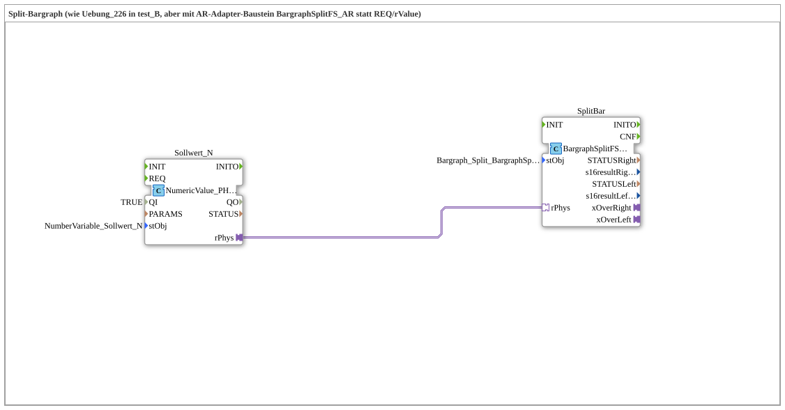

# Exercise_226_AX: Split Bargraph with BargraphSplitFS_AR

* * * * * * * * * *

## Introduction

This exercise is the adapter version of [Exercise 226](../../test_B/Uebungen_doc/Uebung_226.md) (test_B): identical function — a setpoint controls a split bargraph (left/right) — but reading `InputNumber_Sollwert` is done via the AR adapter block `NumericValue_PHYSA` instead of a plain `REQ`/`IND` event. The bargraph control itself still uses the reusable composite function block `BargraphSplitFS`, now addressed via its new adapter wrapper `BargraphSplitFS_AR`.

## Function Blocks (FBs) Used

- **Setpoint_N** (`isobus::UT::io::NumericValue::NumericValue_PHYSA`): AR adapter variant of `NumericValue_PHYS`.

- **Parameters**: `QI = TRUE`, `stObj = NumberVariable_Sollwert_N`.

- **Explanation**: Reads the physical value of `InputNumber_Sollwert` and returns it as the AR adapter plug `rPhys`.

### Sub-Blocks: SplitBar (`isobus::UT::Q::BargraphSplitFS_AR`)

`BargraphSplitFS` itself does not have an AR adapter interface. Just as `PositionMarkerFSA` (Exercise 225b_AX) wraps the block `PositionMarkerFS` around an AR socket, `BargraphSplitFS_AR` (`isobus::UT::Q`) now encapsulates `BargraphSplitFS` in the same way:

- **Parameter of instance `SplitBar`**: `stObj = Bargraph_Split_BargraphSplit`.
- **Internal wiring** (within `.fbt` itself, not changed in this exercise): The AR adapter socket `rPhys` delivers event (`E1`) and data (`D1`) directly to a single internal instance `Inner` of type `BargraphSplitFS` (`rPhys.E1 → Inner.REQ`, `rPhys.D1 → Inner.rValue`) — thus the bracket logic for both sides of the bar is **not** duplicated, but reused unchanged. `Inner.xOverRight`/`Inner.xOverLeft` are passed out as separate AX adapter plugs (`xOverRight`, `xOverLeft`), just as `xOver`/`xUnder` are for `PositionMarkerFSA`. `stObj` is passed through 1:1 to `Inner`.

- **Block file**: `Ventilsteuerung\4diacIDE-workspace\.lib\isobus-3.0.0\typelib\UT\Q\BargraphSplitFS_AR.fbt`.

The existing blocks `NumericValue_PHYSA` and `BargraphSplitFS` themselves were not modified for this wrapper.

## Program Flow and Connections

1. **Read Setpoint**: `Sollwert_N` reads `InputNumber_Sollwert` (via `NumberVariable_Sollwert_N`) and outputs it as the AR plug `rPhys`.

2. **Connect Directly**: `Sollwert_N.rPhys → SplitBar.rPhys`. Unlike in Exercise 225b_AX (parallel actual value writing), the setpoint here only requires **one** consumer — therefore, `AR_SPLIT_2` is completely omitted, and the adapter socket is connected directly.

3. **Controlling the Bargraph**: Internally, `BargraphSplitFS_AR` groups the value as usual (common absolute value limit `r32MaxMagnitude`) and controls the left or right bargraph (`Bargraph_Split_BargraphSplit`) depending on its sign; if the limit is exceeded, it reports this via `xOverRight`/`xOverLeft` (not further wired in this exercise).

4. Everything runs exclusively via `<AdapterConnections>` — not a single plain event or data connection, just like with `Uebung_011b1_PHYSA`.

## Summary

Exercise 226_AX demonstrates the same wrapper concept as 225b_AX, this time for the split bar graph: `BargraphSplitFS_AR` encapsulates the proven `BargraphSplitFS` in an AR adapter socket without duplicating its bracket logic. Because only a single device requires the setpoint here, the `AR_SPLIT_2` distributor from 225b_AX is omitted—making the wiring even simpler. Functionally, this exercise is exactly the same as [Exercise 226](../../test_B/Uebungen_doc/Uebung_226.md) (test_B); only the wiring style differs. Exercise 227_AX then combines this exercise with 225b_AX, allowing a single setpoint to simultaneously control the triangle, bar graph, and actual value.

Exercise 226_AX ---

### 🌐 Related topic subpages on ms-muc-docs.de

- [🌐 Eclipse 4diac IDE & Color Reference on ms-muc-docs.de](https://www.ms-muc-docs.de/iec-61499/eclipse-4diac/)
