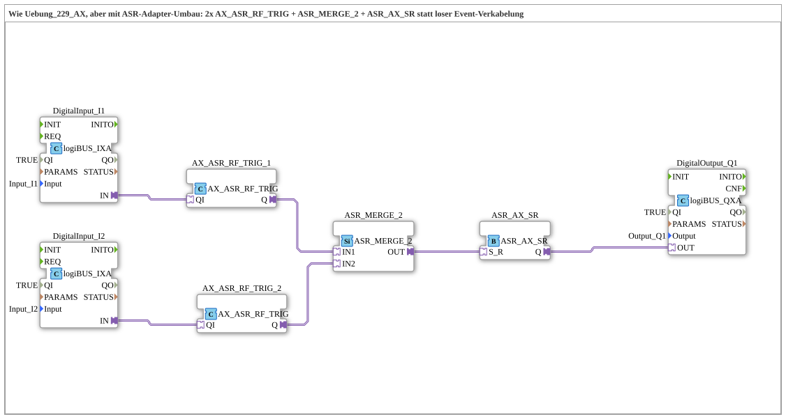

# Exercise_230_AX: Two Pushbuttons, One SR Latch (Last-Wins) with ASR Adapters

* * * * * * * * * *

## Introduction

This exercise implements the exact same function as `Uebung_229_AX.md` (two pushbuttons `I1`/`I2` jointly switch `Q1` via a Last-Wins SR Latch), but implements it entirely with the newer `ASR` adapter modules: instead of wiring each edge as a separate event, a `ASR` adapter combines Set and Reset in a single connector. This exercise demonstrates how the same logic can be implemented using type-safe AdapterConnections instead of raw EventConnections.

## Function Blocks (FBs) Used

- **DigitalInput_I1**, **DigitalInput_I2**: logiBUS digital inputs

- **Type**: `logiBUS::io::DI::logiBUS_IXA`

- **Parameters**: `QI = TRUE`, `Input = Input_I1`, and `Input_I2`

- **Explanation**: Connect the two physical button inputs to the adapter interface.

- **AX_ASR_RF_TRIG_1**, **AX_ASR_RF_TRIG_2**: Edge detection per button with ASR output

- **Type**: `adapter::events::unidirectional::AX_ASR_RF_TRIG`

- **Parameters**: none

- **Explanation**: Replaces `AX_RF_TRIG` from `Uebung_229_AX.md`. Internally, the same core (rising/falling edge) is used, but the two events are not exported as separate EventOutputs (`ER`/`EF`). Instead, they are written directly to a bundled `ASR` adapter output (`Q.SET`/`Q.RESET`).

- **ASR_MERGE_2**: Merges the two ASR sources

- **Type**: `adapter::events::unidirectional::ASR_MERGE_2`

- **Parameters**: None

- **Explanation**: Replaces the four separate EventConnections from `Uebung_229_AX.md`. Accepts the two `ASR` adapters from the two pushbuttons and combines SET with SET and RESET with RESET—the same OR logic as before, but now as a separate, reusable, type-safe function block instead of ad-hoc wiring.

- **ASR_AX_SR**: shared set-reset interlock with bundled ASR input

- **Type**: `adapter::events::unidirectional::ASR_AX_SR`

- **Parameters**: none

- **Explanation**: Replaces `AX_SR` from `Uebung_229_AX.md`. Identical ECC (Set-dominant, START→SET→RESET→SET), but Set and Reset are bundled via a single `ASR` socket (`S_R`) instead of as two separate EventInputs.

- **DigitalOutput_Q1**: logiBUS digital output

- **Type**: `logiBUS::io::DQ::logiBUS_QXA`

- **Parameters**: `QI = TRUE`, `Output = Output_Q1`

- **Description**: Passes the state of `ASR_AX_SR.Q` to the physical output `Q1`.

### Sub-Blocks: None

This exercise does not use any further sub-blocks; all FBs are located directly at the top level of the SubApp.

## Program Flow and Connections

This version uses only AdapterConnections—there are no longer any EventConnections elements:

1. `DigitalInput_I1.IN` → `AX_ASR_RF_TRIG_1.QI` and `DigitalInput_I2.IN` → `AX_ASR_RF_TRIG_2.QI`: the physical button states are passed to the respective edge detection.

2. `AX_ASR_RF_TRIG_1.Q` → `ASR_MERGE_2.IN1` and `AX_ASR_RF_TRIG_2.Q` → `ASR_MERGE_2.IN2`: the combined set/reset signals from both buttons are passed to the merge block.

3. `ASR_MERGE_2.OUT` → `ASR_AX_SR.S_R`: The combined ASR signal controls the common latch.

4. `ASR_AX_SR.Q` → `DigitalOutput_Q1.OUT`: The latch state is set to the physical output `Q1`.

**Behavior identical to `Uebung_229_AX.md`**: This is still a "last-wins" latch, not a hold logic. Pressing `I1` activates `Q1`. When `I1` is released, `Q1` immediately goes OFF, even if `I2` is still being held down—and vice versa. `ASR_MERGE_2` replicates the same OR connection of SET with SET and RESET with RESET that was created in `Uebung_229_AX.md` by the parallel EventConnections. From the outside, this behavior is indistinguishable from `Uebung_229_AX.md`; the only difference lies in the underlying architecture—a comparison of the two SubApps in the 4diac editor shows that `Uebung_229_AX.md` has a `EventConnections` element with four connections, while `Uebung_230_AX.md` has none.

## Summary

Exercise 230 demonstrates how logic built with loose event connections (`Uebung_229_AX.md`) can be completely rebuilt using type-safe adapter blocks without altering its behavior. `AX_ASR_RF_TRIG`, `ASR_MERGE_2`, and `ASR_AX_SR` encapsulate the same edge detection, OR logic, and set/reset logic as before, but now as reusable blocks wired via adapter connections. This exercise thus illustrates the added value of adapter technology compared to ad-hoc event wiring while maintaining the same functionality.

`AX_ASR_RF_TRIG`, `ASR_MERGE_2`, and `ASR_AX_SR` encapsulate the same edge detection, OR logic, and set/reset logic as before, but now as reusable blocks wired via adapter connections. ---

### 🌐 Related topic subpages on ms-muc-docs.de

- [🌐 Eclipse 4diac IDE & Color Reference on ms-muc-docs.de](https://www.ms-muc-docs.de/iec-61499/eclipse-4diac/)
