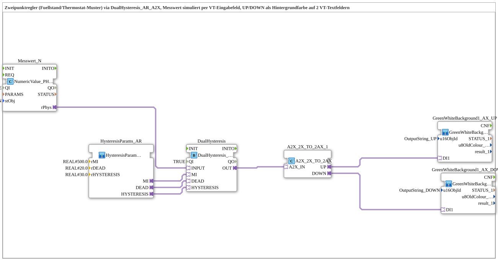

# Exercise_235_AX: Two-Point Controller with Hysteresis (VT Variant)

* * * * * * * * * *

## Introduction

This exercise demonstrates the same two-point controller pattern as `Uebung_234_AX` (dead zone + hysteresis around a mean value), but simulates the measured value using a VT input field instead of a real analog sensor and reports the controller state via the background color of two VT text fields instead of physical outputs.

## Function Blocks (FBs) Used

- **Messwert_N**: Terminal input (Type: `isobus::UT::io::NumericValue::NumericValue_PHYSA`)

- **Parameters**: QI = TRUE, stObj = InputNumber_Messwert_N

- **Explanation**: Reads the physical value as an AR plug (`rPhys`) whenever `InputNumber_Messwert` (VT object 9002, range 0–1000) changes. The operator then simulates the analog sensor from `Uebung_234_AX` in the pool `Workspace_Dreieck`.

- **HysteresisParams_AR**: Parameter block for the hysteresis thresholds

- **Parameters**: rMI = 500.0, rDEAD = 20.0, rHYSTERESIS = 30.0

- **Explanation**: Provides the three thresholds of the two-point controller – the same values as in `Uebung_234_AX`.

- **DualHysteresis**: Two-point controller with dead zone and hysteresis (Type: `logiBUS::signalprocessing::hysteresis::DualHysteresis_AR_A2X`)

- **Parameters**: QI = TRUE

- **Explanation**: Compares the measured value against `MI`: If the value exceeds `MI + DEAD + HYSTERESIS` (550), `UP` switches; If it falls below `MI - DEAD - HYSTERESIS` (450), `DOWN` switches. Switching off only occurs within the pure dead zone `MI ± DEAD` (480–520) – the difference between the switch-on and switch-off points prevents flutter.

- **A2X_2X_TO_2AX_1**: Unbundling of an A2X signal into two AX signals (Type: `adapter::conversion::unidirectional::A2X_2X_TO_2AX`)

- **Parameters**: none

- **Explanation**: `DualHysteresis.OUT` delivers UP/DOWN bundled as a single `A2X` signal. This function block splits the signal back into two separate `AX` signals because `GreenWhiteBackground1_AX` only has one `DI1` input per instance.

### Sub-function blocks: GreenWhiteBackground1_AX_UP, GreenWhiteBackground1_AX_DOWN

- **GreenWhiteBackground1_AX_UP** (Type: `MyLib::sys::GreenWhiteBackground1_AX`)

- **Parameters**: u16ObjId = OutputString_UP

- **Explanation**: Colors the VT text field `OutputString_UP` (VT object 11001) green as long as `UP` is active, otherwise white.

- **GreenWhiteBackground1_AX_DOWN** (Type: `MyLib::sys::GreenWhiteBackground1_AX`)

- **Parameter**: u16ObjId = OutputString_DOWN

- **Explanation**: Colors the VT text field `OutputString_DOWN` (VT object 11002) green as long as `DOWN` is active, otherwise white.

## Program Flow and Connections

1. If the operator changes `InputNumber_Messwert`, `Messwert_N.rPhys` returns the new value.

2. `DualHysteresis.INPUT` ← `Messwert_N.rPhys`: The simulated measured value is sent to the two-point controller.

3. `DualHysteresis.MI/DEAD/HYSTERESIS` ← `HysteresisParams_AR.MI/DEAD/HYSTERESIS`: The threshold values (500.0 / 20.0 / 30.0) are fixed.

4. `A2X_2X_TO_2AX_1.A2X_IN` ← `DualHysteresis.OUT`: The combined UP/DOWN signal is debundled.

5. `GreenWhiteBackground1_AX_UP.DI1` ← `A2X_2X_TO_2AX_1.UP`: The UP state colors `OutputString_UP`.

6. `GreenWhiteBackground1_AX_DOWN.DI1` ← `A2X_2X_TO_2AX_1.DOWN`: The DOWN state colors `OutputString_DOWN`.

7. On the actual terminal: Measured value significantly above 550 → `OutputString_UP` green, `OutputString_DOWN` remains white. Measured value significantly below 450 → reverse. Measured value between 480 and 520 → both white. Values between 520–550 and 450–480 (within the hysteresis, outside the dead zone) demonstrate the hysteresis behavior: The last active state is maintained until the respective dead zone boundary is reached.

## Summary

Exercise 235_AX is the VT counterpart to `Uebung_234_AX`: Instead of a real analog sensor, the operator simulates the measured value via a VT input field, and instead of physical outputs, the background color of two VT text fields indicates the UP/DOWN state of the two-point controller. The actual control logic (`DualHysteresis_AR_A2X` with dead zone and hysteresis around a mean value) is identical in both exercises. The newly created VT objects – `InputNumber_Messwert` (9002) with the associated numerical variable `NumberVariable_Messwert` (21002), as well as `OutputString_UP` (11001) and `OutputString_DOWN` (11002) – are located in `Workspace_Dreieck/DefaultPool/DefaultPool.jop`.

---

### 🌐 Related topic subpages on ms-muc-docs.de

- [🌐 Eclipse 4diac IDE & color reference on ms-muc-docs.de ](https://www.ms-muc-docs.de/iec-61499/eclipse-4diac/)
