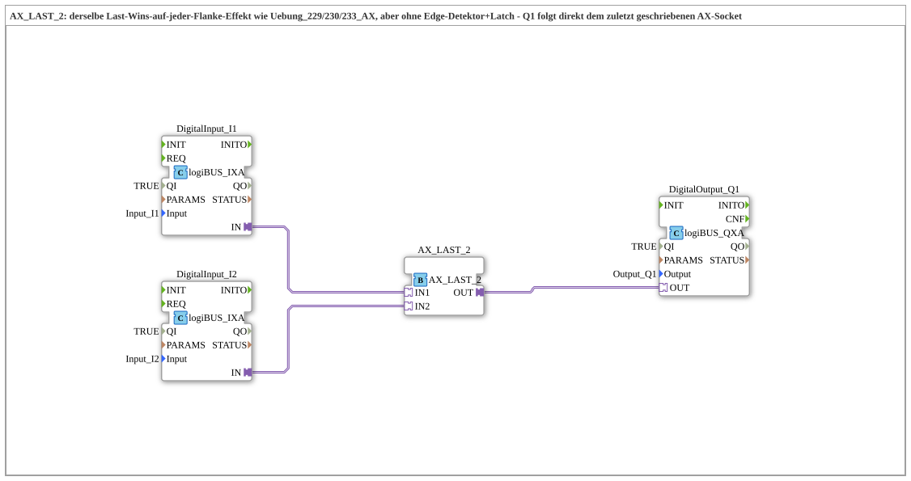

# Exercise_236_AX: AX_LAST_2 – the same Last-Wins effect as 229/230/233, without edge detector and latch

* * * * * * * * * *

## Introduction

Two pushbuttons `I1`/`I2` jointly control an output `Q1` – the same basic idea as in `Uebung_229_AX`/`Uebung_230_AX`/`Uebung_233_AX`, but with a completely different component: `AX_LAST_2` replaces the entire chain of edge detection, merging, and latching with a single adapter component. **Important:** `Uebung_236_AX` behaves observably **identically** to `Uebung_229_AX`/`Uebung_230_AX`/`Uebung_233_AX` – the difference lies in the circuit design, not the behavior.

## Function Blocks (FBs) Used

- **DigitalInput_I1**, **DigitalInput_I2**: logiBUS digital inputs (Type: `logiBUS::io::DI::logiBUS_IXA`)

- **Parameters**: QI = TRUE, Input = Input_I1 or Input_I2

- **Explanation**: Convert the physical button states into AX adapter signals. The adapter write event (`IN.E1`) only fires upon a genuine state change (via `logiBUS_IX.IND`) – it is therefore itself "edge-triggered," just like `E_RF_TRIG` in `AX_RF_TRIG`/`AX_ASR_RF_TRIG`.

- **AX_LAST_2**: "Last written, wins" block (Type: `adapter::events::unidirectional::AX_LAST_2`)

- **Parameters**: none

- **Explanation**: Has two AX sockets (`IN1`, `IN2`) and one AX plug (`OUT`). Its ECC (Execution Code Computing) is remarkably simple: The current data value of the socket that last triggered its own write event (`IN1.E1`/`IN2.E1`) is immediately passed 1:1 to `OUT`.

- **DigitalOutput_Q1**: logiBUS digital output (Type: `logiBUS::io::DQ::logiBUS_QXA`)

- **Parameters**: QI = TRUE, Output = Output_Q1

- **Explanation**: Passes the current state of `AX_LAST_2.OUT` to the peripheral device.

### Sub-Blocks: None

This exercise uses no further sub-blocks; all FBs are arranged directly at the top level of the SubApp – `DigitalInput_I1`/`_I2` are directly connected to `AX_LAST_2.IN1`/`IN2` without any intermediate block.

## Program Flow and Connections

1. `AX_LAST_2.IN1` ← `DigitalInput_I1.IN`: The state of button I1 is directly connected to the first socket of `AX_LAST_2`.
2. `AX_LAST_2.IN2` ← `DigitalInput_I2.IN`: The state of button I2 is directly connected to the second socket – no edge detector, no merge block, no latch in between.
3. `DigitalOutput_Q1.OUT` ← `AX_LAST_2.OUT`: `Q1` follows the value of the socket that last triggered a write event.
4. **Test procedure**: Press `I1` → `Q1` ON. Additionally, press and hold `I2` → `Q1` remains ON (I2 was the last to write). Releasing `I2` (I1 remains pressed) → `Q1` immediately switches to OFF – identical to the behavior of `Uebung_229_AX`/`Uebung_230_AX`, only with a single block instead of three.

**Why this is identical to 229/230/233, not different:** `AX_RF_TRIG`/`AX_ASR_RF_TRIG` reports the rising edge (pressing) as SET and the falling edge (releasing) as RESET to the same latch – any release of any button immediately switches `Q1` OFF, even if another button is still being held down. This is already the same "last flank wins" logic as with `AX_LAST_2`; there's no memory to remember that another button is still active. The real difference between the two schematics lies in the design, not the behavior:

- `Uebung_229_AX`: 2× `AX_RF_TRIG` + shared `AX_SR` (loose EventConnections).

- `Uebung_230_AX`: 2× `AX_ASR_RF_TRIG` + `ASR_MERGE_2` + `ASR_AX_SR` (same function, as adapter blocks).

- `Uebung_236_AX`: **A single** component (`AX_LAST_2`) replaces the entire chain of edge detection, merge, and latch because it works directly on the raw AX write events instead of explicitly generated SET/RESET commands.

**Scalability compared to `Uebung_233_AX` (`ASR_MERGE_3`):** `ASR_MERGE_N` exists as an entire family (`ASR_MERGE_2..7`) – going from 2 to 3 sources (230 → 233) simply means adding another `AX_ASR_RF_TRIG` and replacing `ASR_MERGE_2` with `ASR_MERGE_3`. In contrast, `AX_LAST_2` has **no** higher-order siblings – there is no `AX_LAST_3` in the library. A third raw source could only be included by cascading two `AX_LAST_2` instances, which changes the semantics: a two-level hierarchy is created instead of a flat, equal "last flank wins" link across all three sources. `ASR_MERGE_N` remains a true, flat N-fold OR operation for every input number, while `AX_LAST_2` does not in a cascaded configuration.

## Summary

Exercise 236_AX demonstrates that the "last-wins" interlock of two pushbuttons onto a common output, familiar from exercises 229/230/233, can be replicated with a single function block (`AX_LAST_2`) without requiring an explicit edge detector, merge block, or latch – because `AX_LAST_2` operates directly on the already edge-triggered AX write events. The observable behavior is identical to the three preceding exercises; the only difference lies in the number and type of function blocks used, and in the fact that `AX_LAST_2` – unlike the `ASR_MERGE_N` family – does not scale directly to more than two sources.

---

### 🌐 Related topic subpages on ms-muc-docs.de

- [🌐 Eclipse 4diac IDE & Color Reference on ms-muc-docs.de](https://www.ms-muc-docs.de/iec-61499/eclipse-4diac/)
