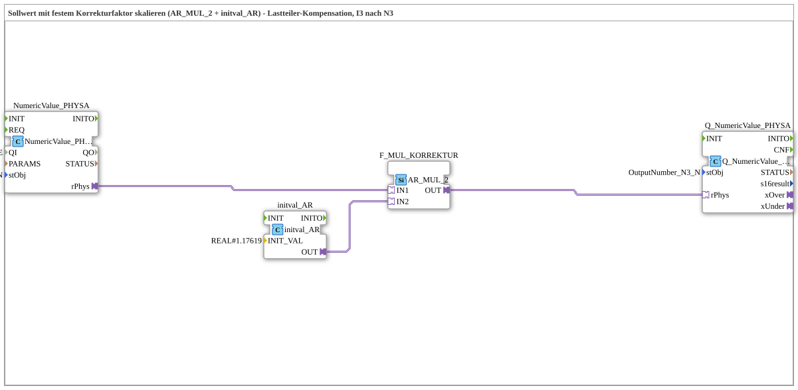

# Uebung_245_AX: Sollwert mit festem Korrekturfaktor skalieren (AR_MUL_2 + initval_AR) - Lastteiler-Kompensation, I3 nach N3

This article describes the 4diac IDE sub-application Uebung_245_AX (Sollwert mit festem Korrekturfaktor skalieren (AR_MUL_2 + initval_AR) - Lastteiler-Kompensation, I3 nach N3).

----

## Objective of the Exercise

The main objective of this exercise is to implement the following requirement: **Sollwert mit festem Korrekturfaktor skalieren (AR_MUL_2 + initval_AR) - Lastteiler-Kompensation, I3 nach N3**

-----

## Description and Components

The exercise consists of the sub-application Uebung_245_AX.SUB, which uses the following function block structure:

### Instantiated Function Blocks (FBs)

- **NumericValue_PHYSA**: Instance of type isobus::UT::io::NumericValue::NumericValue_PHYSA.
  - Parameter QI = TRUE
  - Parameter stObj = InputNumber_I3_N
- **F_MUL_KORREKTUR**: Instance of type adapter::iec61131::arithmetic::AR_MUL_2.
- **Q_NumericValue_PHYSA**: Instance of type isobus::UT::Q::Q_NumericValue_PHYSA.
  - Parameter stObj = OutputNumber_N3_N
- **initval_AR**: Instance of type adapter::types::unidirectional::AR::initval::initval_AR.
  - Parameter INIT_VAL = REAL#1.17619

### Connections and Interfaces

**Adapter Connections:**
- F_MUL_KORREKTUR.OUT -> Q_NumericValue_PHYSA.rPhys
- initval_AR.OUT -> F_MUL_KORREKTUR.IN2
- NumericValue_PHYSA.rPhys -> F_MUL_KORREKTUR.IN1

### Notes from the Model

> Korrekturfaktor 1,17619 = 1 / 0,8502: kompensiert einen Lastteiler (z.B. PWM-Tiefpassfilter, dessen Ausgangsimpedanz gegen die Eingangsimpedanz des angeschlossenen Verbrauchers belastet wird - siehe PVEA-Kompensationsrechnung). I3 = unkorrigierter Sollwert 0-100%, N3 = korrigierter Wert, der am unbelasteten Ausgang eingestellt werden muss, damit am Verbraucher der ursprüngliche Sollwert ankommt.

-----

## Sequence and Operation

1. **Initialization**: Upon system startup, all participating function blocks are initialized.
2. **Event and Signal Processing**: State changes at the inputs trigger events that are forwarded to downstream function blocks across the defined connections.
3. **Output Update**: The receiving function blocks process incoming events and data values to update physical and logical outputs accordingly.

-----

## Summary

Exercise Uebung_245_AX provides a clear demonstration of modular IEC 61499 application design in 4diac IDE.
