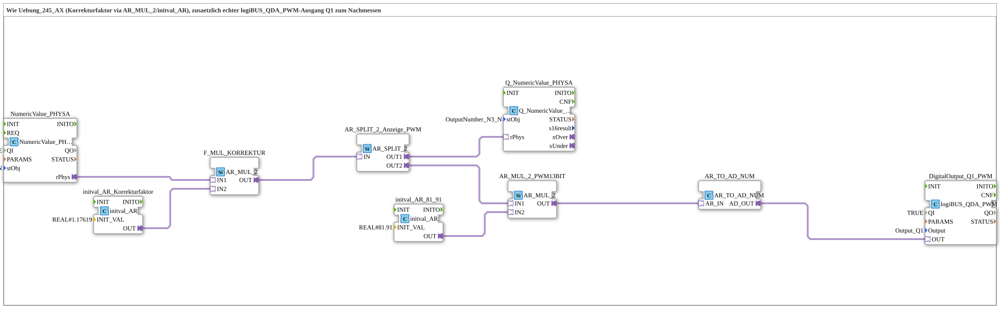

# Uebung_247_AX: Wie Uebung_245_AX (Korrekturfaktor via AR_MUL_2/initval_AR), zusaetzlich echter logiBUS_QDA_PWM-Ausgang Q1 zum Nachmessen

This article describes the 4diac IDE sub-application Uebung_247_AX (Wie Uebung_245_AX (Korrekturfaktor via AR_MUL_2/initval_AR), zusaetzlich echter logiBUS_QDA_PWM-Ausgang Q1 zum Nachmessen).

----

## Objective of the Exercise

The main objective of this exercise is to implement the following requirement: **Wie Uebung_245_AX (Korrekturfaktor via AR_MUL_2/initval_AR), zusaetzlich echter logiBUS_QDA_PWM-Ausgang Q1 zum Nachmessen**

-----

## Description and Components

The exercise consists of the sub-application Uebung_247_AX.SUB, which uses the following function block structure:

### Instantiated Function Blocks (FBs)

- **NumericValue_PHYSA**: Instance of type isobus::UT::io::NumericValue::NumericValue_PHYSA.
  - Parameter QI = TRUE
  - Parameter stObj = InputNumber_I3_N
- **F_MUL_KORREKTUR**: Instance of type adapter::iec61131::arithmetic::AR_MUL_2.
- **initval_AR_Korrekturfaktor**: Instance of type adapter::types::unidirectional::AR::initval::initval_AR.
  - Parameter INIT_VAL = REAL#1.17619
- **AR_SPLIT_2_Anzeige_PWM**: Instance of type adapter::events::unidirectional::AR_SPLIT_2.
- **Q_NumericValue_PHYSA**: Instance of type isobus::UT::Q::Q_NumericValue_PHYSA.
  - Parameter stObj = OutputNumber_N3_N
- **AR_MUL_2_PWM13BIT**: Instance of type adapter::iec61131::arithmetic::AR_MUL_2.
- **initval_AR_81_91**: Instance of type adapter::types::unidirectional::AR::initval::initval_AR.
  - Parameter INIT_VAL = REAL#81.91
- **DigitalOutput_Q1_PWM**: Instance of type logiBUS::io::DQ::logiBUS_QDA_PWM.
  - Parameter QI = TRUE
  - Parameter Output = Output_Q1
- **AR_TO_AD_NUM**: Instance of type adapter::conversion::unidirectional::AR_TO_AD_NUM.

### Connections and Interfaces

**Adapter Connections:**

- NumericValue_PHYSA.rPhys -> F_MUL_KORREKTUR.IN1
- initval_AR_Korrekturfaktor.OUT -> F_MUL_KORREKTUR.IN2
- F_MUL_KORREKTUR.OUT -> AR_SPLIT_2_Anzeige_PWM.IN
- AR_SPLIT_2_Anzeige_PWM.OUT1 -> Q_NumericValue_PHYSA.rPhys
- AR_SPLIT_2_Anzeige_PWM.OUT2 -> AR_MUL_2_PWM13BIT.IN1
- initval_AR_81_91.OUT -> AR_MUL_2_PWM13BIT.IN2
- AR_MUL_2_PWM13BIT.OUT -> AR_TO_AD_NUM.AR_IN
- AR_TO_AD_NUM.AD_OUT -> DigitalOutput_Q1_PWM.OUT

### Notes from the Model

> 0-100% Tastgrad = 0-8191 (13-Bit LEDC, siehe RampLimitFS_TO_logiBUS_QDA_PWM_OPC.SUB in MyLib_AX-1.0.0): Faktor 81,91 = 8191/100. Korrigierter Wert (bis 117,619% bei I3>85%) wird NICHT geklemmt - zum Nachmessen absichtlich so belassen, siehe Beschreibung. Mit Multimeter/Oszilloskop an Q1 gegen GND: Mittelwert = Tastgrad% x Versorgungsspannung.

-----

## Sequence and Operation

1. **Initialization**: Upon system startup, all participating function blocks are initialized.
2. **Event and Signal Processing**: State changes at the inputs trigger events that are forwarded to downstream function blocks across the defined connections.
3. **Output Update**: The receiving function blocks process incoming events and data values to update physical and logical outputs accordingly.

-----

## Summary

Exercise Uebung_247_AX provides a clear demonstration of modular IEC 61499 application design in 4diac IDE.
