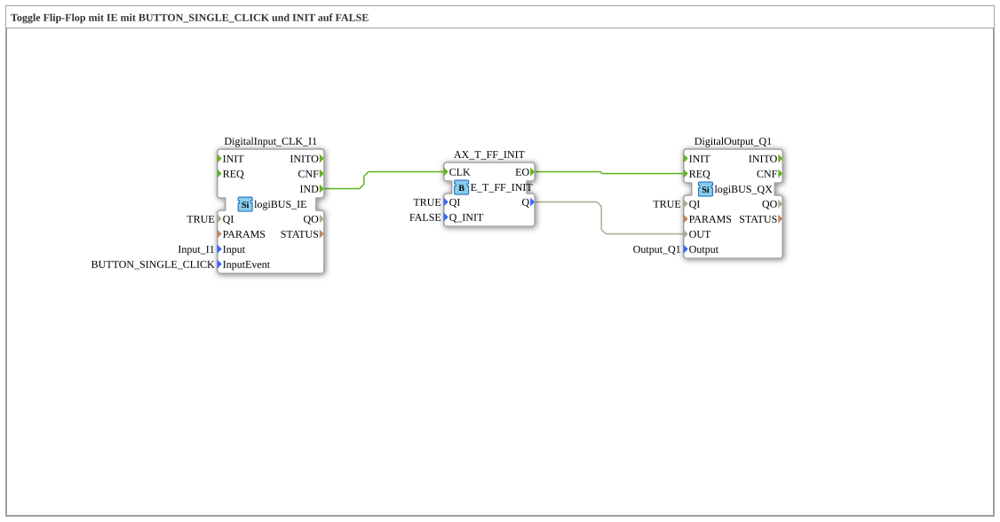

# Uebung_004a10a: Toggle Flip-Flop mit IE mit BUTTON_SINGLE_CLICK und INIT auf FALSE

This article describes the 4diac IDE sub-application Uebung_004a10a (Toggle Flip-Flop mit IE mit BUTTON_SINGLE_CLICK und INIT auf FALSE).

----

## Objective of the Exercise

The main objective of this exercise is to implement the following requirement: **Toggle Flip-Flop mit IE mit BUTTON_SINGLE_CLICK und INIT auf FALSE**

-----

## Description and Components

The exercise consists of the sub-application Uebung_004a10a.SUB, which uses the following function block structure:

### Instantiated Function Blocks (FBs)

- **DigitalOutput_Q1**: Instance of type logiBUS::io::DQ::logiBUS_QX.
  - Parameter QI = TRUE
  - Parameter Output = Output_Q1
- **DigitalInput_CLK_I1**: Instance of type logiBUS::io::DI::logiBUS_IE.
  - Parameter QI = TRUE
  - Parameter Input = Input_I1
  - Parameter InputEvent = BUTTON_SINGLE_CLICK
- **AX_T_FF_INIT**: Instance of type iec61499::events::E_T_FF_INIT.
  - Parameter QI = TRUE
  - Parameter Q_INIT = FALSE

### Connections and Interfaces

**Event Connections:**

- DigitalInput_CLK_I1.IND -> AX_T_FF_INIT.CLK
- AX_T_FF_INIT.EO -> DigitalOutput_Q1.REQ

**Data Connections:**

- AX_T_FF_INIT.Q -> DigitalOutput_Q1.OUT

-----

## Sequence and Operation

1. **Initialization**: Upon system startup, all participating function blocks are initialized.
2. **Event and Signal Processing**: State changes at the inputs trigger events that are forwarded to downstream function blocks across the defined connections.
3. **Output Update**: The receiving function blocks process incoming events and data values to update physical and logical outputs accordingly.

-----

## Summary

Exercise Uebung_004a10a provides a clear demonstration of modular IEC 61499 application design in 4diac IDE.
