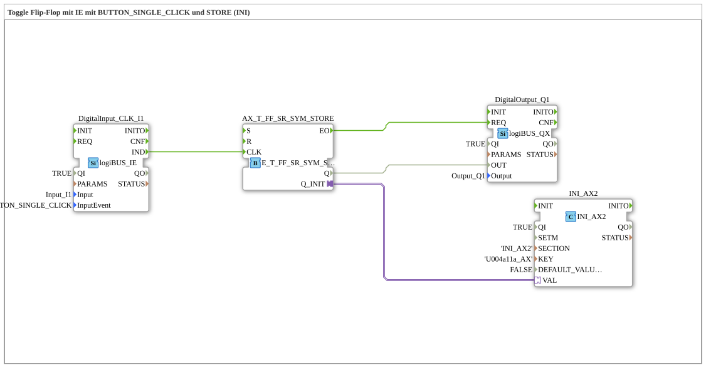

# Uebung_004a11a: Toggle Flip-Flop mit IE mit BUTTON_SINGLE_CLICK und STORE (INI)

This article describes the 4diac IDE sub-application Uebung_004a11a (Toggle Flip-Flop mit IE mit BUTTON_SINGLE_CLICK und STORE (INI)).

----

## Objective of the Exercise

The main objective of this exercise is to implement the following requirement: **Toggle Flip-Flop mit IE mit BUTTON_SINGLE_CLICK und STORE (INI)**

-----

## Description and Components

The exercise consists of the sub-application Uebung_004a11a.SUB, which uses the following function block structure:

### Instantiated Function Blocks (FBs)

- **DigitalOutput_Q1**: Instance of type logiBUS::io::DQ::logiBUS_QX.
  - Parameter QI = TRUE
  - Parameter Output = Output_Q1
- **DigitalInput_CLK_I1**: Instance of type logiBUS::io::DI::logiBUS_IE.
  - Parameter QI = TRUE
  - Parameter Input = Input_I1
  - Parameter InputEvent = BUTTON_SINGLE_CLICK
- **AX_T_FF_SR_SYM_STORE**: Instance of type adapter::iec61499::events::E_T_FF_SR_SYM_STORE.
- **INI_AX2**: Instance of type eclipse4diac::storage::INI_AX2.
  - Parameter QI = TRUE
  - Parameter SECTION = 'INI_AX2'
  - Parameter KEY = 'U004a11a_AX'
  - Parameter DEFAULT_VALUE = FALSE

### Connections and Interfaces

**Adapter Connections:**
- AX_T_FF_SR_SYM_STORE.Q_INIT -> INI_AX2.VAL

**Event Connections:**
- DigitalInput_CLK_I1.IND -> AX_T_FF_SR_SYM_STORE.CLK
- AX_T_FF_SR_SYM_STORE.EO -> DigitalOutput_Q1.REQ

**Data Connections:**
- AX_T_FF_SR_SYM_STORE.Q -> DigitalOutput_Q1.OUT

### Notes from the Model

> am Anfang letzten Zustand laden!

-----

## Sequence and Operation

1. **Initialization**: Upon system startup, all participating function blocks are initialized.
2. **Event and Signal Processing**: State changes at the inputs trigger events that are forwarded to downstream function blocks across the defined connections.
3. **Output Update**: The receiving function blocks process incoming events and data values to update physical and logical outputs accordingly.

-----

## Summary

Exercise Uebung_004a11a provides a clear demonstration of modular IEC 61499 application design in 4diac IDE.
