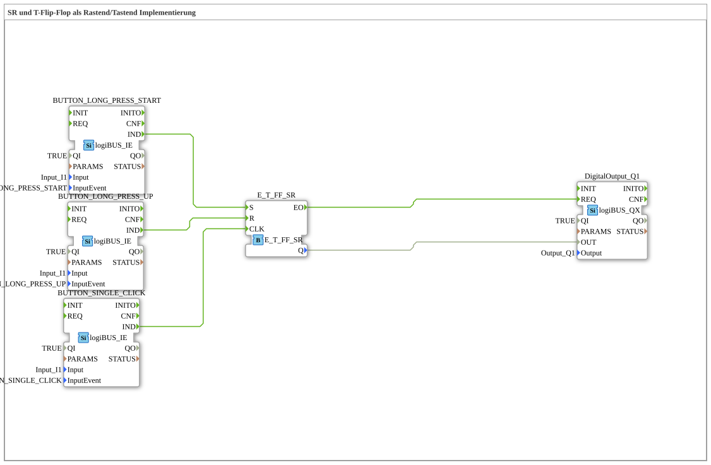

# Uebung_006a5: SR und T-Flip-Flop als Rastend/Tastend Implementierung

This article describes the 4diac IDE sub-application Uebung_006a5 (SR und T-Flip-Flop als Rastend/Tastend Implementierung).

----

## Objective of the Exercise

The main objective of this exercise is to implement the following requirement: **SR und T-Flip-Flop als Rastend/Tastend Implementierung**

-----

## Description and Components

The exercise consists of the sub-application Uebung_006a5.SUB, which uses the following function block structure:

### Instantiated Function Blocks (FBs)

- **BUTTON_LONG_PRESS_START**: Instance of type logiBUS::io::DI::logiBUS_IE.
  - Parameter QI = TRUE
  - Parameter PARAMS = 
  - Parameter Input = Input_I1
  - Parameter InputEvent = BUTTON_LONG_PRESS_START
- **BUTTON_LONG_PRESS_UP**: Instance of type logiBUS::io::DI::logiBUS_IE.
  - Parameter QI = TRUE
  - Parameter PARAMS = 
  - Parameter Input = Input_I1
  - Parameter InputEvent = BUTTON_LONG_PRESS_UP
- **E_T_FF_SR**: Instance of type iec61499::events::E_T_FF_SR.
- **BUTTON_SINGLE_CLICK**: Instance of type logiBUS::io::DI::logiBUS_IE.
  - Parameter QI = TRUE
  - Parameter PARAMS = 
  - Parameter Input = Input_I1
  - Parameter InputEvent = BUTTON_SINGLE_CLICK
- **DigitalOutput_Q1**: Instance of type logiBUS::io::DQ::logiBUS_QX.
  - Parameter QI = TRUE
  - Parameter Output = Output_Q1

### Connections and Interfaces

**Event Connections:**

- BUTTON_LONG_PRESS_START.IND -> E_T_FF_SR.S
- BUTTON_LONG_PRESS_UP.IND -> E_T_FF_SR.R
- BUTTON_SINGLE_CLICK.IND -> E_T_FF_SR.CLK
- E_T_FF_SR.EO -> DigitalOutput_Q1.REQ

**Data Connections:**

- E_T_FF_SR.Q -> DigitalOutput_Q1.OUT

### Notes from the Model

> Universal Eingang: 
so können wir mit einem Taster ODER  einem Schalter arbeiten.

-----

## Sequence and Operation

1. **Initialization**: Upon system startup, all participating function blocks are initialized.
2. **Event and Signal Processing**: State changes at the inputs trigger events that are forwarded to downstream function blocks across the defined connections.
3. **Output Update**: The receiving function blocks process incoming events and data values to update physical and logical outputs accordingly.

-----

## Summary

Exercise Uebung_006a5 provides a clear demonstration of modular IEC 61499 application design in 4diac IDE.
