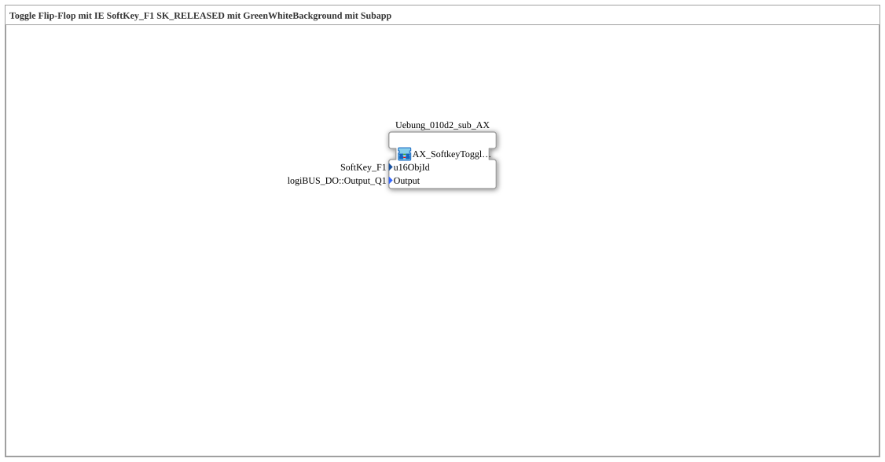

# Uebung_010d2: Toggle Flip-Flop mit IE SoftKey_F1 SK_RELEASED mit GreenWhiteBackground mit Subapp

This article describes the 4diac IDE sub-application Uebung_010d2 (Toggle Flip-Flop mit IE SoftKey_F1 SK_RELEASED mit GreenWhiteBackground mit Subapp).

----

## Objective of the Exercise

The main objective of this exercise is to implement the following requirement: **Toggle Flip-Flop mit IE SoftKey_F1 SK_RELEASED mit GreenWhiteBackground mit Subapp**

-----

## Description and Components

The exercise consists of the sub-application Uebung_010d2.SUB, which uses the following function block structure:

-----

## Sequence and Operation

1. **Initialization**: Upon system startup, all participating function blocks are initialized.
2. **Signal Forwarding**: Function blocks process control and data signals according to their configuration.

-----

## Summary

Exercise Uebung_010d2 provides a clear demonstration of modular IEC 61499 application design in 4diac IDE.
