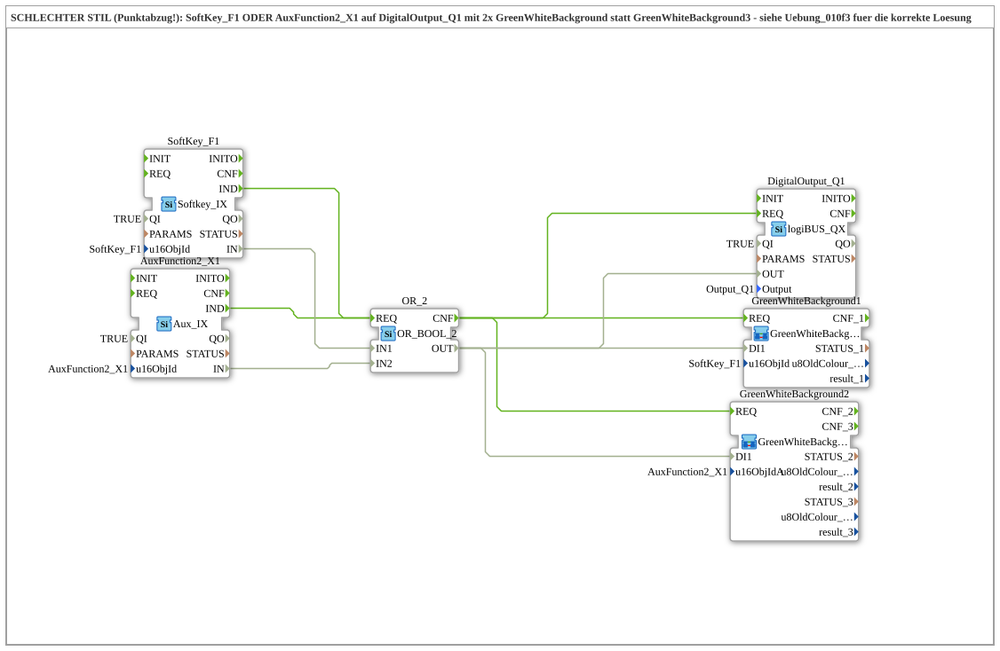

# Uebung_010f4: SCHLECHTER STIL (Punktabzug!): SoftKey_F1 ODER AuxFunction2_X1 auf DigitalOutput_Q1 mit 2x GreenWhiteBackground statt GreenWhiteBackground3 - siehe Uebung_010f3 fuer die korrekte Loesung

This article describes the 4diac IDE sub-application Uebung_010f4 (SCHLECHTER STIL (Punktabzug!): SoftKey_F1 ODER AuxFunction2_X1 auf DigitalOutput_Q1 mit 2x GreenWhiteBackground statt GreenWhiteBackground3 - siehe Uebung_010f3 fuer die korrekte Loesung).

----

## Objective of the Exercise

The main objective of this exercise is to implement the following requirement: **SCHLECHTER STIL (Punktabzug!): SoftKey_F1 ODER AuxFunction2_X1 auf DigitalOutput_Q1 mit 2x GreenWhiteBackground statt GreenWhiteBackground3 - siehe Uebung_010f3 fuer die korrekte Loesung**

-----

## Description and Components

The exercise consists of the sub-application Uebung_010f4.SUB, which uses the following function block structure:

### Instantiated Function Blocks (FBs)

- **DigitalOutput_Q1**: Instance of type logiBUS::io::DQ::logiBUS_QX.
  - Parameter QI = TRUE
  - Parameter PARAMS = 
  - Parameter Output = Output_Q1
- **SoftKey_F1**: Instance of type isobus::UT::io::Softkey::Softkey_IX.
  - Parameter QI = TRUE
  - Parameter u16ObjId = SoftKey_F1
- **AuxFunction2_X1**: Instance of type isobus::UT::io::Auxiliary::IN::Aux_IX.
  - Parameter QI = TRUE
  - Parameter u16ObjId = AuxFunction2_X1
- **OR_2**: Instance of type iec61131::booleanOperators::OR_BOOL_2.

### Connections and Interfaces

**Event Connections:**

- SoftKey_F1.IND -> OR_2.REQ
- AuxFunction2_X1.IND -> OR_2.REQ
- OR_2.CNF -> DigitalOutput_Q1.REQ
- OR_2.CNF -> GreenWhiteBackground1.REQ
- OR_2.CNF -> GreenWhiteBackground2.REQ

**Data Connections:**

- SoftKey_F1.IN -> OR_2.IN1
- AuxFunction2_X1.IN -> OR_2.IN2
- OR_2.OUT -> DigitalOutput_Q1.OUT
- OR_2.OUT -> GreenWhiteBackground1.DI1
- OR_2.OUT -> GreenWhiteBackground2.DI1

### Notes from the Model

> SCHLECHTER STIL - Punktabzug! 
Hier wurden GreenWhiteBackground1 UND GreenWhiteBackground2 einzeln verdrahtet, obwohl es mit GreenWhiteBackground3 (ein Baustein, u16ObjId + u16ObjIdA) genau fuer diesen Fall (1 normales VT-Objekt + 1 Aux-Objekt) schon fertig existiert. Unnoetige Verdopplung der Farbauswahl-Logik. 
Korrekte Loesung: Uebung_010f3.

-----

## Sequence and Operation

1. **Initialization**: Upon system startup, all participating function blocks are initialized.
2. **Event and Signal Processing**: State changes at the inputs trigger events that are forwarded to downstream function blocks across the defined connections.
3. **Output Update**: The receiving function blocks process incoming events and data values to update physical and logical outputs accordingly.

-----

## Summary

Exercise Uebung_010f4 provides a clear demonstration of modular IEC 61499 application design in 4diac IDE.
