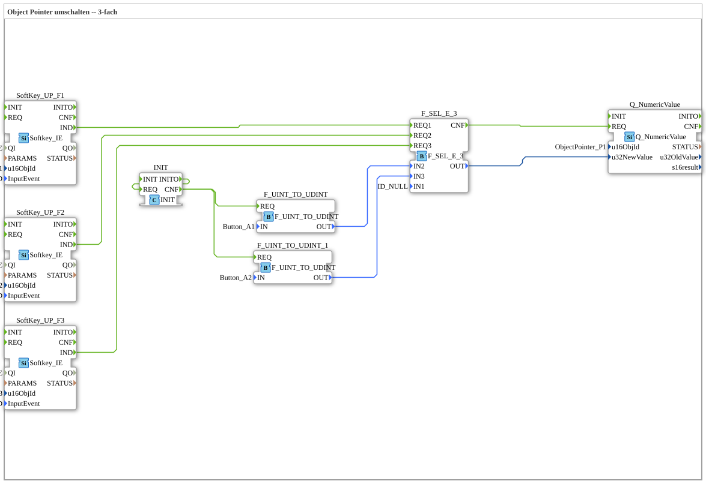

# Uebung_015b: Object Pointer umschalten -- 3-fach

This article describes the 4diac IDE sub-application Uebung_015b (Object Pointer umschalten -- 3-fach).

----

## Objective of the Exercise

The main objective of this exercise is to implement the following requirement: **Object Pointer umschalten -- 3-fach**

-----

## Description and Components

The exercise consists of the sub-application Uebung_015b.SUB, which uses the following function block structure:

### Instantiated Function Blocks (FBs)

- **SoftKey_UP_F1**: Instance of type isobus::UT::io::Softkey::Softkey_IE.
  - Parameter QI = TRUE
  - Parameter u16ObjId = SoftKey_F1
  - Parameter InputEvent = SK_RELEASED
- **SoftKey_UP_F2**: Instance of type isobus::UT::io::Softkey::Softkey_IE.
  - Parameter QI = TRUE
  - Parameter u16ObjId = SoftKey_F2
  - Parameter InputEvent = SK_RELEASED
- **F_UINT_TO_UDINT**: Instance of type iec61131::conversion::F_UINT_TO_UDINT.
  - Parameter IN = Button_A1
- **F_SEL_E_3**: Instance of type eclipse4diac::utils::selection::F_SEL_E_3.
  - Parameter IN1 = ID_NULL
- **Q_NumericValue**: Instance of type isobus::UT::Q::Q_NumericValue.
  - Parameter u16ObjId = ObjectPointer_P1
- **SoftKey_UP_F3**: Instance of type isobus::UT::io::Softkey::Softkey_IE.
  - Parameter QI = TRUE
  - Parameter u16ObjId = SoftKey_F3
  - Parameter InputEvent = SK_RELEASED
- **F_UINT_TO_UDINT_1**: Instance of type iec61131::conversion::F_UINT_TO_UDINT.
  - Parameter IN = Button_A2
- **INIT**: Instance of type iec61131::booleanOperators::INIT.

### Connections and Interfaces

**Event Connections:**
- F_SEL_E_3.CNF -> Q_NumericValue.REQ
- SoftKey_UP_F1.IND -> F_SEL_E_3.REQ1
- SoftKey_UP_F2.IND -> F_SEL_E_3.REQ2
- SoftKey_UP_F3.IND -> F_SEL_E_3.REQ3
- INIT.INITO -> INIT.REQ
- INIT.CNF -> F_UINT_TO_UDINT.REQ
- INIT.CNF -> F_UINT_TO_UDINT_1.REQ

**Data Connections:**
- F_UINT_TO_UDINT.OUT -> F_SEL_E_3.IN2
- F_SEL_E_3.OUT -> Q_NumericValue.u32NewValue
- F_UINT_TO_UDINT_1.OUT -> F_SEL_E_3.IN3

-----

## Sequence and Operation

1. **Initialization**: Upon system startup, all participating function blocks are initialized.
2. **Event and Signal Processing**: State changes at the inputs trigger events that are forwarded to downstream function blocks across the defined connections.
3. **Output Update**: The receiving function blocks process incoming events and data values to update physical and logical outputs accordingly.

-----

## Summary

Exercise Uebung_015b provides a clear demonstration of modular IEC 61499 application design in 4diac IDE.
