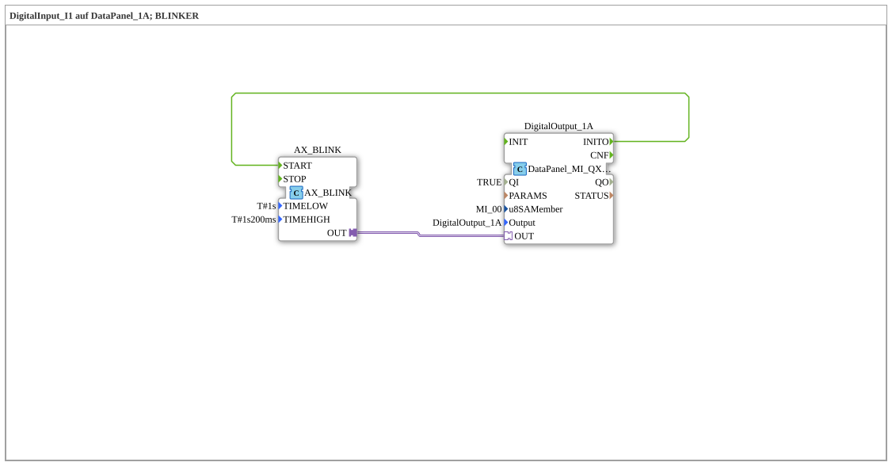

# Uebung_020f4: DigitalInput_I1 auf DataPanel_1A; BLINKER

This article describes the 4diac IDE sub-application Uebung_020f4 (DigitalInput_I1 auf DataPanel_1A; BLINKER).

----

## Objective of the Exercise

The main objective of this exercise is to implement the following requirement: **DigitalInput_I1 auf DataPanel_1A; BLINKER**

-----

## Description and Components

The exercise consists of the sub-application Uebung_020f4.SUB, which uses the following function block structure:

### Instantiated Function Blocks (FBs)

- **AX_BLINK**: Instance of type adapter::events::unidirectional::signals::AX_BLINK.
  - Parameter TIMELOW = T#1s
  - Parameter TIMEHIGH = T#1s200ms
- **DigitalOutput_1A**: Instance of type DataPanel::io::MI::DQ::DataPanel_MI_QXA.
  - Parameter QI = TRUE
  - Parameter u8SAMember = MI_00
  - Parameter Output = DigitalOutput_1A

### Connections and Interfaces

**Adapter Connections:**

- AX_BLINK.OUT -> DigitalOutput_1A.OUT

**Event Connections:**

- DigitalOutput_1A.INITO -> AX_BLINK.START

-----

## Sequence and Operation

1. **Initialization**: Upon system startup, all participating function blocks are initialized.
2. **Event and Signal Processing**: State changes at the inputs trigger events that are forwarded to downstream function blocks across the defined connections.
3. **Output Update**: The receiving function blocks process incoming events and data values to update physical and logical outputs accordingly.

-----

## Summary

Exercise Uebung_020f4 provides a clear demonstration of modular IEC 61499 application design in 4diac IDE.
