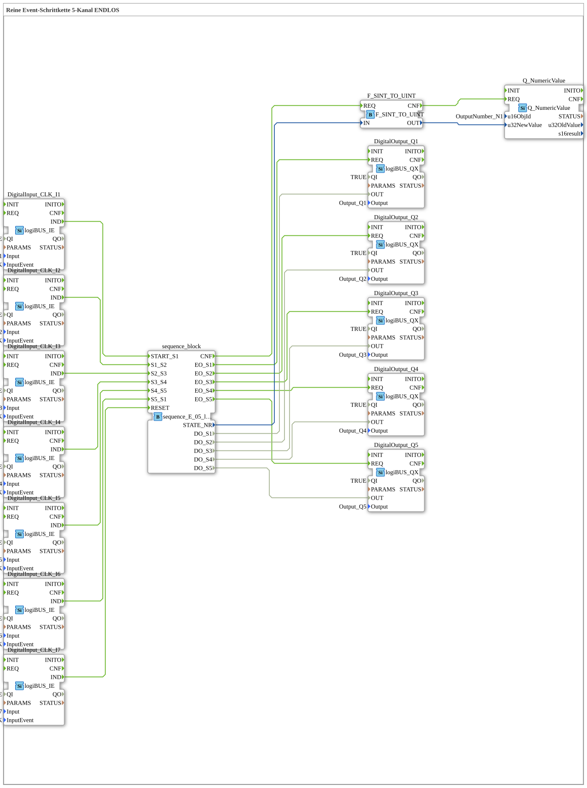

# Uebung_058: Pure Event-Driven Step Chain, 5 Channels (Loop)

This article describes the logiBUS® exercise `Uebung_058`. We build a purely event-driven step chain.

----

## Goal of the Exercise

Realize a sequence across 5 outputs (Q1, Q2, Q3, Q4, Q5), where each step advances solely on an external event (a button press) - no automatic time-based advancement.

-----

## Description and Components

The subapplication `Uebung_058` uses the sequencer `sequence_E_05_loop`, which cycles through 5 states purely event-driven.

Each transition between steps is triggered by its own dedicated button press (`I1` through `I7`) - the sequence waits at each step until the next button is pressed.

- **`Q_NumericValue`**: Displays the current step number on the ISOBUS terminal.

-----

## Behavior

1. Start via button `I1` -> the sequence jumps to `S1`, output `Q1` becomes active.
2. Every further button press advances to the next step.
3. After the last step, the sequence automatically returns to S1 (loop).
4. Reset via the last button -> everything off.
