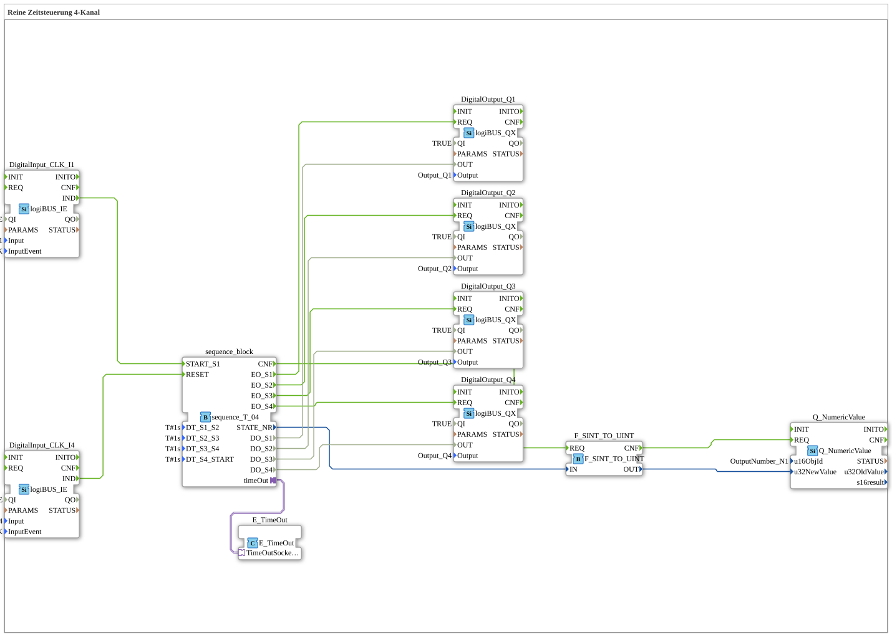

# Uebung_061: Pure Time-Controlled Sequence, 4 Channels

This article describes the logiBUS® exercise `Uebung_061`. We build a purely time-driven step chain.

----

## Goal of the Exercise

Realize an automatic sequence across 4 outputs (Q1, Q2, Q3, Q4), where each step advances to the next purely after a fixed dwell time (`DT_S1_S2` etc., each `T#1s`) elapses - with no further button press needed once the sequence is running.

-----

## Description and Components

The subapplication `Uebung_061` uses the sequencer `sequence_T_04`, which cycles through 4 states (`S1` to `S4`) purely on elapsed time.

- **`sequence_T_04`**: Manages the 4 steps; each transition happens once the respective `DT_Sx_Sy` parameter elapses.
- **`E_TimeOut`**: Watchdog supervising the sequence.
- **`Q_NumericValue`**: Displays the current step number on the ISOBUS terminal.

-----

## Behavior

1. Start via button `I1` -> the sequence jumps to `S1`.
2. Each output (`Q1, Q2, Q3, Q4`) is switched active for the configured time before automatically advancing to the next step.
3. After the last step, the sequence ends.
4. Reset via button `I4` -> everything off, sequence back to its base state.
