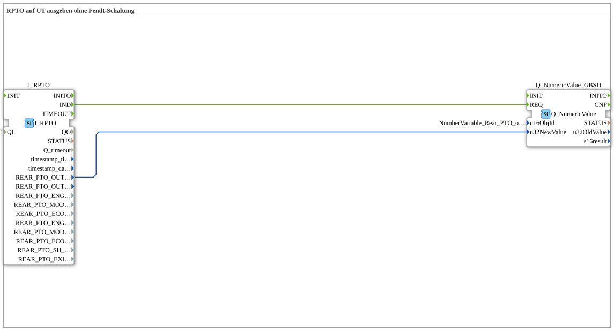

# Uebung_074b: Output RPTO on the UT, No Fendt Fallback

This article describes the logiBUS® exercise `Uebung_074b`. The direct (non-adapter) variant of `Uebung_074b_AUI` - see there for the conceptually identical behavior.

----

## Goal of the Exercise

Display the rear PTO output shaft speed on the VT terminal, taken directly from the TECU value, with no selection logic.

-----

## Description and Components

- **`I_RPTO`**: `isobus::tecu::I_RPTO`, reads the PTO output shaft speed from the Tractor ECU (TECU) via ISOBUS.
- **`Q_NumericValue_GBSD`**: displays the value directly on the VT terminal (`u16ObjId = NumberVariable_Rear_PTO_output_shaft_speed`).

-----

## Behavior

1. `I_RPTO` continuously reads the PTO output shaft speed from the TECU.
2. On every report (`IND`), the value (`REAR_PTO_OUTP_SHAFT_SPEED`) is displayed directly in `Q_NumericValue_GBSD` - with no adapter or selection logic in between.
