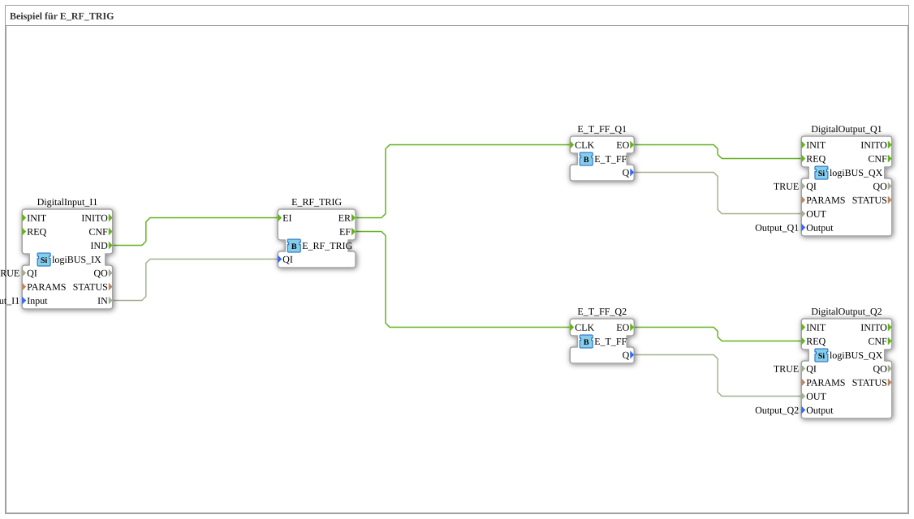

# Uebung_089a: Beispiel für E_RF_TRIG

This article describes the 4diac IDE sub-application Uebung_089a (Beispiel für E_RF_TRIG).

----

## Objective of the Exercise

The main objective of this exercise is to implement the following requirement: **Beispiel für E_RF_TRIG**

-----

## Description and Components

The exercise consists of the sub-application Uebung_089a.SUB, which uses the following function block structure:

### Instantiated Function Blocks (FBs)

- **DigitalInput_I1**: Instance of type logiBUS::io::DI::logiBUS_IX.
  - Parameter QI = TRUE
  - Parameter Input = Input_I1
- **E_RF_TRIG**: Instance of type iec61499::events::E_RF_TRIG.
- **E_T_FF_Q1**: Instance of type iec61499::events::E_T_FF.
- **E_T_FF_Q2**: Instance of type iec61499::events::E_T_FF.
- **DigitalOutput_Q1**: Instance of type logiBUS::io::DQ::logiBUS_QX.
  - Parameter QI = TRUE
  - Parameter Output = Output_Q1
- **DigitalOutput_Q2**: Instance of type logiBUS::io::DQ::logiBUS_QX.
  - Parameter QI = TRUE
  - Parameter Output = Output_Q2

### Connections and Interfaces

**Event Connections:**
- DigitalInput_I1.IND -> E_RF_TRIG.EI
- E_RF_TRIG.ER -> E_T_FF_Q1.CLK
- E_RF_TRIG.EF -> E_T_FF_Q2.CLK
- E_T_FF_Q1.EO -> DigitalOutput_Q1.REQ
- E_T_FF_Q2.EO -> DigitalOutput_Q2.REQ

**Data Connections:**
- DigitalInput_I1.IN -> E_RF_TRIG.QI
- E_T_FF_Q1.Q -> DigitalOutput_Q1.OUT
- E_T_FF_Q2.Q -> DigitalOutput_Q2.OUT

### Notes from the Model

> Ein einziger Eingang, EIN Signal - E_RF_TRIG liefert beide Flanken gleichzeitig (ER=steigend, EF=fallend). Q1 togglet bei steigender, Q2 bei fallender Flanke.

-----

## Sequence and Operation

1. **Initialization**: Upon system startup, all participating function blocks are initialized.
2. **Event and Signal Processing**: State changes at the inputs trigger events that are forwarded to downstream function blocks across the defined connections.
3. **Output Update**: The receiving function blocks process incoming events and data values to update physical and logical outputs accordingly.

-----

## Summary

Exercise Uebung_089a provides a clear demonstration of modular IEC 61499 application design in 4diac IDE.
