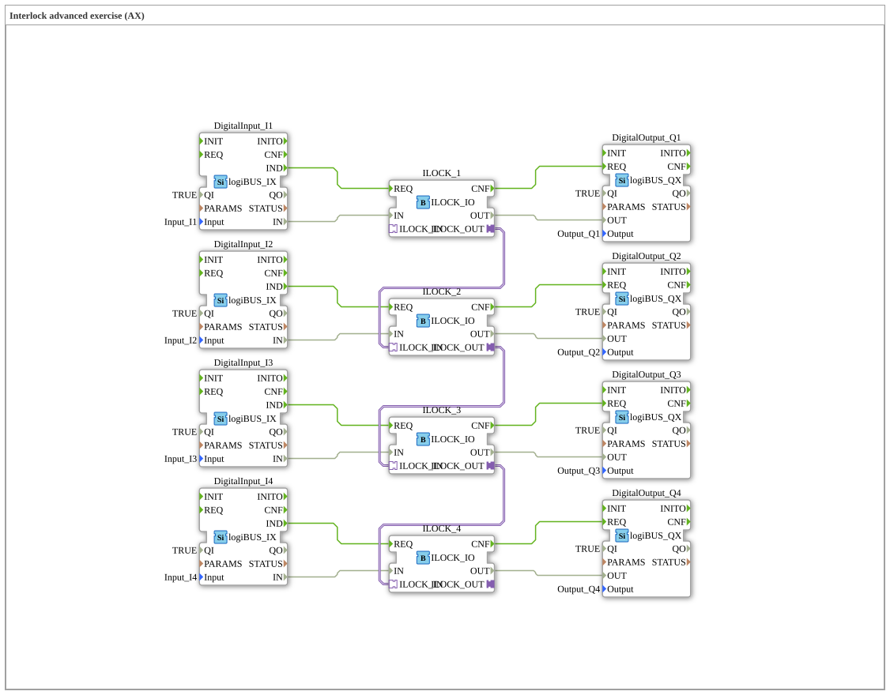

# Uebung_201_Interlock: Interlock advanced exercise (AX)

This article describes the 4diac IDE sub-application Uebung_201_Interlock (Interlock advanced exercise (AX)).

----

## Objective of the Exercise

The main objective of this exercise is to implement the following requirement: **Interlock advanced exercise (AX)**

-----

## Description and Components

The exercise consists of the sub-application Uebung_201_Interlock.SUB, which uses the following function block structure:

### Instantiated Function Blocks (FBs)

- **DigitalInput_I1**: Instance of type logiBUS::io::DI::logiBUS_IX.
  - Parameter QI = TRUE
  - Parameter Input = Input_I1
- **DigitalOutput_Q4**: Instance of type logiBUS::io::DQ::logiBUS_QX.
  - Parameter QI = TRUE
  - Parameter Output = Output_Q4
- **ILOCK_1**: Instance of type logiBUS::signalprocessing::interlock::ILOCK_IO.
- **DigitalInput_I2**: Instance of type logiBUS::io::DI::logiBUS_IX.
  - Parameter QI = TRUE
  - Parameter Input = Input_I2
- **DigitalOutput_Q1**: Instance of type logiBUS::io::DQ::logiBUS_QX.
  - Parameter QI = TRUE
  - Parameter Output = Output_Q1
- **ILOCK_2**: Instance of type logiBUS::signalprocessing::interlock::ILOCK_IO.
- **DigitalOutput_Q3**: Instance of type logiBUS::io::DQ::logiBUS_QX.
  - Parameter QI = TRUE
  - Parameter Output = Output_Q3
- **DigitalOutput_Q2**: Instance of type logiBUS::io::DQ::logiBUS_QX.
  - Parameter QI = TRUE
  - Parameter Output = Output_Q2
- **ILOCK_3**: Instance of type logiBUS::signalprocessing::interlock::ILOCK_IO.
- **ILOCK_4**: Instance of type logiBUS::signalprocessing::interlock::ILOCK_IO.
- **DigitalInput_I3**: Instance of type logiBUS::io::DI::logiBUS_IX.
  - Parameter QI = TRUE
  - Parameter Input = Input_I3
- **DigitalInput_I4**: Instance of type logiBUS::io::DI::logiBUS_IX.
  - Parameter QI = TRUE
  - Parameter Input = Input_I4

### Connections and Interfaces

**Adapter Connections:**
- ILOCK_1.ILOCK_OUT -> ILOCK_2.ILOCK_IN
- ILOCK_2.ILOCK_OUT -> ILOCK_3.ILOCK_IN
- ILOCK_3.ILOCK_OUT -> ILOCK_4.ILOCK_IN

**Event Connections:**
- DigitalInput_I4.IND -> ILOCK_4.REQ
- DigitalInput_I3.IND -> ILOCK_3.REQ
- DigitalInput_I2.IND -> ILOCK_2.REQ
- DigitalInput_I1.IND -> ILOCK_1.REQ
- ILOCK_1.CNF -> DigitalOutput_Q1.REQ
- ILOCK_2.CNF -> DigitalOutput_Q2.REQ
- ILOCK_3.CNF -> DigitalOutput_Q3.REQ
- ILOCK_4.CNF -> DigitalOutput_Q4.REQ

**Data Connections:**
- DigitalInput_I4.IN -> ILOCK_4.IN
- DigitalInput_I3.IN -> ILOCK_3.IN
- DigitalInput_I2.IN -> ILOCK_2.IN
- DigitalInput_I1.IN -> ILOCK_1.IN
- ILOCK_4.OUT -> DigitalOutput_Q4.OUT
- ILOCK_3.OUT -> DigitalOutput_Q3.OUT
- ILOCK_2.OUT -> DigitalOutput_Q2.OUT
- ILOCK_1.OUT -> DigitalOutput_Q1.OUT

-----

## Sequence and Operation

1. **Initialization**: Upon system startup, all participating function blocks are initialized.
2. **Event and Signal Processing**: State changes at the inputs trigger events that are forwarded to downstream function blocks across the defined connections.
3. **Output Update**: The receiving function blocks process incoming events and data values to update physical and logical outputs accordingly.

-----

## Summary

Exercise Uebung_201_Interlock provides a clear demonstration of modular IEC 61499 application design in 4diac IDE.
