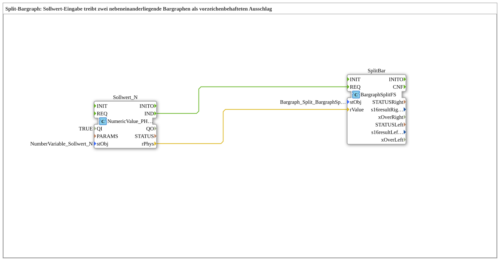

# Exercise_226: Split-Bar Graph

* * * * * * * * * *

## Introduction

This exercise controls two adjacent linear bar graphs (`Bargraph_Split_links`/`Bargraph_Split_rechts`) so that together they display a signed deflection from -42 to +42: For a positive setpoint, the right bar fills up; for a negative setpoint, the left bar fills up; the other bar remains at 0.

## Function Blocks (FBs) Used

- **Setpoint_N**: Terminal input (Type: `isobus::UT::io::NumericValue::NumericValue_PHYS`)

- **Parameters**: `QI = TRUE`, `stObj = NumberVariable_Sollwert_N`

- **Explanation**: Reads changes to the setpoint. The value entered as `InputNumber_Sollwert` (VT object 9000) is returned as the physical value `REAL` via `rPhys`.

- **SplitBar**: Split-bar graph control (Type: `isobus::UT::Q::BargraphSplitFS`)

- **Parameter**: `stObj = Bargraph_Split_BargraphSplit`

- **Explanation**: The positive part of the target value is enclosed in brackets `[0, r32MaxMagnitude]` and written to the right bar; the negative part is also enclosed in brackets and written to the left bar. Both sides write directly to their bar graph object ID via Command Numeric Value (ISO 11783-6 Annex F.22), without the bound `NumberVariable`. The bar IDs and the common magnitude range are bundled from the constant `Bargraph_Split_BargraphSplit` (type `BargraphSplit_S`), which is automatically generated from the geometry of `.jop`. `xOverRight`/`xOverLeft` only report a range exceedance if `|Sollwert| > r32MaxMagnitude` is present – there are intentionally no `xUnder` outputs, as the inactive side is always at 0 during normal operation.
`xOverRight`/`xOverLeft` only report a range exceedance if `|Sollwert| > r32MaxMagnitude` is present – there are intentionally no `xUnder` outputs, as the inactive side is normally always at 0.
``xOverRight``/``|Sollwert| > r32MaxMagnitude`` is present. ### Sub-modules: none

## Program Flow and Connections

1. If the operator changes `InputNumber_Sollwert`, `Sollwert_N.IND` fires and delivers the physical value via `Sollwert_N.rPhys`.

2. `Sollwert_N.IND` triggers `SplitBar.REQ`.

3. `Sollwert_N.rPhys` is directly routed to `SplitBar.rValue` (no split module is needed, as only a single consumer requires the setpoint).

4. `SplitBar` calculates the two bar values (positive portion on the right, negated positive portion on the left) and writes them to the two bar graph objects.

## Summary

This exercise demonstrates how a single signed setpoint is split into two adjacent bar graphs using the reusable block `BargraphSplitFS`, without having to manually recreate the bracketing and sign logic each time. For the version fully wired via AR adapters, see `Uebung_226_AX` in `test_AX`.

---

### 🌐 Related topic subpages on ms-muc-docs.de

- [🌐 Eclipse 4diac IDE & color reference on ms-muc-docs.de ](https://www.ms-muc-docs.de/iec-61499/eclipse-4diac/)
