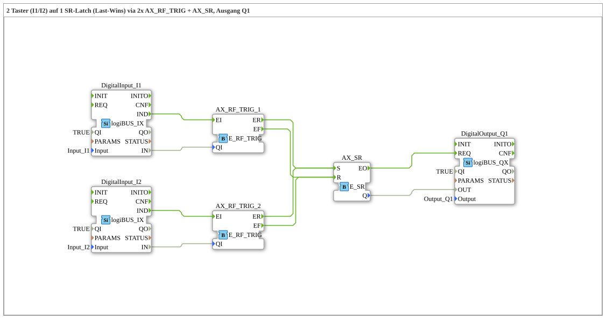

# Uebung_229: 2 Taster (I1/I2) auf 1 SR-Latch (Last-Wins) via 2x AX_RF_TRIG + AX_SR, Ausgang Q1

This article describes the 4diac IDE sub-application Uebung_229 (2 Taster (I1/I2) auf 1 SR-Latch (Last-Wins) via 2x AX_RF_TRIG + AX_SR, Ausgang Q1).

----

## Objective of the Exercise

The main objective of this exercise is to implement the following requirement: **2 Taster (I1/I2) auf 1 SR-Latch (Last-Wins) via 2x AX_RF_TRIG + AX_SR, Ausgang Q1**

-----

## Description and Components

The exercise consists of the sub-application Uebung_229.SUB, which uses the following function block structure:

### Instantiated Function Blocks (FBs)

- **DigitalInput_I1**: Instance of type logiBUS::io::DI::logiBUS_IX.
  - Parameter QI = TRUE
  - Parameter Input = Input_I1
- **DigitalInput_I2**: Instance of type logiBUS::io::DI::logiBUS_IX.
  - Parameter QI = TRUE
  - Parameter Input = Input_I2
- **AX_RF_TRIG_1**: Instance of type iec61499::events::E_RF_TRIG.
- **AX_RF_TRIG_2**: Instance of type iec61499::events::E_RF_TRIG.
- **AX_SR**: Instance of type iec61499::events::E_SR.
- **DigitalOutput_Q1**: Instance of type logiBUS::io::DQ::logiBUS_QX.
  - Parameter QI = TRUE
  - Parameter Output = Output_Q1

### Connections and Interfaces

**Event Connections:**

- AX_RF_TRIG_1.ER -> AX_SR.S
- AX_RF_TRIG_2.ER -> AX_SR.S
- AX_RF_TRIG_1.EF -> AX_SR.R
- AX_RF_TRIG_2.EF -> AX_SR.R
- DigitalInput_I2.IND -> AX_RF_TRIG_2.EI
- DigitalInput_I1.IND -> AX_RF_TRIG_1.EI
- AX_SR.EO -> DigitalOutput_Q1.REQ

**Data Connections:**

- DigitalInput_I2.IN -> AX_RF_TRIG_2.QI
- DigitalInput_I1.IN -> AX_RF_TRIG_1.QI
- AX_SR.Q -> DigitalOutput_Q1.OUT

-----

## Sequence and Operation

1. **Initialization**: Upon system startup, all participating function blocks are initialized.
2. **Event and Signal Processing**: State changes at the inputs trigger events that are forwarded to downstream function blocks across the defined connections.
3. **Output Update**: The receiving function blocks process incoming events and data values to update physical and logical outputs accordingly.

-----

## Summary

Exercise Uebung_229 provides a clear demonstration of modular IEC 61499 application design in 4diac IDE.
