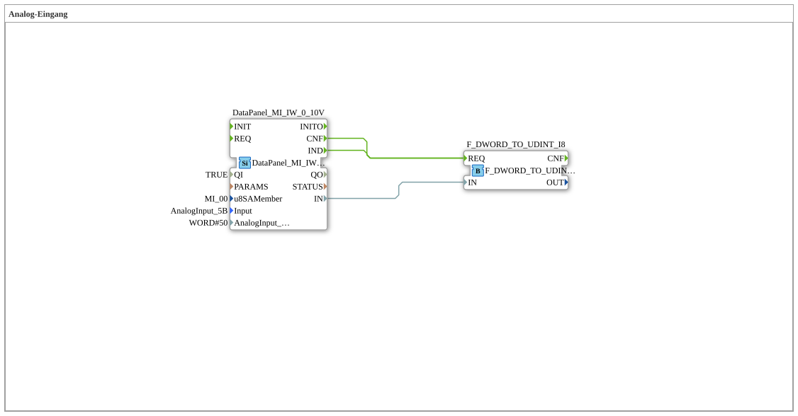

# Uebung_230: Analog Input

This article describes the logiBUS® exercise `Uebung_230`. We read an analog 0-10V input on the DataPanel and convert the raw value into a usable numeric value.

----

## Goal of the Exercise

Read an analog voltage input (`AnalogInput_5B`) on the DataPanel and convert the raw value (DWORD) into a UDINT numeric value, with hysteresis against signal noise.

-----

## Description and Components

- **`DataPanel_MI_IW_0_10V`**: `DataPanel::io::MI::AI::DataPanel_MI_IW_0_10V`, reads an analog 0-10V input on the DataPanel expansion module (`u8SAMember = MI_00`, `Input = AnalogInput_5B`, `AnalogInput_hysteresis = 50`).
- **`F_DWORD_TO_UDINT_I8`**: `iec61131::conversion::F_DWORD_TO_UDINT`, converts the raw DWORD measurement into a UDINT numeric value.

-----

## Behavior

1. `DataPanel_MI_IW_0_10V` continuously reads the analog input voltage, filtered through a hysteresis of 50 to suppress small signal fluctuations.
2. Both on every value change (`IND`) and every confirmation (`CNF`), `F_DWORD_TO_UDINT_I8` is triggered.
3. `F_DWORD_TO_UDINT_I8` converts the raw DWORD value into a UDINT numeric value usable for further processing.
