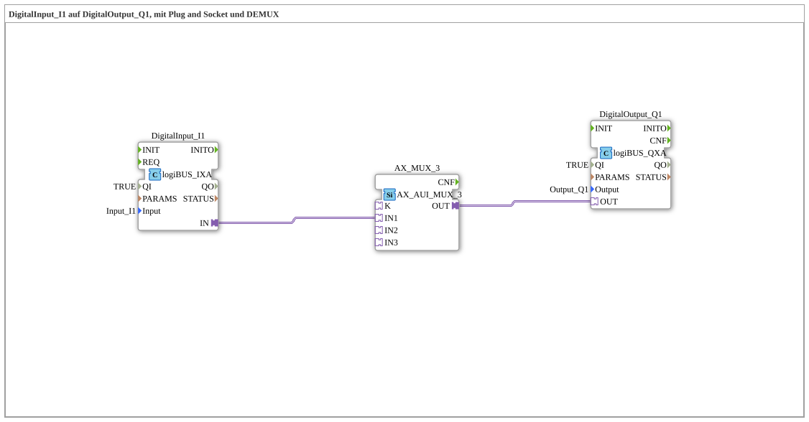

# Versuch_103c2: DigitalInput to DigitalOutput via an AX multiplexer adapter

* * * * * * * * * *

## Introduction

Routes a digital input through a 3-way multiplexer adapter (`AX_AUI_MUX_3`) to a digital output - a plug-and-socket adapter connection instead of a direct data connection. The corresponding `Uebung_103c2_AX` (test_AX) shows the same pattern in the AX exercise environment; this experiment is the equivalent variant in `test_B`.

## Function Blocks Used (FBs)

- **DigitalInput_I1** – Type: `logiBUS::io::DI::logiBUS_IXA`
    - Parameter: `QI = TRUE`, `Input = Input_I1`
    - Functionality: digital input, provides its state via the `IN` adapter connector.
- **AX_MUX_3** – Type: `adapter::selection::unidirectional::AX_AUI_MUX_3`
    - Functionality: 3-way multiplexer adapter (unidirectional) - selects one of up to three input signals onto a shared output. Here, only the first input (`IN1`) is wired.
- **DigitalOutput_Q1** – Type: `logiBUS::io::DQ::logiBUS_QXA`
    - Parameter: `QI = TRUE`, `Output = Output_Q1`
    - Functionality: digital output, takes over its state via the `OUT` adapter connector.

## Program Flow and Connections

Adapter connections (not classic data/event connections): `DigitalInput_I1.IN` → `AX_MUX_3.IN1`, `AX_MUX_3.OUT` → `DigitalOutput_Q1.OUT`. The physical input `Input_I1` is passed through the multiplexer adapter and switches the physical output `Output_Q1`.

## Summary

Shows the simplest wiring of an `AX_AUI_MUX_3` adapter with only one active input - demonstrates the plug-and-socket adapter connection in place of classic data connections.
