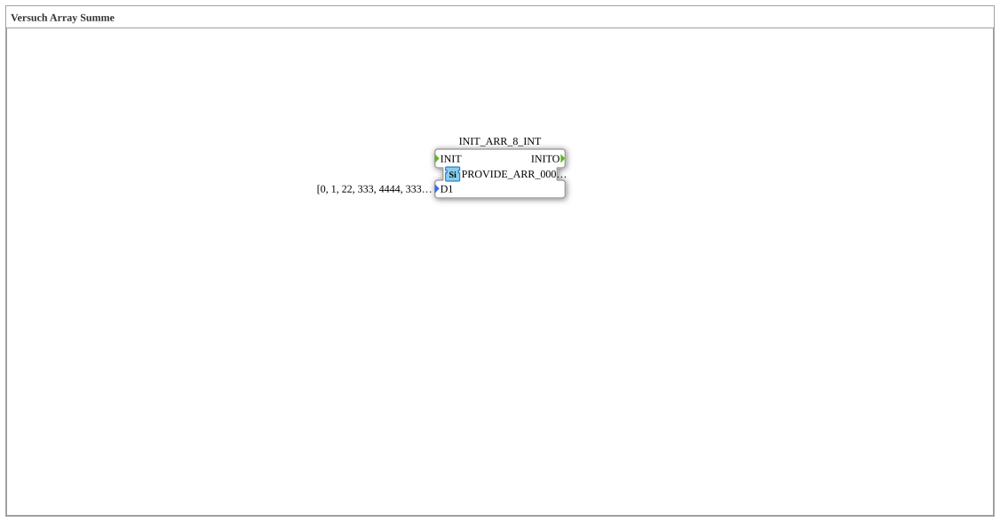

# Versuch_400: Provide an array constant

* * * * * * * * * *

## Introduction

The simplest block of the array experiment series: a hard-wired 8-element INT array is provided but (as yet) not consumed by any other block. Serves as the starting point for the following experiments (`Versuch_401` onward), which build on this array provider.

## Function Blocks Used (FBs)

- **INIT_ARR_8_INT** – Type: `eclipse4diac::convert::providers::PROVIDE_ARR_0008_INT`
    - Parameter: `D1 = [0, 1, 22, 333, 4444, 333, 22, 1]`
    - Functionality: provides the fixed 8-element array on data output `D1` on every call (or on FORTE startup via its internal `INIT` event) and fires `INITO`.

## Program Flow and Connections

There is only one block and no connections to other blocks - `INIT_ARR_8_INT` initializes itself on startup and keeps its array value constantly available at output `D1`.

## Summary

Shows the pure provisioning of an array constant via `PROVIDE_ARR_0008_INT`, without any further processing - the base block for the more complex array experiments in this series.
