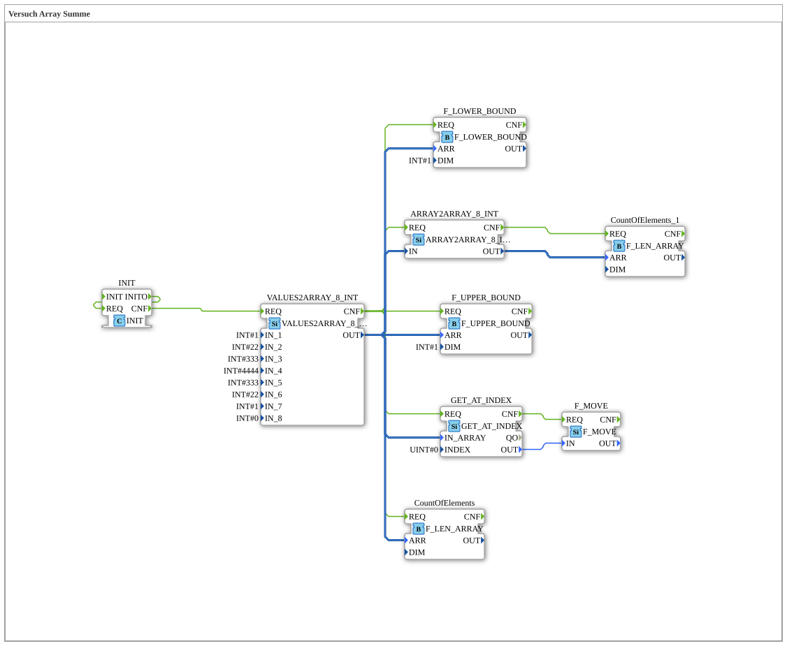

# Versuch_403: Copy an array and re-evaluate it

* * * * * * * * * *

## Introduction

Extends `Versuch_402` with an array-to-array copy (`ARRAY2ARRAY_8_INT`): the assembled array is copied into a second, independent array instance, whose element count is determined separately, again.

## Function Blocks Used (FBs)

- **INIT** – Type: `iec61131::booleanOperators::INIT` – triggers the chain itself (see `Versuch_402`).
- **VALUES2ARRAY_8_INT** – Type: `eclipse4diac::convert::VALUES2ARRAY_8_INT`
    - Parameter: `IN_1..IN_8 = 1, 22, 333, 4444, 333, 22, 1, 0`
- **GET_AT_INDEX** – Type: `eclipse4diac::convert::GET_AT_INDEX`, parameter: `INDEX = 0`
- **F_MOVE** – Type: `iec61131::selection::F_MOVE`, attribute: `DataType = INT`
- **CountOfElements** – Type: `eclipse4diac::utils::arrays::F_LEN_ARRAY` – length of the original array.
- **F_UPPER_BOUND** / **F_LOWER_BOUND** – Type: `iec61131::arrays::F_UPPER_BOUND`/`F_LOWER_BOUND`, each with parameter `DIM = INT#1`.
- **ARRAY2ARRAY_8_INT** – Type: `eclipse4diac::convert::ARRAY2ARRAY_8_INT`
    - Functionality: copies an 8-element array into a new, independent array instance.
- **CountOfElements_1** – Type: `eclipse4diac::utils::arrays::F_LEN_ARRAY` – length of the array copy (second, independent instance).

## Program Flow and Connections

As in `Versuch_402`, `VALUES2ARRAY_8_INT.CNF` produces the array and triggers `GET_AT_INDEX`, `CountOfElements`, `F_LOWER_BOUND`, `F_UPPER_BOUND`, and additionally `ARRAY2ARRAY_8_INT.REQ`. `ARRAY2ARRAY_8_INT` copies the array to its own `OUT` output; its `CNF` in turn triggers `CountOfElements_1.REQ`, which determines the length of the copy independently of the original.

## Summary

Shows how an array can be further processed as an independent copy via `ARRAY2ARRAY_8_INT` without modifying the original - both instances (original and copy) are checked for their length separately here.
