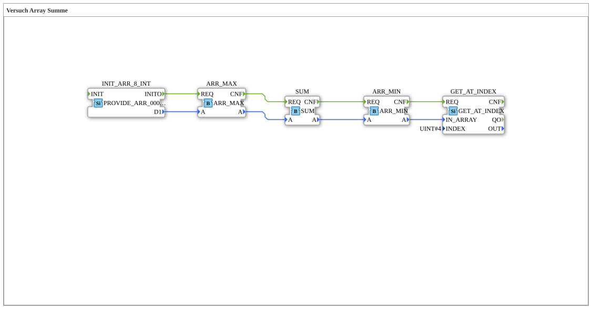

# Versuch_408: Array statistics in a sequential chain

* * * * * * * * * *

## Introduction

Computes the same array statistics as `Versuch_406` (max, sum, min, index access), but - unlike there - not in parallel but **chained sequentially**: each block only triggers the next once its own computation is complete (`CNF`). In addition, the array itself is passed from block to block via the `A`/`IN_ARRAY` data connections, rather than feeding all consumers from the same source at once.

## Function Blocks Used (FBs)

- **INIT_ARR_8_INT** – Type: `eclipse4diac::convert::providers::PROVIDE_ARR_0008_INT`
    - Parameter: `D1 = [0, 1, 22, 333, 4444, 333, 22, 1]`
- **ARR_MAX** – Type: `logiBUS::utils::dyn_arr::ARR_MAX`
- **SUM** – Type: `logiBUS::utils::dyn_arr::SUM`
- **ARR_MIN** – Type: `logiBUS::utils::dyn_arr::ARR_MIN`
- **GET_AT_INDEX** – Type: `eclipse4diac::convert::GET_AT_INDEX`, parameter: `INDEX = 4` (element `4444`)

## Program Flow and Connections

Event chain: `INIT_ARR_8_INT.INITO` → `ARR_MAX.REQ` → (after `ARR_MAX.CNF`) `SUM.REQ` → (after `SUM.CNF`) `ARR_MIN.REQ` → (after `ARR_MIN.CNF`) `GET_AT_INDEX.REQ`. In parallel, the array itself is passed along on the data side: `INIT_ARR_8_INT.D1` → `ARR_MAX.A` → `SUM.A` → `ARR_MIN.A` → `GET_AT_INDEX.IN_ARRAY` - each block passes its own `A` array on unchanged to the next, instead of every block reading directly from the same source.

## Summary

Shows sequential (rather than parallel) chaining of array evaluations along with passing the array data value from block to block - an alternative wiring pattern to the parallel variants `Versuch_401`/`Versuch_406`.
